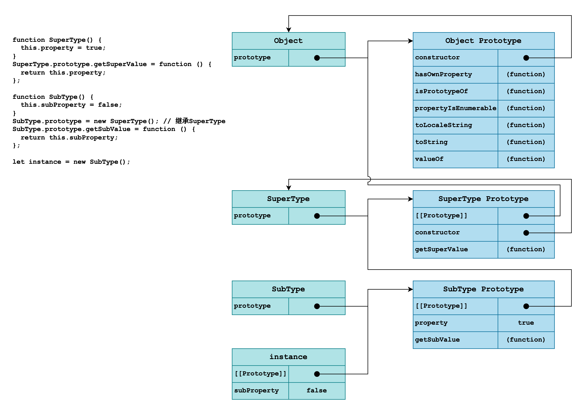

## 继承

**实现继承**是ECMAScript唯一支持的继承方式，主要是通过**原型链**实现的。

### 原型链

- 每个**构造函数**都有一个`prototype`属性，指向它的**原型对象**；**原型对象**都有一个`constructor`属性，指回**构造函数**。
- 每个**对象实例**都有一个内部指针`[[Prototype]]`，它指向对象的**原型对象**。
- 通过**构造函数**`new`一个对象实例时，对象实例的`[[Prototype]]`就指向了**构造函数**的`prototype`属性值。
- 如果将**构造函数**的**原型对象**重写为另外一个类型的**对象实例**，**对象实例**的内部指针`[[Prototype]]`指向的是另外一个**原型对象**，**原型对象**的`constructor`属性就指向了另外一个**构造函数**。通过对象的内部属性`[[Prototype]]`形成了一个**原型链**。

```js
function SuperType() {
  this.property = true;
}
SuperType.prototype.getSuperValue = function () {
  return this.property;
};

function SubType() {
  this.subProperty = false;
}
SubType.prototype = new SuperType(); // 继承SuperType
SubType.prototype.constructor = SubType;
SubType.prototype.getSubValue = function () {
  return this.subProperty;
};

let instance = new SubType();
console.log(instance.getSuperValue()); // true
```


所有引用类型都继承自`Object`，任何函数的默认原型都是一个`Object`实例。

#### 原型与继承关系
原型与实例的关系可以通过两种方式来确定：
- 使用`instanceof`操作符，如果一个实例的原型链中出现过相应的构造函数，则`instanceof`返回`true`。
- 使用`isPrototypeOf()`方法，原型链中的每个原型都可以调用这个方法，只要原型链中包含这个原型，就返回`true`。

```js
// `instanceof`
console.log(instance instanceof Object);    // true
console.log(instance instanceof SuperType); // true
console.log(instance instanceof SubType);   // true
// `isPrototypeOf()`
console.log(Object.prototype.isPrototypeOf(instance));    // true
console.log(SuperType.prototype.isPrototypeOf(instance)); // true
console.log(SubType.prototype.isPrototypeOf(instance));   // true
```

#### 原型链的问题

- 原型中包含的引用值会在所有实例间共享。

### 盗用构造函数/对象伪装/经典继承

使用`apply()`和`call()`方法，在子类构造函数中调用父类构造函数，解决原型包含引用值导致的继承问题。


### 组合继承

使用原型链继承原型上的属性和方法，通过盗用构造函数继承实例属性。这样既可以把方法定义在原型上实现重用，也可以让每个实例都有自己的属性。

```js
function SuperType(name) {
  this.name = name;
  this.colors = ['red', 'green', 'blue'];
}
SuperType.prototype.sayName = function () {
  console.log(this.name);
};

function SubType(name, age) {
  SuperType.call(this, name); // 盗用构造函数，继承属性
  this.age = age;
}
// 原型链，继承方法
SubType.prototype = new SuperType();
SubType.prototype.sayAge = function () {
  console.log(this.age);
};

let instance1 = new SubType('Nicholas', 29);
let instance2 = new SubType('Greg', 27);
instance1.colors.push('yellow');
console.log(instance1); // SuperType { name: 'Nicholas', colors: [ 'red', 'green', 'blue', 'yellow' ], age: 29 }
console.log(instance2); // SuperType { name: 'Greg', colors: [ 'red', 'green', 'blue' ], age: 27 }
console.log(instance1.sayName === instance2.sayName); // true
console.log(instance1.sayAge === instance2.sayAge); // true
// `instanceof`, `isPrototypeOf()`
console.log(instance1 instanceof Object); // true
console.log(instance1 instanceof SuperType); // true
console.log(instance1 instanceof SubType); // true
console.log(SubType.prototype.isPrototypeOf(instance2)); // true
console.log(SuperType.prototype.isPrototypeOf(instance2)); // true
console.log(Object.prototype.isPrototypeOf(instance2)); // true
```

组合继承是JavaScript中使用最多的继承模式，组合继承也保留了`instanceof`操作符和`isPrototypeOf()`方法识别合成对象的能力。

### 原型式继承

<<JavaScript中的原型式继承>>描述了即使不自定义类型也可以通过原型实现对象之间的信息共享：

```js
// 对传入对象执行一次浅复制
function object(obj) {
  function F() {} // 临时的构造函数
  F.prototype = obj;
  return new F();
}
```

在ECMAScript5中定义的方法`Object.create()`将原型式继承的概念规范化了，它与`object()`方法的效果相同。

原型式继承非常适合不需要单独创建构造函数，但仍然需要在**对象间共享信息**的场合。

### 寄生式继承

创建一个实现继承的函数，以某种方式增强对象，然后返回这个对象：

```js
function createAnother(original) {
  let clone = Object.create(original); // 调用`函数`创建一个新对象
  clone.doSomething = function() {     // 增强新创建的对象
    console.log('hello world');
  }
  return clone; // 返回这个对象
}
```

寄生式继承同样适合主要**关注对象**，而不在乎类型和构造函数的场景。

### 寄生式组合继承


