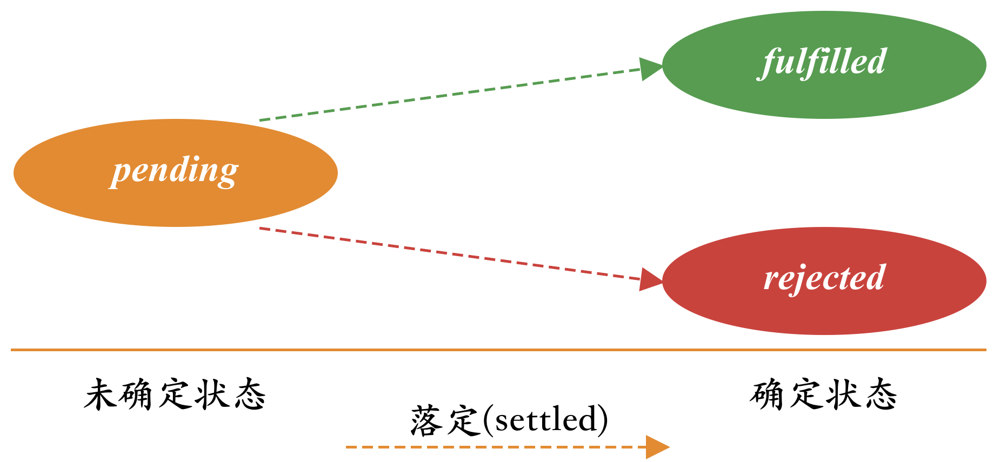
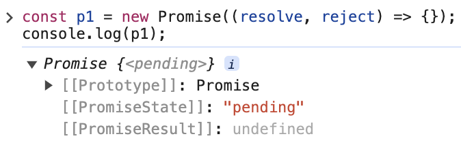
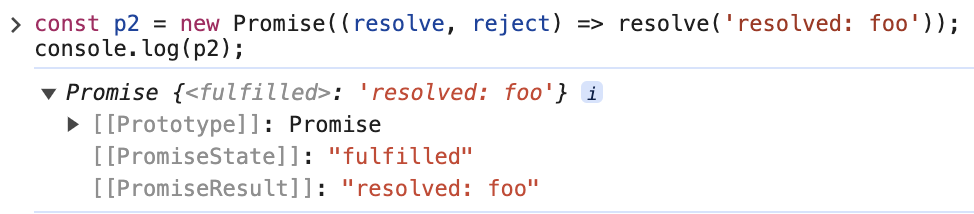
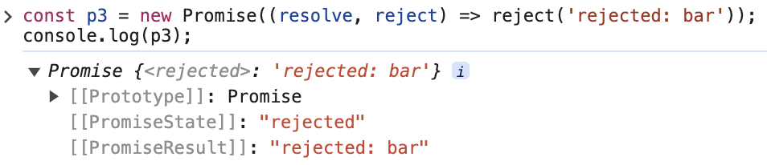

## 1. Promise基础

Promise是异步操作结果的“临时占位符”，这个结果会在未来的某个时间点提供给当前程序。Promise是ES6新增的引用类型，异步函数可以返回一个Promise，而不用通过订阅一个事件或者传递一个回调给该函数。

```js
// fetch()函数发送网络请求，并等待结果，p的类型是Promise。
const p = fetch('https://dog.ceo/api/breeds/image/random');
```

Promise是个有状态的对象，可能的状态包括：`pending`、`fulfilled`和`rejected`。`pending`是Promise的初始状态，处于`pending`状态的Promise，最终会落定为代表成功的`fulfilled`，或者代表失败的`rejected`。Promise的状态是不可逆的，落定到具体确认状态后将不再改变。



Promise具有两个私有属性[[PromiseState]]和[[PromiseResult]]，[[PromiseState]]用以表示Promise的状态，[[PromiseResult]]表示当Promise状态落定到确定状态时的值(`fulfilled`)或原因(`rejected`)。

| pending Promise                               | fulfilled Promise                              | rejcted Promise                                |
| --------------------------------------------- | ---------------------------------------------- | ---------------------------------------------- |
|  |  |  |

  