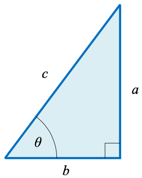

### 角度（`degree`）和弧度（`radian`）

**度**（$^\circ$, `degree`）是角度度量单位，一周（a full circle）等于 $360^\circ$，$1^\circ$ 等于60**分**（minute），1分等于60**秒**（second）。

**弧度**（`radian`）简写 $rad$，$1\text{ }rad\approx57.2958^\circ$。
$$
1^\circ = 60^{\prime} \\
1^{\prime} = 60^{\prime\prime} \\
360^\circ = 2\pi\text{ }rad \\
180^\circ = \pi\text{ }rad
$$

```python
import math
import numpy as np

# `math.radians()` 将角度转换成弧度
print(math.pi == math.radians(180), math.tau == math.radians(360))  # True True
# `math.degrees()` 将弧度转换成角度
print(math.degrees(math.pi), math.degrees(math.tau))  # 180.0 360.0

# `numpy.deg2rad()` 将角度转换成弧度
print(np.deg2rad(180) == np.pi, np.deg2rad(360) == 2 * np.pi)  # True True
# `numpy.rad2deg()` 将弧度转换成角度
print(np.rad2deg(np.pi), np.rad2deg(2 * np.pi))  # 180.0 360.0
```

$a$ 和 $b$ 是直角（$90^\circ$）三角形的直角边，$c$ 是斜边。



**勾股定理**：$a^2 + b^2 = c^2$ 

| 三角函数（`trigonometric function`） | 定义                                                | NumPy函数     |
| ------------------------------------ | --------------------------------------------------- | ------------- |
| 正弦 `sine`                          | $\sin\theta = \dfrac{a}{c}$                         | `numpy.sin()` |
| 余弦 `cosine`                        | $\cos\theta = \dfrac{b}{c}$                         | `numpy.cos()` |
| 正切 `tangent`                       | $\tan\theta = \dfrac{a}{b}$                         | `numpy.tan()` |
| 余切 `cotangent`                     | $\cot\theta = \dfrac{b}{a} = \dfrac{1}{\tan\theta}$ |               |
| 正割 `secant`                        | $\sec\theta = \dfrac{c}{b} = \dfrac{1}{\cos\theta}$ |               |
| 余割 `cosecant`                      | $\csc\theta = \dfrac{c}{a} = \dfrac{1}{\sin\theta}$ |               |

| 反三角函数（`inverse trigonometric function`） | 数学表达        | NumPy函数        |
| ---------------------------------------------- | --------------- | ---------------- |
| 反正弦                                         | $\arcsin\theta$ | `numpy.arcsin()` |
| 反余弦                                         | $\arccos\theta$ | `numpy.arccos()` |
| 反正切                                         | $\arctan\theta$ | `numpy.arctan()` |

```python
import numpy as np

# degree: 30°
rad = np.pi / 6
# 正弦: 1/2, 余弦: \sqrt{3}/2, 正切: \sqrt{3}/3
print(f"sine: {np.sin(rad)}, cosine: {np.cos(rad)}, tangent: {np.tan(rad)}")
# 余切: \sqrt{3}, 正割: 2/\sqrt{3}, 余割: 2
print(f"cotangent: {1 / np.tan(rad)}, secant: {1 / np.cos(rad)}, cosecant: {1 / np.sin(rad)}")
# 反正弦: 30°, numpy.pi/6
print(np.rad2deg(np.arcsin(0.5)))
# 反余弦：45°, numpy.pi/4
print(np.rad2deg(np.arccos(np.sqrt(2) / 2)))
# 反正切：45°, numpy.pi/4
print(np.rad2deg(np.arctan(1)))
```

**余弦定理**

$$
\begin{cases}
a^2 = b^2 + c^2 - 2bc\cdot\cos\alpha \\
b^2 = a^2 + c^2 - 2ac\cdot\cos\beta \\
c^2 = a^2 + b^2 - 2ab\cdot\cos\gamma
\end{cases}
$$

