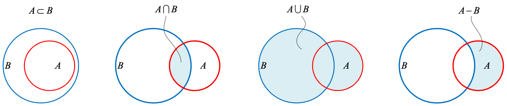

### 集合（`set`）

**集合**是由若干确定的**元素**（member, element）所构成的整体，分为**有限元素集合**（finite set）、**无限元素集合**（infinite set）和**空集**（empty set, null set）。

元素和集合之间的关系：**属于 $\in$**（belong to）和**不属于 $\notin$**（not belong to）。

集合$\mathit{A}$ 中的元素也都是集合$\mathit{B}$ 的元素，那么$\mathit{A}$ 是 $\mathit{B}$ 的**子集**（subset），记作 $\mathit{A} \subseteq \mathit{B}$。$\mathit{B}$ 是 $\mathit{A}$​ 的**超集**（superset），记作 $\mathit{B} \supseteq \mathit{A}$。

如果同时满足$\mathit{A} \subseteq \mathit{B}, \mathit{A} \ne \mathit{B}$，那么 $\mathit{A}$ 是 $\mathit{B}$ 的**真子集**，记作 $\mathit{A} \subset \mathit{B}$ 。

| 集合运算                       | 说明                                                         | 数学表达                                                     |
| ------------------------------ | ------------------------------------------------------------ | ------------------------------------------------------------ |
| 交集 `intersection`            | 由所有属于 $\mathit{A}$ 且属于 $\mathit{B}$ 的元素组成的集合 | $\mathit{A} \cap \mathit{B}$                                 |
| 并集 `union`                   | $\mathit{A}$ 和 $\mathit{B}$ 所有元素合并组成的集合          | $\mathit{A} \cup \mathit{B}$                                 |
| 相对补集 `relative complement` | 由所有属于 $\mathit{A}$ 但不属于 $\mathit{B}$ 的元素组成的集合 | $\mathit{A} \setminus \mathit{B}$ 或 $\mathit{A} - \mathit{B}$ |

**绝对补集**（`absolute complement`）：设 $\Omega$ 是一个集合，$\mathit{A}$ 是 $\Omega$ 的一个子集，由 $\Omega$ 中所有不属于 $\mathit{A}$ 的元素组成的集合，叫做子集 $\mathit{A}$ 在 $\Omega$​ 中的绝对补集。

**文氏图**（Venn diagram）



```python
# Bk3_Ch4_01
```


### 多项式（`polynomial`）

**算数**（arithmetic）基于**已知量**（known values），**代数**（algebra）基于**未知量**（unknown values），也称为**变量**（variables）。未知量有助于将数学问题抽象化、一般化。例如变量 $\mathit{r}$ 作为圆的半径抽象，不用具体到是 $\mathit{5}$ 还是 $\mathit{20}$ ，面积是 $\pi\mathit{r}^2$。

多项式形式如下，$x$ 是**变量**，$n$ 是**多项式次数**（degree of a polynomial），$a_0, a_1, \cdots, a_n$ 是**系数**（coefficient）。
$$
a_nx^n + a_{n-1}x^{n-1} + \cdots + a_{1}x + a_0
$$

多项式是由**单项式**（monomial）加减构成的，例如 $a_nx^n, 5, a_0, 2xy$ 都是单项式。单项式中所有变量指数之后，叫作**单项式的次数**，例如 $3x^5$ 的次数是 $\mathit{5}$, $2xy$ 的次数是 $\mathit{2}(=1+1)$。

只有一个变量的多项式称为**一元多项式**（univariate polynomial），两个变量的多项式称为**二元多项式**（bivariate polynomial），多于一个变量的多项式统称为**多元多项式**（multivariate polynomial）。

最高项次数较小的多项式有特殊的名称，比如**常数式** (constant equation)、**一次式** (linear equation)、**二次式** (quadratic equation)、**三次式** (cubic equation)、**四次式** (quartic equation) 和**五次式** (quintic equation) 等等。

```python
# Bk3_Ch4_02
# Bk3_Ch4_03
```


### 杨辉三角，帕斯卡三角（`Pascal's triangle`）

$(x+1)^n$展开后，按单项 *x* 的次数从高到低排列：

$$
\begin{array}{lcr}
(x+1)^0=\qquad \qquad \qquad \quad 1\\
(x+1)^1=\qquad \qquad \qquad x+1\\
(x+1)^2=\qquad \qquad \quad x^2+2x+1\\
(x+1)^3=\qquad \qquad x^3+3x^2+3x+1\\
(x+1)^4=\qquad \quad x^4+4x^3+6x^2+4x+1\\
(x+1)^5=\qquad x^5+5x^4+10x^3+10x^2+5x+1\\
(x+1)^6=\quad x^6+6x^5+15x^4+20x^3+15x^2+6x+1
\end{array}
$$

### 排列（`permutation`）组合（`combination`）


### 方程（`equation`）


设 $\boldsymbol{v}$ 为单位向量，$\boldsymbol{a}$ 在 $\boldsymbol{v}$ 方向上的标量投影：
$$
\big\Vert\boldsymbol{a}\big\Vert \cos \theta = \dfrac{\boldsymbol{a} \cdot \boldsymbol{v}}{\big\Vert\boldsymbol{v}\big\Vert} = \boldsymbol{a} \cdot \boldsymbol{v}
$$
$\boldsymbol{a}$ 在 $\boldsymbol{v}$ 方向上的向量投影：
$$
\text{proj}_{\boldsymbol{v}}{\boldsymbol{a}} = (\big\Vert\boldsymbol{a}\big\Vert \cos \theta)\boldsymbol{v} = (\boldsymbol{a} \cdot \boldsymbol{v})\boldsymbol{v} = (\boldsymbol{a}^T\boldsymbol{v})\boldsymbol{v} = (\boldsymbol{v}^T\boldsymbol{a})\boldsymbol{v}
$$


$$
\overset{a=b+c+d}{\underset{b=c+d+e+f}{\rightleftarrows}} \\
\stackrel{\alpha\alpha\alpha\alpha\alpha}{\rightleftarrows} \\
A \xrightarrow{123456789999999} B
$$
