### 一次函数：一条斜线

| 函数形式                       | 数学式                                                       | 函数图像                                                     |
| ------------------------------ | ------------------------------------------------------------ | ------------------------------------------------------------ |
| 斜截式 `slope-intercept form`  | $y = f(x) = ax+b$                                            | 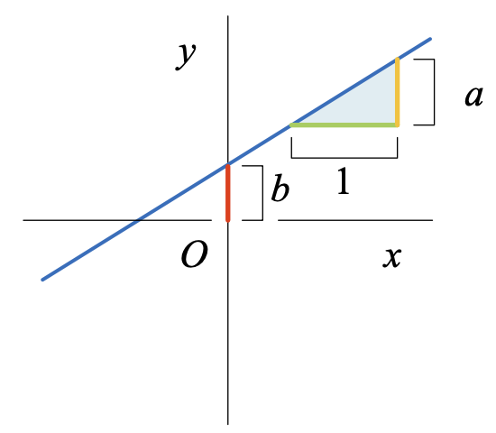 |
| 点斜式 `point-slope form`      | $y-y^{(1)}=f(x)-y^{(1)}=a(x-x^{(1)})$                        | 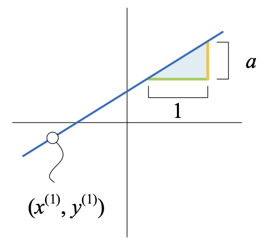 |
| 两点式 `two-point form`        | $y-y^{(1)}=\underbrace{\dfrac{y^{(2)}-y^{(1)}}{x^{(2)}-x^{(1)}}}_{Slope}(x-x^{(1)})\\(y-y^{(1)})(x^{(2)}-x^{(1)})=(y^{(2)}-y^{(1)})(x-x^{(1)})$ | 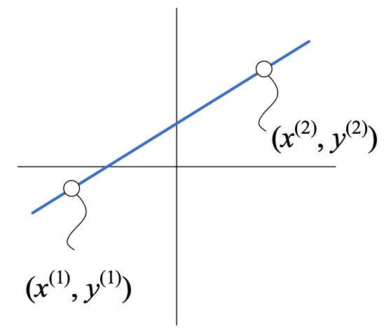 |
| 参数方程 `parametric equation` |                                                              | 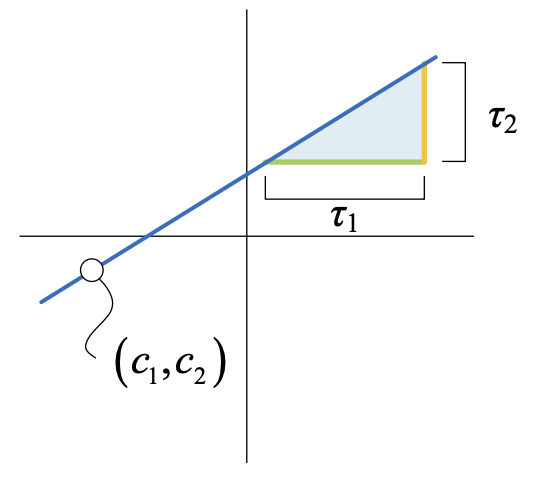 |

- $a$ 是斜率，$b$ 是$y$轴截距。

- $a=0$ 时，**常数函数**。

- $b=0$ 时，**比例函数**，$a$ 又叫做比例常数。

- $a > 0$ 时，**正斜率**，单调递增。

- $a < 0$ 时，**负斜率**，单调递减。

- $a$ 的绝对值越大，一次函数图像越陡峭。

- $b$ 相当于图像上下平移。

- 如果两条直线的**斜率相等**，它们或平行或重合，当两条直线的**斜率乘积为$-1$**时，两条曲线相互垂直。

### 二次函数：一条抛物线

| 函数形式               | 数学式                            | 函数图像                                                     |
| ---------------------- | --------------------------------- | ------------------------------------------------------------ |
| 基本式 `standard form` | $f(x)=ax^2+bx+c,\ a \neq 0$       | 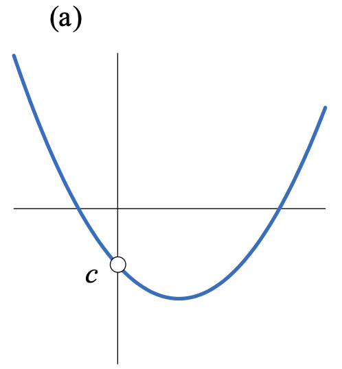 |
| 两根式 `factored form` | $f(x)=a(x-r_1)(x-r_2),\ a \neq 0$ | 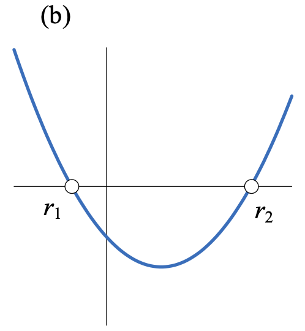 |
| 顶点式 `vertex form`   | $f(x)=a(x-h)^2+k,\ a \neq 0$      | 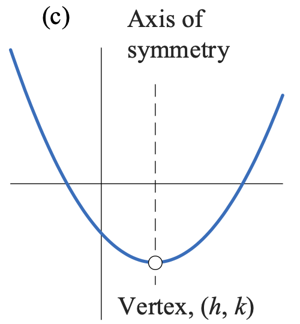 |

- $a$ 称作**二次项系数**，$b$ 是**一次项系数**，$c$ 是常数项，也叫$y$轴截距。
- $a$ 的绝对值越大，二次函数图像开口越小，图像变化越剧烈。
- 极值（`extrema`或`local extrema`）是局部最大或最小值；最值（`global extrema`）是整体最大或最小值。
  - 极大值（`maxima`, `local maxima`, `relative maxima`），极小值（`minima`, `local minima`, `relative minima`）。
  - 最大值（`maximum`, `global maximum`, `absolute maximum`），最小值（`minimum`, `global minimum`, `absolute minimum`）。
- 二次函数顶点是**最值点**，也是函数单调性的**拐点**，以 $h$ 为界，二次函数**单调区间**分别是 $(-\infty, h)$ 和 $(h, +\infty)$。

### 多项式函数（`polynomial function`）

$$
y = f(x) = a_kx^k + a_{k-1}x^{k-1} + \cdots + a_2x^2 + a_1x + a_0 = \sum_{i=0}^k{a_ix^i}
$$

最高项系数 $a_k \neq 0$，$k$ 为最高项次数。

### 幂函数：底数为自变量

$$
f(x) = k \cdot x^p
$$

自变量 $x$ 是底数，$p$ 是指数。

**平方函数和平方根函数**
$$
y = f(x) = x^2 \\
y = f(x) = \sqrt{x} = x^{\frac{1}{2}}
$$

**立方函数和立方根函数**
$$
y = f(x) = x^3 \\
y = f(x) = \sqrt[3]{x} = x^{\frac{1}{3}}
$$
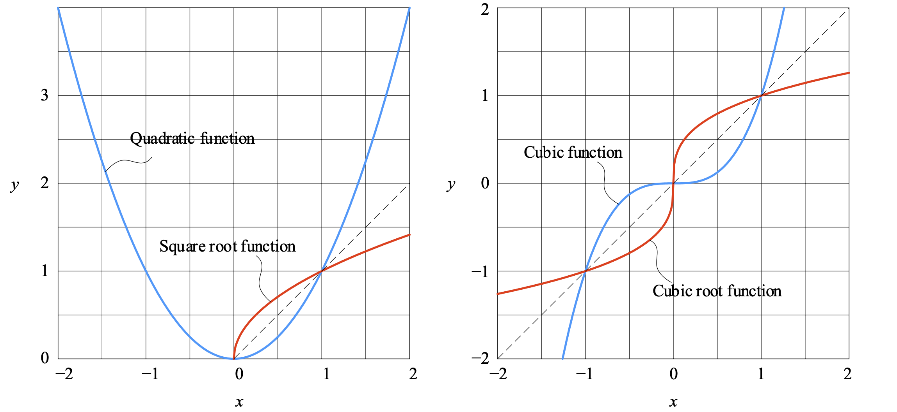

- 当 $p$ 是偶数时，幂函数为偶函数，图像关于 $y$ 轴对称，$p$ 值越大，$x$ 绝对值增大时，函数值越快接近正无穷。
- 当 $p$ 是奇数时，幂函数为奇函数，图像关于原点对称，$p$ 值越大，$x$ 绝对值增大时，函数值越快接近正无穷或负无穷。

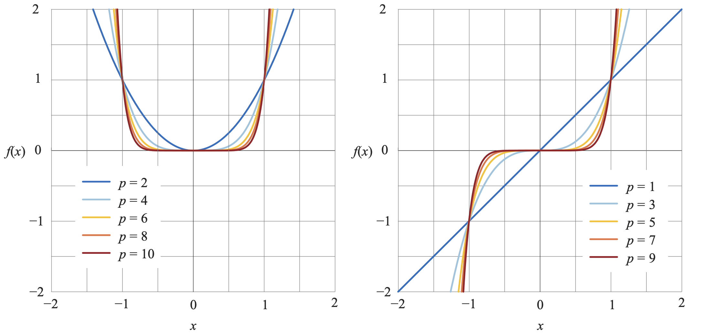

**反比例函数**
$$
y = f(x) = \dfrac{k}{x}
$$

- 和 $y=f(x)=\dfrac{1}{x}$ 相比，$|k|>1$ 时，双曲线朝远离原点方向拉伸；$|k| < 1$ 时，双曲线向靠近原点方向压缩。

- 反比例函数有两条渐近线，水平渐近线 $y=0$ 和竖直渐近线 $x=0$。

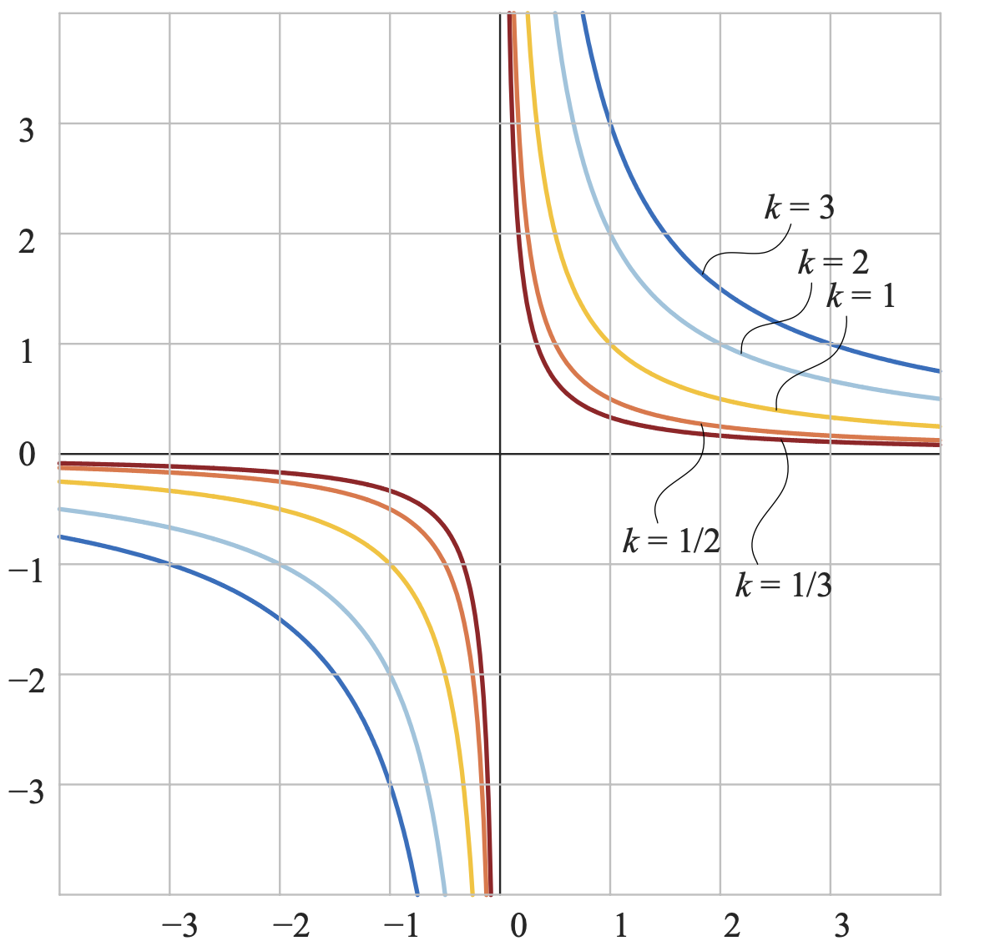

**有理函数**

反比例函数上下左右移动可以得到最简单的有理函数，$h$ 左右移动竖直渐近线，$a$ 上下移动水平渐近线。
$$
y = f(x) = \dfrac{k}{x-h} + a, \ x \neq h
$$
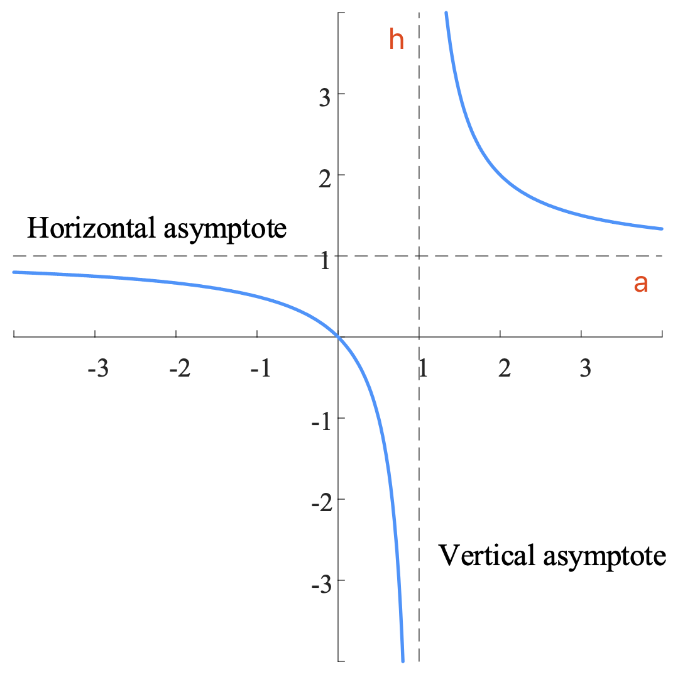

### 分段函数，不连续函数

分段函数是自变量 $x$ 的不同的取值范围有不同的解析式的函数。分段函数不能算做代数函数。

**插值 `interpolation`**指通过已知离散数据点，在一定范围内推导求得新数据点的方法。**线性插值`linear interpolation`**指插值函数为一次函数。插值函数是分段函数时，也称**分段插值**，每两个相邻的数据点之间是一个分段函数。
$$
f(x)=
\begin{cases}
f_1(x) & x^{(1)} \leq x \leq x^{(2)} \\
f_2(x) & x^{(2)} \leq x \leq x^{(3)} \\
\cdots & \cdots \\
f_{n-1}(x) & x^{(n-1)} \leq x \leq x^{(n)} \\
\end{cases}
$$
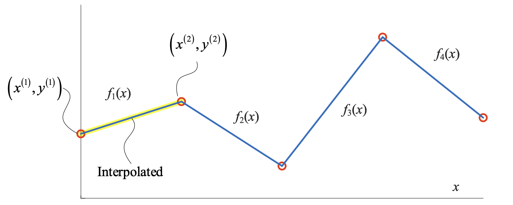

**绝对值函数**

可以将绝对值函数看做是分段函数，一般式如下：
$$
f(x) = k|x-h| + a
$$

