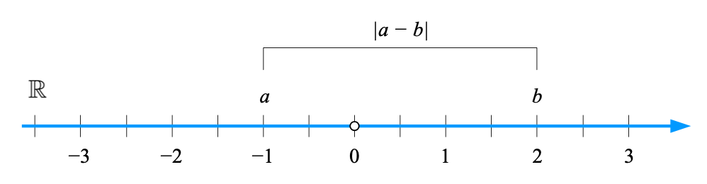
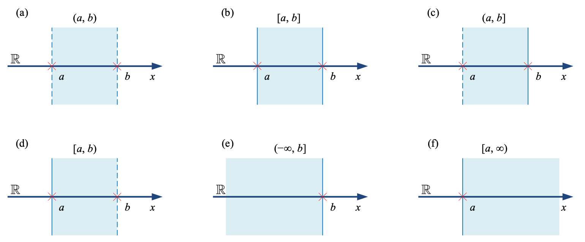
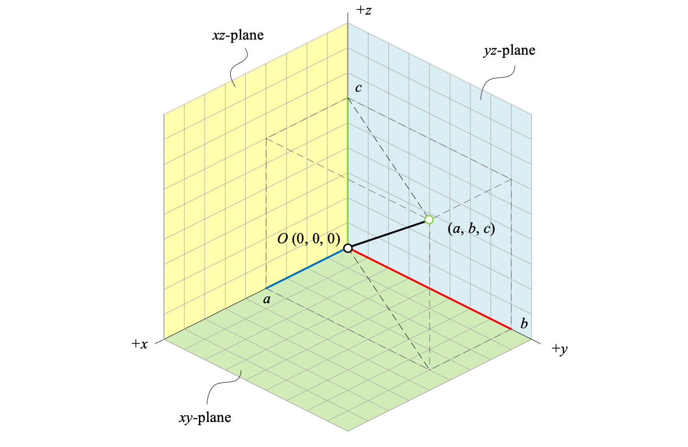
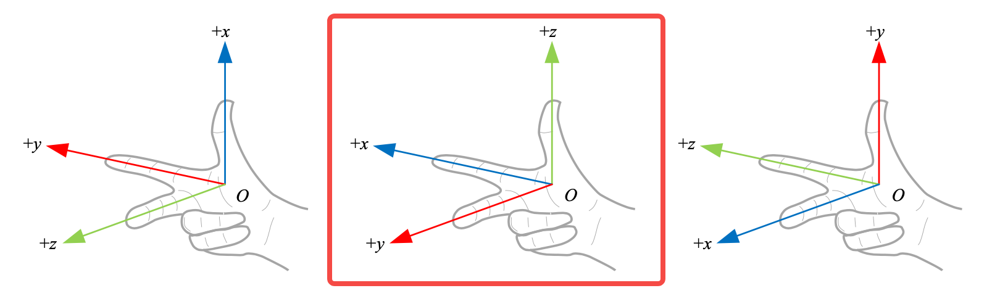
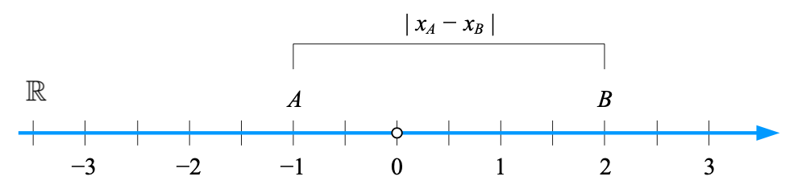
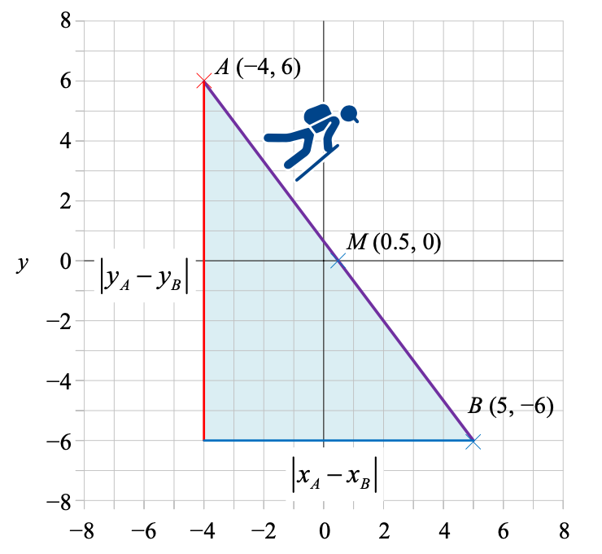
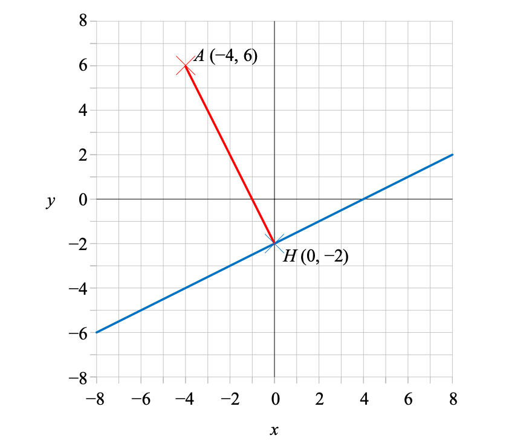
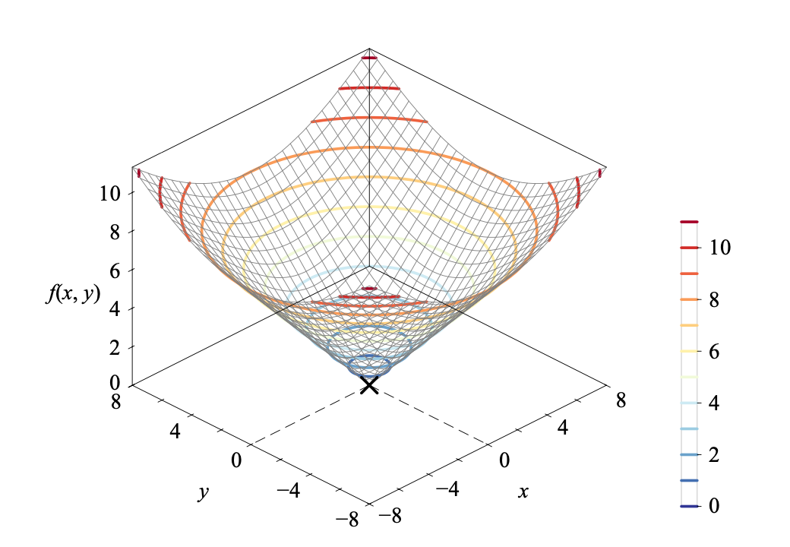
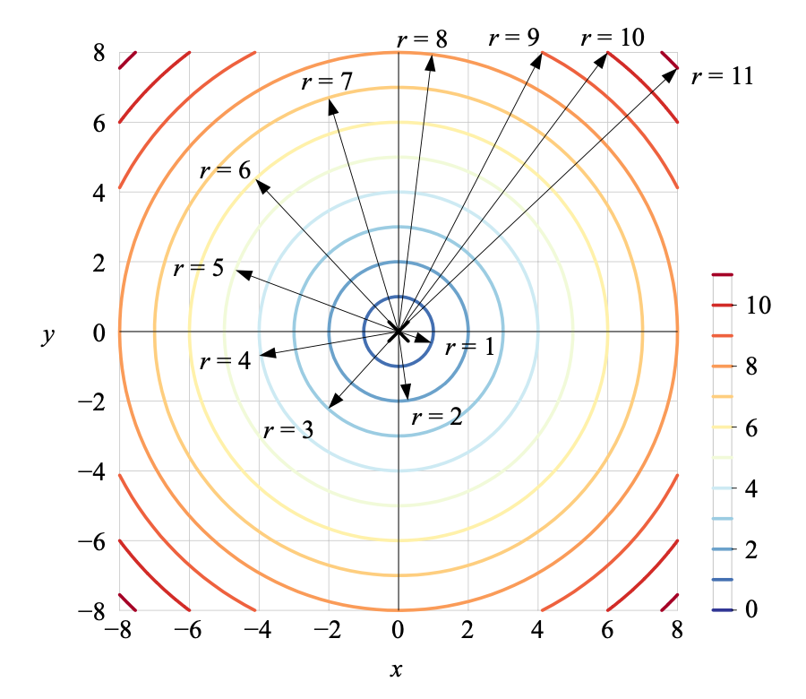

### 数轴

**数轴**描述一维空间，数轴上的每一个点都对应一个实数，记作 $\mathbb{R}$​​， 数轴上**原点**右侧的数为正数，左侧的数为负数。

某个数 $x$ 的**绝对值**是指数轴上该数**与原点的距离**，记作 $\left|x\right|$，实数绝对值为非负数，即 $\left|x\right| \geqslant 0$。

变量的上下界可以写成区间，**区间**是指一定范围的数的集合。$\left( -\infty, \infty \right)$ 代表整根实数轴。

### 笛卡尔坐标系/平面直角坐标系 `cartesian coordinate system`

**笛卡尔坐标系**是两根相交于**原点**（origin）相互垂直的实数轴，也叫**平面直角坐标系**，记作 $\mathbb{R}^2$ 。

横轴常被称作 $x$ 轴，纵轴常被称作 $y$​ 轴。横轴和纵轴将 $xy$ 分成四个象限，象限不包括坐标轴。

平面上的点可以表示为坐标 $(a, b)$，$a$ 表示横坐标，$b$​ 表示纵坐标。

平面直角坐标系中，给定如下两条直线
$$
\begin{cases}
ax + by + c = 0,& a \neq 0, b \neq 0 \\
\alpha x + \beta y + \gamma = 0,& \alpha \neq 0, \beta \neq 0
\end{cases}
$$
如果两条直线**垂直**，则**斜率相乘为$-1$**，即 $\dfrac{a}{b}\dfrac{\alpha}{\beta} = -1$；如果两条直线**平行或重合**，则**斜率相同**，即 $\dfrac{a}{b} = \dfrac{\alpha}{\beta}$。

#### 参数方程

在平面直角坐标系中，如果曲线上任意一点坐标 $(x, y)$ 都是某个参数的函数，对于参数任何取值，方程组确定的点 $(x, y)$ 都在这条曲线上，那么这个方程就叫做曲线的**参数方程**。

用参数方程法绘制的单位圆，对应的参数方程：
$$
\begin{cases}
x_1 = \cos(t) \\
x_2 = \sin(t), & t \in [0, 2\pi] 
\end{cases}
$$

### 极坐标系`polar coordinate system`

$O$ 是极坐标的**极点**（pole），从 $O$ 向右引一条射线作为**极轴**，规定逆时针角度为正。

平面上任意一点 $P$ 的位置可以由线段 $OP$ 的长度 $r$ 和极轴到 $OP$ 的角度 $\theta$ 确定，$(r, \theta)$ 就是 $P$ 点的极坐标。一般，$r$ 称为**极径**，$\theta$ 称为**极角**。

平面上，极坐标 $(r, \theta)$ 可以转化为直角坐标系坐标 $(x_1, x_2)$。
$$
\begin{cases}
x_1 = r \cdot \cos\theta \\
x_2 = r \cdot \sin\theta
\end{cases}
$$

### 三维直角坐标系

在二维直角坐标系原点处升起一根垂直平面的数轴便张成了**三维直角坐标系**。三维直角坐标系有三个坐标轴：$x$ 轴或横轴，$y$ 轴或纵轴，$z$ 轴或竖轴；有三个平面：$xy$ 平面，$yz$ 平面，$xz$ 平面，三个平面将三维空间分成了八个部分，称为卦限（octant）。

#### 空间平面

三维直角坐标系中，平面可以写成如下三元一次方程。
$$
ax + by + cz + d= 0\\
\begin{bmatrix} a&b&c \end{bmatrix}\begin{bmatrix} x\\y\\z \end{bmatrix} + d = 0
$$

#### 空间直线

多数情况下，两个三元一次方程确定一条三维空间直线

三元一次方程组解的个数

### 距离

统计距离

两点之间线段长度叫做欧几里得距离，或欧式距离

### 欧几里得距离

两点之间线段长度叫做**欧几里得距离**或**欧式距离**。

| 维度           | 距离公式                                                     | 图例                                                         |
| -------------- | ------------------------------------------------------------ | ------------------------------------------------------------ |
| 实数轴         | $ \text{dist}(A, B) = \left\vert x_A - x_B \right\vert $     |  |
| 平面直角坐标系 | $\text{dist}(A,B) = \sqrt{(x_A - x_B)^2 + (y_A - y_B)^2} \\ = \sqrt{\begin{bmatrix} x_A - x_B & y_A - y_B \end{bmatrix} \begin{bmatrix} x_A - x_B \\ y_A - y_B \end{bmatrix}}$ |  $M = \left( \dfrac{x_A + x_B}{2}, \dfrac{y_A + y_B}{2} \right)$ |
| 三维直角坐标系 | $\text{dist}(A,B) = \sqrt{(x_A - x_B)^2 + (y_A - y_B)^2 + (z_A - z_B)^2} \\ = \sqrt{\begin{bmatrix} x_A - x_B & y_A - y_B & z_A - z_B \end{bmatrix} \begin{bmatrix} x_A - x_B \\ y_A - y_B \\ z_A - z_B \end{bmatrix}}$ |  |
| $n$ 维空间     | $\text{dist}(A,B) = \sqrt{(x_{1,A} - x_{1,B})^2 + (x_{2,A} - x_{2,B})^2 + \cdots + (x_{n,A} - x_{n,B})^2} \\ = \sqrt{\begin{bmatrix} x_{1,A} - x_{1,B} & x_{2,A} - x_{2,B} & \cdots & x_{n,A} - x_{n,B} \end{bmatrix} \begin{bmatrix} x_{1,A} - x_{1,B} \\ x_{2,A} - x_{2,B} \\ \vdots \\ x_{n,A} - x_{n,B} \end{bmatrix}}$ |                                                              |

#### 点到直线的距离

平面直角坐标系上一条直线 $l: ax+by+c=0$，直线外一点 $A(x_A,y_A)$ 到该直线的距离：
$$
\text{dist}(A, l) = \dfrac{\left\vert ax_A+by_A+c \right\vert}{\sqrt{a^2+b^2}}
$$
直线 $l$ 上距离 $A$ 最近点的坐标 $H(x_H,y_H)$​：
$$
\begin{array}{lcl}
x_H = \dfrac{b^2x_A - aby_A - ac}{a^2 + b^2} \\
y_H = \dfrac{-abx_A + a^2y_A - bc}{a^2 + b^2}
\end{array}
$$

#### 平行线间距离

给定如下两条平行线 $l_1$ 和 $l_2$ 对应解析式：
$$
\begin{cases}
ax + by + c_1 = 0\\
ax + by + c_2 = 0, \quad c_1 \neq c_2
\end{cases}
$$
这两条平行线之间的距离：
$$
\text{dist}(l_1, l_2) = \dfrac{\left\vert c_1 - c_2 \right\vert}{\sqrt{a^2 + b^2}}
$$

### 等距线

任意一点 $P(x,y)$ 距离原点 $(0,0)$ 的欧氏距离为 $r$，对应的解析式：
$$
\text{dist}(P, O) = \sqrt{x^2 + y^2} = r
$$
两边平方得到半径为 $r$ 的正圆的解析式：
$$
x^2 + y^2 = r^2
$$
构造如下的二元函数 $f(x,y)$：
$$
f(x,y) = \sqrt{x^2 + y^2}
$$
下图为 $f(x,y)$ 在三维直角坐标系的曲面形状，$f(x,y)$ 上值相等的相邻各点所连成的曲线是**等高线**。

将等高线投影到 $xy$ 平面上，便得到了下图所示的平面等高线，即**等距线**。距离原点 $O$ 的欧式距离取不同值时，等距线是一系列同心圆。

