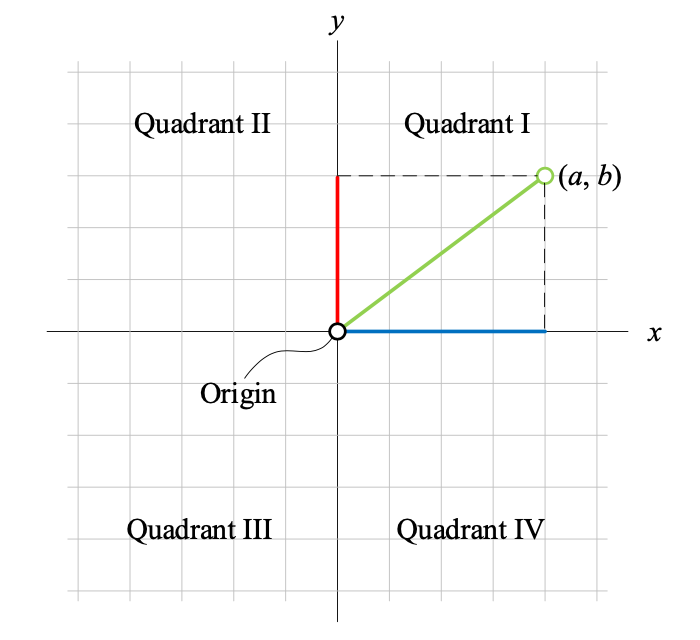
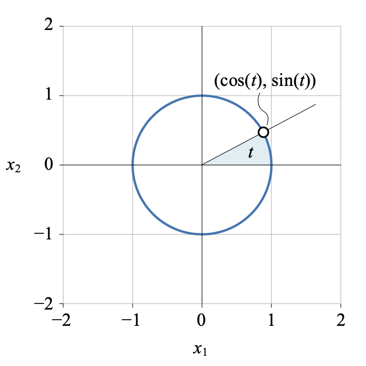
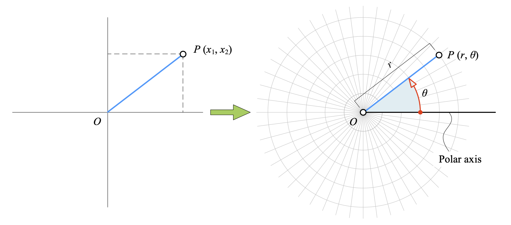

**数轴**描述一维空间，两根垂直并相交于原点的实数轴张成二维直角坐标系，即**笛卡尔坐标系**，在二维直角坐标系原点处升起一根垂直平面的数轴便张成了**三维直角坐标系**。

### 笛卡尔坐标系/平面直角坐标系 `cartesian coordinate system`

**笛卡尔坐标系**是两根相交于**原点**（origin）相互垂直的实数轴，也叫**平面直角坐标系**，记作 $\mathbb{R}^2$ 。

横轴常被称作 $x$ 轴，纵轴常被称作 $y$​ 轴。横轴和纵轴将 $xy$ 分成四个象限，象限不包括坐标轴。

平面上的点可以表示为坐标 $(a, b)$，$a$ 表示横坐标，$b$​ 表示纵坐标。

平面直角坐标系中，给定如下两条直线
$$
\begin{cases}
ax + by + c = 0,& a \neq 0, b \neq 0 \\
\alpha x + \beta y + \gamma = 0,& \alpha \neq 0, \beta \neq 0
\end{cases}
$$
如果两条直线**垂直**，则**斜率相乘为$-1$**，即 $\dfrac{a}{b}\dfrac{\alpha}{\beta} = -1$；如果两条直线**平行或重合**，则**斜率相同**，即 $\dfrac{a}{b} = \dfrac{\alpha}{\beta}$。

#### 参数方程

在平面直角坐标系中，如果曲线上任意一点坐标 $(x, y)$ 都是某个参数的函数，对于参数任何取值，方程组确定的点 $(x, y)$ 都在这条曲线上，那么这个方程就叫做曲线的**参数方程**。

用参数方程法绘制的单位圆，对应的参数方程：
$$
\begin{cases}
x_1 = \cos(t) \\
x_2 = \sin(t), & t \in [0, 2\pi] 
\end{cases}
$$

### 极坐标系`polar coordinate system`

$O$ 是极坐标的**极点**（pole），从 $O$ 向右引一条射线作为**极轴**，规定逆时针角度为正。

平面上任意一点 $P$ 的位置可以由线段 $OP$ 的长度 $r$ 和极轴到 $OP$ 的角度 $\theta$ 确定，$(r, \theta)$ 就是 $P$ 点的极坐标。一般，$r$ 称为**极径**，$\theta$ 称为**极角**。

平面上，极坐标 $(r, \theta)$ 可以转化为直角坐标系坐标 $(x_1, x_2)$。
$$
\begin{cases}
x_1 = r \cdot \cos\theta \\
x_2 = r \cdot \sin\theta
\end{cases}
$$

