## 函数（`Function`）

给定集合 $\mathit{X}$ ，对 $\mathit{X}$ 中元素 $x$ 施加**映射法则** $f$ ，记作**函数** $f(x)$，得到的结果 $y=f(x)$ 属于集合 $\mathit{Y}$。集合 $\mathit{X}$ 称作**定义域**，集合 $\mathit{Y}$ 称作**值域**，$x$ 称作**自变量**，$y$​ 称作**因变量**。

函数的自变量为一个时，叫做**一元函数**，函数的自变量为两个或两个以上时，叫做**多元函数**。

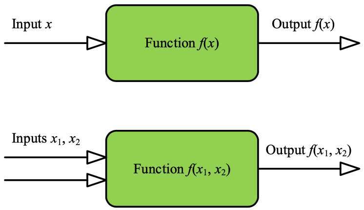

**函数分类**

- 代数函数 `algebraic function`：常数与自变量相互之间有限次的加、减、乘、除、有理指数幂和开方等运算构造的函数。
- 超越函数 `transcendental function`：“超出”代数函数范畴的函数，如对数函数、指数函数、三角函数等等。

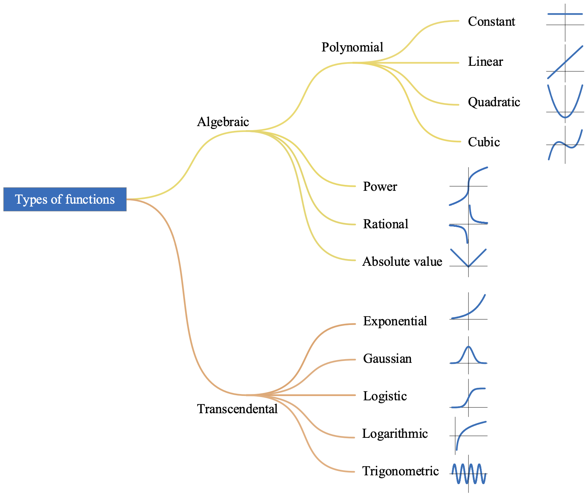

### 一元函数的性质

#### 奇偶性

- **偶函数**，函数图像关于纵轴对称，$f(-x) = f(x)$。
- **奇函数**，函数图像关于原点对称，$f(-x) = -f(x)$。

#### 连续性

函数不连续的几种情况：**渐近线间断`asymptotic discontinuity`**，**跳跃间断`jump discontinuity`**，**点间断`point discontinuity`**。

#### 单调性

- 单调递增 `monotonically increasing`：图(d)
- 单调递减 `monotonically decreasing`：图(e)

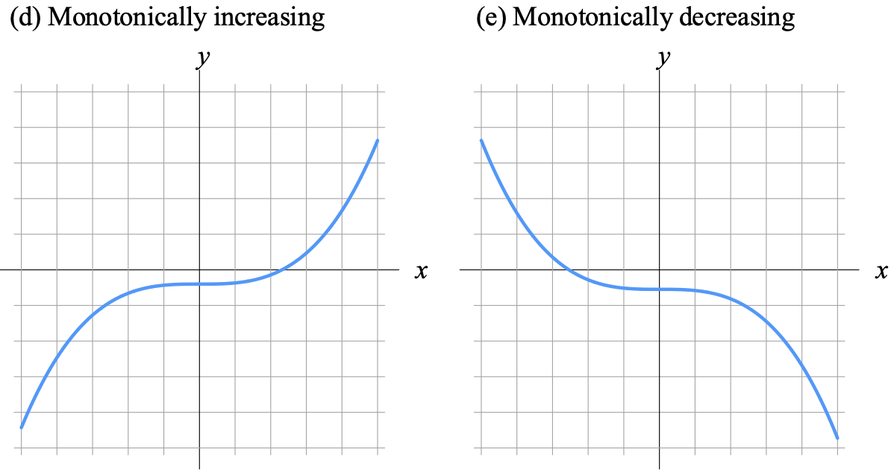

#### 周期性

周期函数满足：$f(x+T) = f(x)$，其中 $T$ 是周期（period），也叫最小正周期。

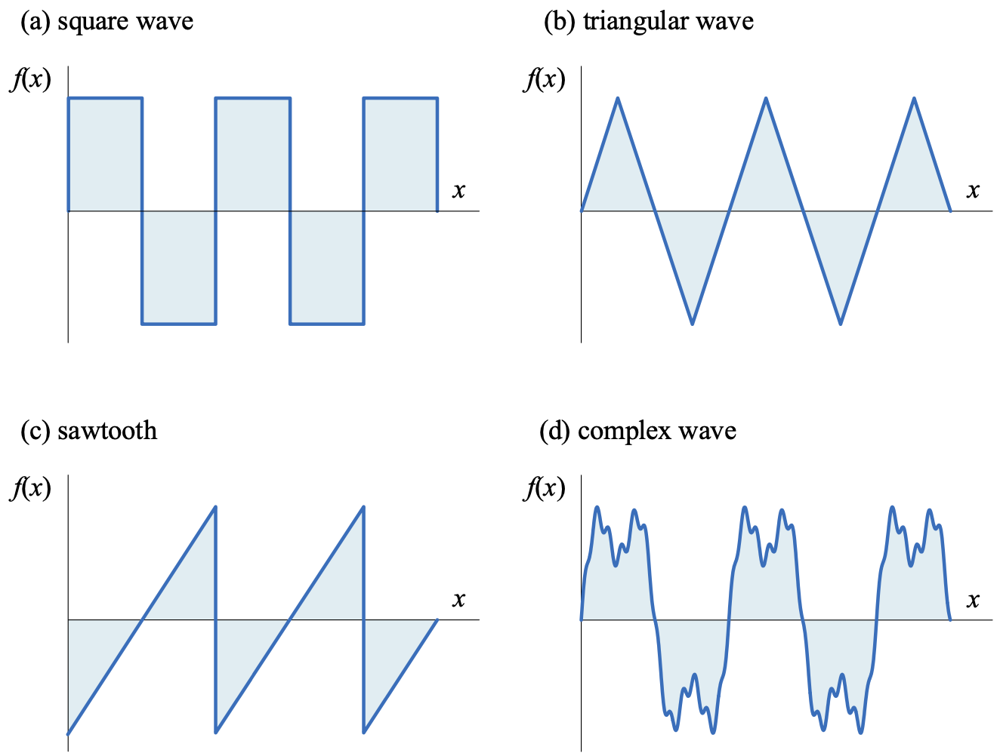

#### 凹凸性

图(a)为**凸函数**`convex function`，图(b)所示为**凹函数**`concave function`。

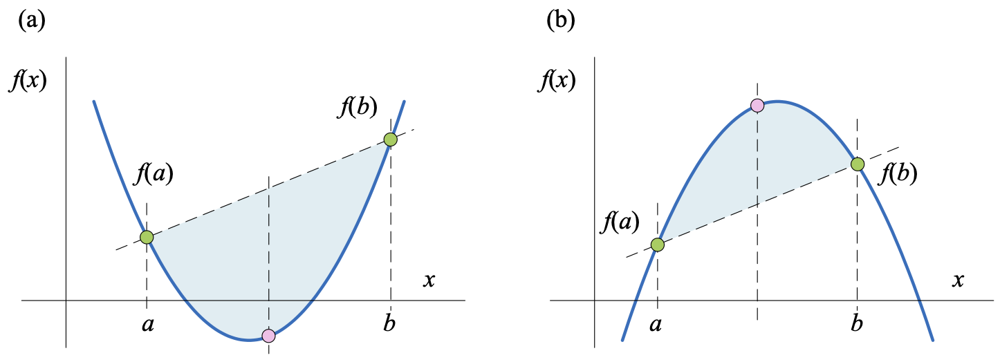

若 $f(x)$ 在区间 $\mathit{I}$ 有定义，对于任意 $a, b \in \mathit{I}\ 且\ a \neq b$ 

- 如果 $f(\dfrac{a+b}{2}) \lt \dfrac{f(a) + f(b)}{2}$ 则 $f(x)$ 在该区间内为**凸函数**。
- 如果 $f(\dfrac{a+b}{2}) \gt \dfrac{f(a) + f(b)}{2}$ 则 $f(x)$ 在该区间内为**凹函数**。

在 $(a, b)$ 区间内任一点 $x = c$ ，在函数上点 $(c, f(c))$ 做一条切线，切线的解析式是 $y = f(c) + k(x - c)$，$k$ 为切线斜率。
- 如果函数为**凸函数**，当 $x \neq c$，函数 $f(x)$ 图像在切线上方，即 $f(x) > f(c) + k(x - c),\quad x \in (a, b), x \neq c$。

- 如果函数为**凹函数**，当 $x \neq c$，函数 $f(x)$ 图像在切线下方，即 $f(x) < f(c) + k(x - c),\quad x \in (a, b), x \neq c$。

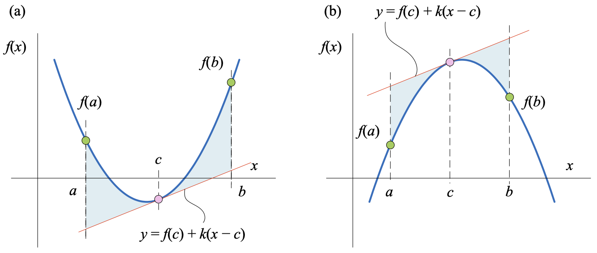

#### 反函数（`inverse function`）

反函数 $x = f^{-1}(y)$ 的定义域、值域分别是函数 $y = f(x)$ 的值域和定义域。 原函数和反函数的图像关于 $y = x$ 直线对称，并不是所有函数都存在反函数。
$$
f^{-1}(f(x)) = x
$$
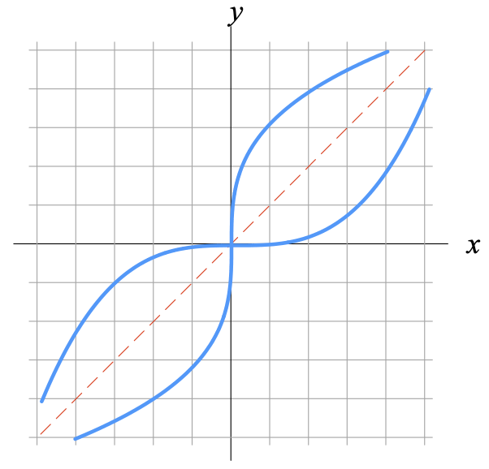

#### 隐函数（`implicit function`）

隐函数是由**隐式方程**所隐含定义的函数，隐函数相比一般函数较难分离自变量和因变量。

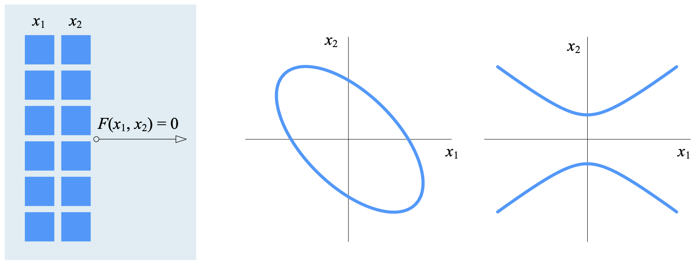

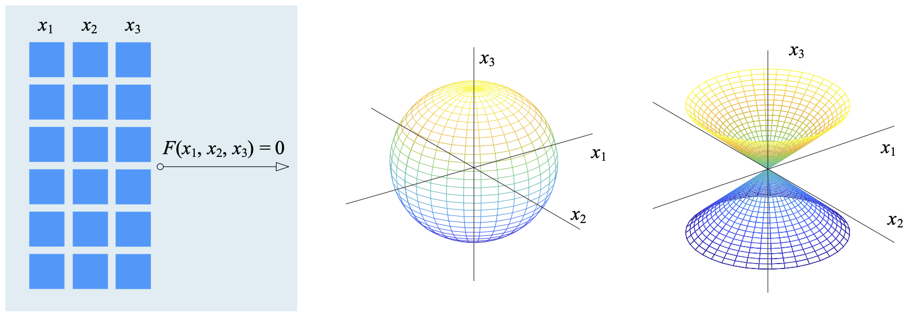

### 二元函数（`bivariate function`）

有两个自变量函数叫做二元函数，有多个自变量函数叫做多元函数，$y = f(x_1, x_2, \cdots, x_D)$ 有 $D$ 个自变量。

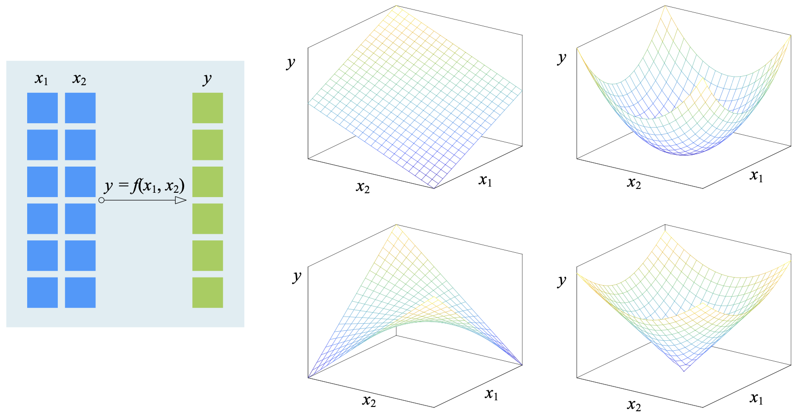

#### 网格化数据

绘制二元函数 $f(x_1, x_2)$ 在三维空间的图形，需要一系列整齐的网格化坐标值 $(x_1, x_2)$：
$$
(x_1, x_2) = 
\begin{bmatrix}
(-2, -1)&(-1, -1)&(0, -1)&(1, -1)&(2,-1)\\
(-2, \quad 0)&(-1,\quad 0)&(0,\quad 0)&(1,\quad 0)&(2,\quad 0)\\
(-2, \quad 1)&(-1,\quad 1)&(0,\quad 1)&(1,\quad 1)&(2,\quad 1)\\
(-2, \quad 2)&(-1,\quad 2)&(0,\quad 2)&(1,\quad 2)&(2,\quad 2)
\end{bmatrix}
$$
可以将上述网格坐标点分离成两个矩阵形式，$\boldsymbol{X_1}$ 代表横坐标，$\boldsymbol{X_2}$ 代表纵坐标。
$$
\boldsymbol X_1 = \begin{bmatrix}-2&-1&0&1&2\\-2&-1&0&1&2\\-2&-1&0&1&2\\-2&-1&0&1&2\end{bmatrix},\quad
\boldsymbol X_2 = \begin{bmatrix}-1&-1&-1&-1\\0&0&0&0\\1&1&1&1\\2&2&2&2\end{bmatrix}
$$
一个示例：$f(x_1, x_2) = 3(1 - x_1)^2e^{-x_1^2-(x_2+1)^2}-10(\dfrac{x_1}{5}-x_1^3-x_2^5)e^{-x_1^2-x_2^2}-\dfrac{1}{3}e^{-(x_1+1)^2-x_2^2}$

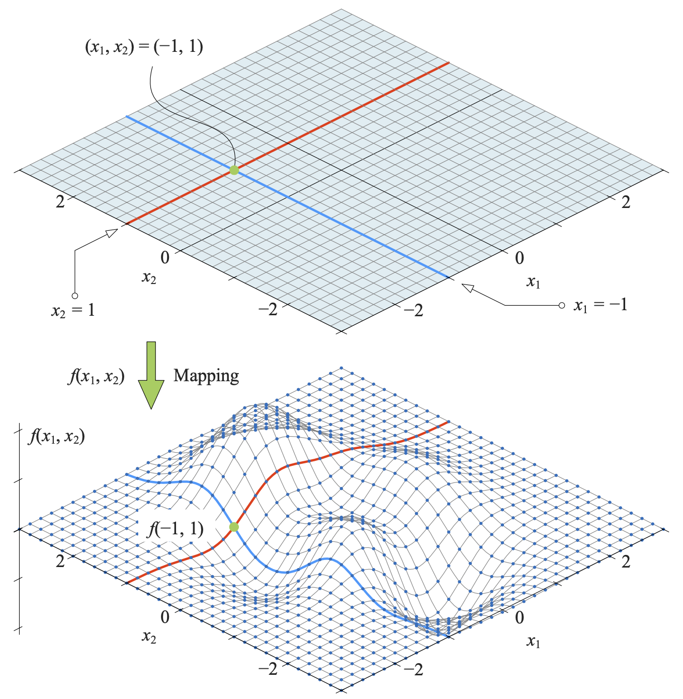

### 降维

剖面线，在曲面上沿着横轴或纵轴切一刀。

