## 几何变换

**线性映射 `linear mapping`**是指从一个空间到另外一个空间的映射，且保持加法和数量乘法运算。例如，映射 $L$ 将向量空间 $V$ 映射到向量空间 $W$，对于所有的 $\boldsymbol{v}_1, \boldsymbol{v}_2 \in V$ 和标量 $\alpha, \beta$，满足：
$$
L(\alpha\boldsymbol{v}_1 + \beta\boldsymbol{v}_2) = \alpha L(\boldsymbol{v}_1) + \beta L(\boldsymbol{v}_2)
$$
线性映射是将一个空间的点或几何形体映射到另外一个空间。

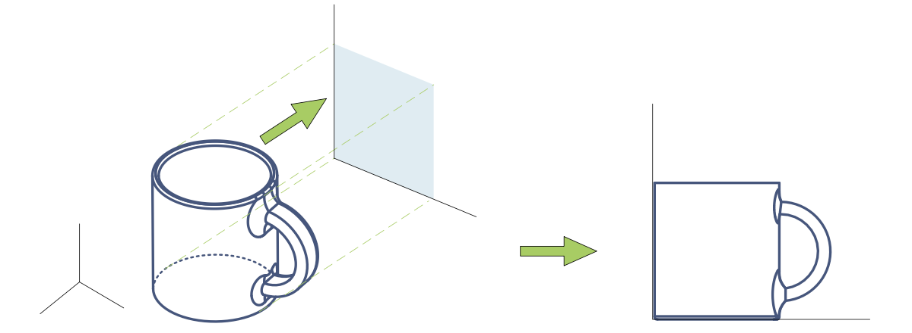

**线性变换 `linear transformation`**是线性空间到自身的线性映射，是一种特殊的线性映射。线性变换是在同一个坐标系中完成的图像变换，线性变换产生**“平行且等距”**的网格，并且**原点保持固定**。

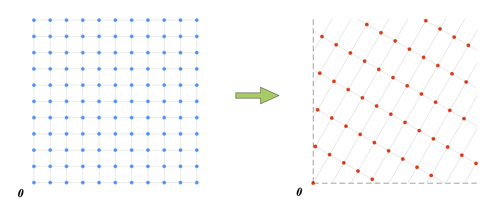

### 常见平面几何变换

$\mathbb{R}^2 \rightarrow \mathbb{R}^2$ ，正交投影相当于降维，结果在 $\mathbb{R}^2$ 的子空间中。

#### 1. 平移 `translation`

平移**不是**线性变换，是一种**仿射变换`affine transformation`**，对应的运算是 $\boldsymbol{y} = \boldsymbol{A}\boldsymbol{x} + \boldsymbol{b}$。从几何视角看，仿射变换是一个向量空间的线性映射（$\boldsymbol{A}\boldsymbol{x}$）叠加平移（$\boldsymbol{b}$），变换结果在以外一个仿射空间。$\boldsymbol{b} \neq \boldsymbol{0}$，平移导致原点位置发生变化，线性变换可以看做特殊的仿射变换。
$$
\begin{bmatrix} z_1 \\ z_2 \end{bmatrix} = \begin{bmatrix} x_1 \\ x_2 \end{bmatrix} + \begin{bmatrix} t_1 \\ t_2 \end{bmatrix}
$$
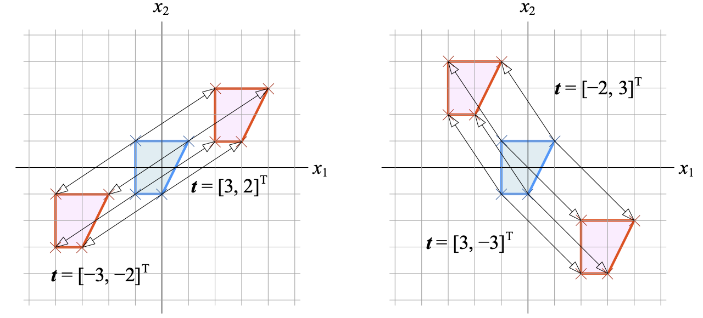

#### 2. 缩放 `scaling`

**等比例缩放**是指在缩放时各个维度采用相同缩放比例。
$$
\begin{bmatrix} z_1 \\ z_2 \end{bmatrix} = s\begin{bmatrix} x_1 \\ x_2 \end{bmatrix} = \underbrace{\begin{bmatrix} s&0 \\ 0&s \end{bmatrix}}_{s}\begin{bmatrix} x_1 \\ x_2 \end{bmatrix}
$$
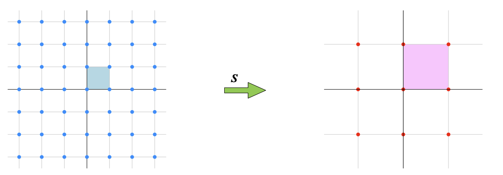

转化矩阵 $\boldsymbol{S}$ 的行列式值 $\det(\begin{bmatrix} s&0 \\ 0&s \end{bmatrix}) = s^2$，对于 $\mathbb{R}^2$，等比例缩放对应图形面积变化 $s^2$ 倍。

**非等比例缩放**
$$
\boldsymbol{S} = \boldsymbol{S}^T = \begin{bmatrix} s_1&0 \\ 0&s_2 \end{bmatrix} \\
\begin{bmatrix} z_1 \\ z_2 \end{bmatrix} = \boldsymbol{S}\begin{bmatrix} x_1 \\ x_2 \end{bmatrix} = \begin{bmatrix} s_1&0 \\ 0&s_2 \end{bmatrix} \begin{bmatrix} x_1 \\ x_2 \end{bmatrix}
$$
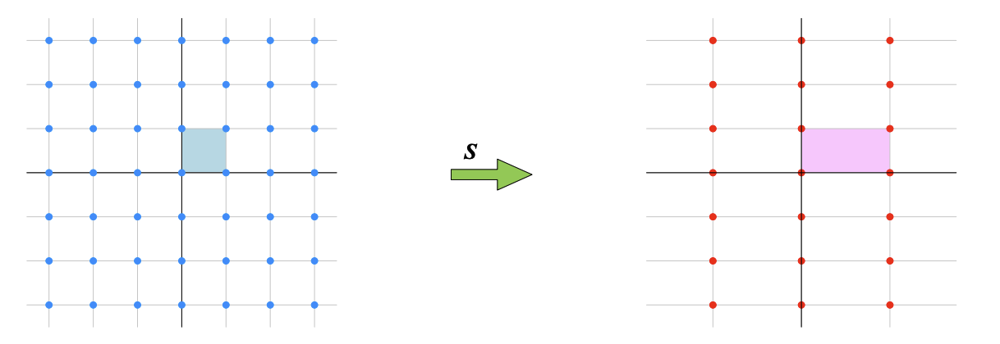

**挤压**指沿着水平方向或竖直方向压扁，但是面积保持不变。
$$
\begin{bmatrix} z_1 \\ z_2 \end{bmatrix} = s\begin{bmatrix} x_1 \\ x_2 \end{bmatrix} = \underbrace{\begin{bmatrix} s&0 \\ 0&\cfrac{1}{s} \end{bmatrix}}_{s}\begin{bmatrix} x_1 \\ x_2 \end{bmatrix}
$$
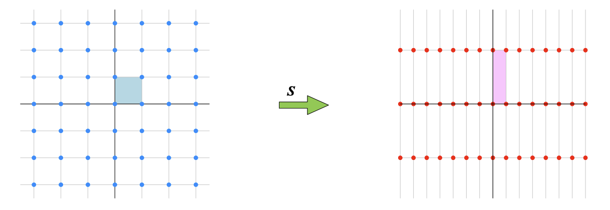

转化矩阵 $\boldsymbol{S}$ 的行列式值 $\det(\begin{bmatrix} s&0 \\ 0&\cfrac{1}{s} \end{bmatrix}) = 1$。

#### 3. 旋转 `rotation`

$\boldsymbol{e}_1$ 和 $\boldsymbol{e}_2$ 逆时针旋转 $\theta$ 分别得到 $\boldsymbol{r}_1$ 和 $\boldsymbol{r}_2$

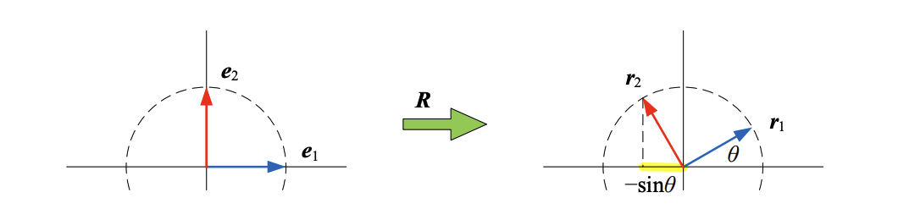
$$
\boldsymbol{r}_1 = \begin{bmatrix} \cos\theta \\ \sin\theta \end{bmatrix}, \quad \boldsymbol{r}_2 = \begin{bmatrix} -\sin\theta \\ \cos\theta \end{bmatrix}\\
\boldsymbol{R} = \begin{bmatrix} \boldsymbol{r}_1 & \boldsymbol{r}_2 \end{bmatrix} = \begin{bmatrix} \cos{\theta} & -\sin{\theta}\\ \sin{\theta} & \cos{\theta}\end{bmatrix}
$$
列向量坐标 $\boldsymbol{x}$ 逆时针旋转 $\theta$ 得到 $\boldsymbol{z}$
$$
\begin{bmatrix} z_1 \\ z_2 \end{bmatrix} = \boldsymbol{R} \begin{bmatrix} x_1 \\ x_2 \end{bmatrix}, \quad
\boldsymbol{R} = \begin{bmatrix} \cos{\theta} & -\sin{\theta}\\ \sin{\theta} & \cos{\theta}\end{bmatrix}
$$
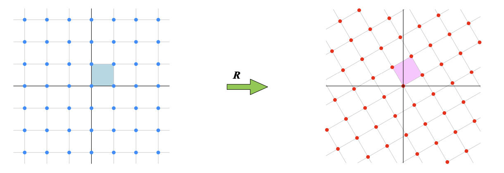

$\boldsymbol{R}$ 的行列式为$1$，即旋转前后面积不变：
$$
\det(\begin{bmatrix} \cos{\theta} & -\sin{\theta}\\ \sin{\theta} & \cos{\theta}\end{bmatrix}) = \cos^2\theta + \sin^2\theta = 1
$$
对于数据矩阵情况，逆时针旋转 $\theta$ 的矩阵乘法如下：
$$
\boldsymbol{Z}_{n \times 2} = \boldsymbol{X}_{n \times 2} \boldsymbol{R}^T =\boldsymbol{X}_{n \times 2}\begin{bmatrix} \cos{\theta} & \sin{\theta}\\ -\sin{\theta} & \cos{\theta}\end{bmatrix}
$$

#### 4. 镜像 `reflection`

**关于切向量 $\boldsymbol{\tau}$ 镜像**
$$
\boldsymbol{\tau} = \begin{bmatrix} \tau_1 \\ \tau_2 \end{bmatrix}
$$
过原点、切向量为 $\boldsymbol{\tau}$ 直线**镜像**的线性变换操作如下
$$
\begin{bmatrix} z_1 \\ z_2 \end{bmatrix} = 
\underbrace{\frac{1}{\big\Vert \boldsymbol{\tau} \big\Vert^2} \begin{bmatrix} \tau_1^2-\tau_2^2 & 2\tau_1\tau_2 \\ 2\tau_1\tau_2 & \tau_2^2-\tau_1^2 \end{bmatrix}}_{\boldsymbol{T}} \begin{bmatrix} x_1 \\ x_2 \end{bmatrix}
$$
$\boldsymbol{T}$ 的行列式值为负数，线性变换前后图形发生翻转。
$$
\det\left(\frac{1}{\big\Vert \boldsymbol{\tau} \big\Vert^2} \begin{bmatrix} \tau_1^2-\tau_2^2 & 2\tau_1\tau_2 \\ 2\tau_1\tau_2 & \tau_2^2-\tau_1^2 \end{bmatrix}\right) = \dfrac{-(\tau_1^2 - \tau_2^2)^2 - 4\tau_1^2\tau_2^2}{\big\Vert \boldsymbol{\tau} \big\Vert^4} = \dfrac{-(\tau_1^2 + \tau_2^2)^2}{(\tau_1^2 + \tau_2^2)^2} = -1
$$
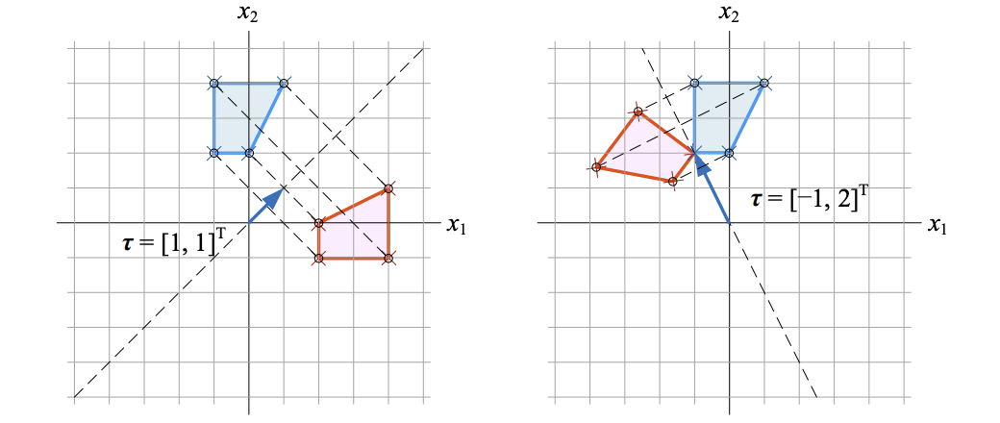

**关于通过原点，方向和横轴夹角 $\theta$ 直线镜像**，切向量 $\boldsymbol{\tau} = \begin{bmatrix} \cos\theta \\ \sin\theta \end{bmatrix}$，完成镜像的运算
$$
\begin{bmatrix} z_1 \\ z_2 \end{bmatrix} = 
\underbrace{\begin{bmatrix} \cos2\theta&\sin2\theta \\ \sin2\theta&-\cos2\theta \end{bmatrix}}_{\boldsymbol{T}} \begin{bmatrix} x_1 \\ x_2 \end{bmatrix}
$$
**关于横纵轴镜像**
$$
\begin{array}{lcl}
\begin{bmatrix} z_1 \\ z_2 \end{bmatrix} = 
\underbrace{\begin{bmatrix} 1&0 \\ 0&-1 \end{bmatrix}}_{\text{关于横轴镜像}} \begin{bmatrix} x_1 \\ x_2 \end{bmatrix} \\
\begin{bmatrix} z_1 \\ z_2 \end{bmatrix} = 
\underbrace{\begin{bmatrix} -1&0 \\ 0&1 \end{bmatrix}}_{\text{关于纵轴镜像}} \begin{bmatrix} x_1 \\ x_2 \end{bmatrix}
\end{array}
$$

#### 5. 投影 `projection`

给定某点的坐标为 $(x_1, x_2)$，向通过原点，切向量为 $\boldsymbol{\tau} = \begin{bmatrix} \tau_1 \\ \tau_2 \end{bmatrix}$ 直线方向**投影**，投影点坐标 $(z_1,z_2)$ 为：
$$
\begin{bmatrix} z_1 \\ z_2 \end{bmatrix} = 
\underbrace{\frac{1}{\big\Vert \boldsymbol{\tau} \big\Vert^2} \begin{bmatrix} \tau_1^2 & \tau_1\tau_2 \\ \tau_1\tau_2 & \tau_2^2 \end{bmatrix}}_{\boldsymbol{P}} \begin{bmatrix} x_1 \\ x_2 \end{bmatrix}
$$
正交投影的特点， $(x_1, x_2)$ 和 $(z_1,z_2)$ 两点连线垂直于 $\boldsymbol{\tau}$，**投影是一个降维的过程**。投影矩阵 $\boldsymbol{P}$ 的行列式值为 $0$。

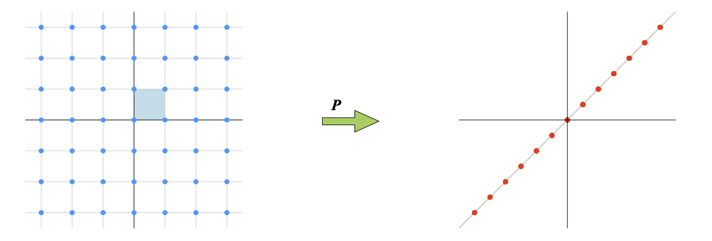

**横纵轴投影**
$$
\begin{array}{lcl}
\begin{bmatrix} z_1 \\ z_2 \end{bmatrix} = 
\underbrace{\begin{bmatrix} 1&0 \\ 0&0 \end{bmatrix}}_{\text{向横轴投影}} \begin{bmatrix} x_1 \\ x_2 \end{bmatrix} \\
\begin{bmatrix} z_1 \\ z_2 \end{bmatrix} = 
\underbrace{\begin{bmatrix} 0&0 \\ 0&1 \end{bmatrix}}_{\text{向纵轴投影}} \begin{bmatrix} x_1 \\ x_2 \end{bmatrix}
\end{array}
$$
**秩**

$\boldsymbol{P}$ 的列向量线性相关，$\boldsymbol{P}$ 的**秩**为 $1$，即 $\text{rank}(\boldsymbol{P}) = 1$。
$$
\boldsymbol{P} = \frac{1}{\big\Vert \boldsymbol{\tau} \big\Vert^2} \begin{bmatrix} \tau_1^2 & \tau_1\tau_2 \\ \tau_1\tau_2 & \tau_2^2 \end{bmatrix} = \frac{1}{\big\Vert \boldsymbol{\tau} \big\Vert^2}\begin{bmatrix} \tau_1\begin{bmatrix}\tau_1\\\tau_2\end{bmatrix} & \tau_2\begin{bmatrix}\tau_1\\\tau_2\end{bmatrix}\end{bmatrix}
$$
**张量积**
$$
\boldsymbol{P} = \frac{1}{\big\Vert \boldsymbol{\tau} \big\Vert^2} \begin{bmatrix} \tau_1^2 & \tau_1\tau_2 \\ \tau_1\tau_2 & \tau_2^2 \end{bmatrix} = \frac{1}{\big\Vert \boldsymbol{\tau} \big\Vert^2}\begin{bmatrix} \tau_1\begin{bmatrix}\tau_1\\\tau_2\end{bmatrix} & \tau_2\begin{bmatrix}\tau_1\\\tau_2\end{bmatrix}\end{bmatrix} = \frac{1}{\big\Vert \boldsymbol{\tau} \big\Vert^2}\begin{bmatrix}\tau_1\\\tau_2\end{bmatrix}\begin{bmatrix}\tau_1&\tau_2\end{bmatrix} = \left(\frac{1}{\big\Vert \boldsymbol{\tau} \big\Vert}\begin{bmatrix}\tau_1\\\tau_2\end{bmatrix}\right)\left(\frac{1}{\big\Vert \boldsymbol{\tau} \big\Vert}\begin{bmatrix}\tau_1\\\tau_2\end{bmatrix}\right)^T
$$
$\boldsymbol{\tau}$ 单位化得到的单位向量 $\hat{\boldsymbol{\tau}}$：
$$
\begin{array}{lcl}
\hat{\boldsymbol{\tau}} = \dfrac{1}{\big\Vert \boldsymbol{\tau} \big\Vert}\begin{bmatrix}\tau_1\\\tau_2\end{bmatrix} \\
\Rightarrow \\
\boldsymbol{P} = \hat{\boldsymbol{\tau}}\hat{\boldsymbol{\tau}}^T = \hat{\boldsymbol{\tau}} \otimes \hat{\boldsymbol{\tau}}
\end{array}
$$

### 行列式的几何意义

对于 $2 \times 2$ 矩阵 $\boldsymbol{A}$，$\boldsymbol{A}\boldsymbol{x} = \boldsymbol{b}$ 代表某种几何变换，$\boldsymbol{A}$ 的行列式值决定了变换前后面积缩放比例。$\boldsymbol{A} = \begin{bmatrix} \boldsymbol{a}_1 & \boldsymbol{a}_2 \end{bmatrix}$，在 $\boldsymbol{A}$ 的作用下，单位向量 $\boldsymbol{e}_1$ 和 $\boldsymbol{e}_2$ 变成了 $\boldsymbol{a}_1$ 和 $\boldsymbol{a}_2$：
$$
\underbrace{\begin{bmatrix} \boldsymbol{a}_1 & \boldsymbol{a}_2 \end{bmatrix}}_{\boldsymbol{A}}\underset{\boldsymbol{e}_1}{\begin{bmatrix} 1\\0 \end{bmatrix}} = \boldsymbol{a}_1, \quad
\underbrace{\begin{bmatrix} \boldsymbol{a}_1 & \boldsymbol{a}_2 \end{bmatrix}}_{\boldsymbol{A}}\underset{\boldsymbol{e}_2}{\begin{bmatrix} 0\\1 \end{bmatrix}} = \boldsymbol{a}_2
$$

- $0 \lt \big\vert \boldsymbol{A} \big\vert \lt 1$，变换之后平面几何形状面积缩小。
- $\big\vert \boldsymbol{A} \big\vert = 1$，变换之后平面几何形状面积不变。
- $\big\vert \boldsymbol{A} \big\vert \gt 1$，变换之后平面几何形状面积放大。
- $\big\vert \boldsymbol{A} \big\vert = 0$，从几何上来看，$\boldsymbol{A}$ 中含有“降维”变换成分。
- $\big\vert \boldsymbol{A} \big\vert \lt 0$，从几何上来看，图形翻转。

| 几何变换                                            | 图例                                                         | 列向量坐标                                                   | 行向量坐标                                                   |
| --------------------------------------------------- | ------------------------------------------------------------ | ------------------------------------------------------------ | ------------------------------------------------------------ |
| 平移                                                | 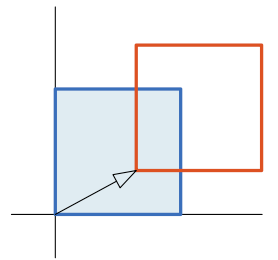 | $\begin{bmatrix} z_1 \\ z_2 \end{bmatrix} = \begin{bmatrix} x_1 \\ x_2 \end{bmatrix} + \begin{bmatrix} t_1 \\ t_2 \end{bmatrix}$ | $\begin{bmatrix} z_1 & z_2 \end{bmatrix} = \begin{bmatrix} x_1 & x_2 \end{bmatrix} + \begin{bmatrix} t_1 & t_2 \end{bmatrix}$  $\boldsymbol{Z}_{n \times 2} = \boldsymbol{X}_{n \times 2} + \begin{bmatrix} t_1 & t_2 \end{bmatrix}$ |
| 等比例缩放 $\text{s}$ 倍                            | 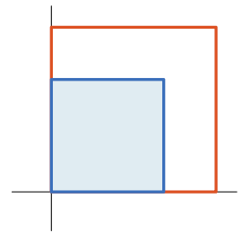 | $\begin{bmatrix} z_1 \\ z_2 \end{bmatrix} = s\begin{bmatrix} x_1 \\ x_2 \end{bmatrix} = \begin{bmatrix} s&0 \\ 0&s \end{bmatrix}\begin{bmatrix} x_1 \\ x_2 \end{bmatrix}$ | $\begin{bmatrix} z_1&z_2 \end{bmatrix} = s\begin{bmatrix} x_1&x_2 \end{bmatrix} = \begin{bmatrix} x_1 & x_2 \end{bmatrix}\begin{bmatrix} s&0 \\ 0&s \end{bmatrix}$  $\boldsymbol{Z}_{n \times 2} = \boldsymbol{X}_{n \times 2}\begin{bmatrix} s&0\\0&s \end{bmatrix}$ |
| 非等比例缩放                                        | 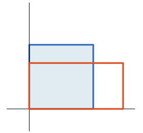 | $\begin{bmatrix} z_1 \\ z_2 \end{bmatrix}  = \begin{bmatrix} s_1&0 \\ 0&s_2 \end{bmatrix}\begin{bmatrix} x_1 \\ x_2 \end{bmatrix}$ | $\begin{bmatrix} z_1&z_2 \end{bmatrix} = \begin{bmatrix} x_1 & x_2 \end{bmatrix}\begin{bmatrix} s_1&0 \\ 0&s_2 \end{bmatrix}$  $\boldsymbol{Z}_{n \times 2} = \boldsymbol{X}_{n \times 2}\begin{bmatrix} s_1&0\\0&s_2 \end{bmatrix}$ |
| 挤压 $\text{s}$ 倍                                  | 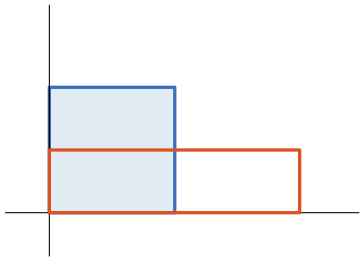 | $\begin{bmatrix} z_1 \\ z_2 \end{bmatrix}  = \begin{bmatrix} s&0 \\ 0&\cfrac{1}{s} \end{bmatrix}\begin{bmatrix} x_1 \\ x_2 \end{bmatrix}$ | $\begin{bmatrix} z_1&z_2 \end{bmatrix} = \begin{bmatrix} x_1 & x_2 \end{bmatrix}\begin{bmatrix} s&0 \\ 0&\cfrac{1}{s} \end{bmatrix}$  $\boldsymbol{Z}_{n \times 2} = \boldsymbol{X}_{n \times 2}\begin{bmatrix} s&0 \\ 0&\cfrac{1}{s} \end{bmatrix}$ |
| 逆时针旋转 $\theta$                                 | 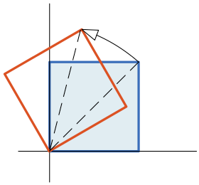 | $\begin{bmatrix} z_1 \\ z_2 \end{bmatrix}  = \begin{bmatrix} \cos\theta&-\sin\theta \\ \sin\theta&\cos\theta \end{bmatrix}\begin{bmatrix} x_1 \\ x_2 \end{bmatrix}$ | $\begin{bmatrix} z_1&z_2 \end{bmatrix} = \begin{bmatrix} x_1 & x_2 \end{bmatrix}\begin{bmatrix} \cos\theta&\sin\theta \\ -\sin\theta&\cos\theta \end{bmatrix}$  $\boldsymbol{Z}_{n \times 2} = \boldsymbol{X}_{n \times 2} \boldsymbol{R}^T =\boldsymbol{X}_{n \times 2}\begin{bmatrix} \cos{\theta} & \sin{\theta}\\ -\sin{\theta} & \cos{\theta}\end{bmatrix}$ |
| 顺时针旋转 $\theta$                                 | 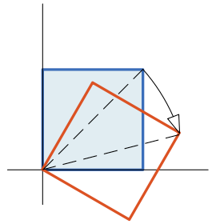 | $\begin{bmatrix} z_1 \\ z_2 \end{bmatrix}  = \begin{bmatrix} \cos\theta&\sin\theta \\ -\sin\theta&\cos\theta \end{bmatrix}\begin{bmatrix} x_1 \\ x_2 \end{bmatrix}$ | $\begin{bmatrix} z_1&z_2 \end{bmatrix} = \begin{bmatrix} x_1 & x_2 \end{bmatrix}\begin{bmatrix} \cos\theta&-\sin\theta \\ \sin\theta&\cos\theta \end{bmatrix}$  $\boldsymbol{Z}_{n \times 2} = \boldsymbol{X}_{n \times 2} \boldsymbol{R}^T =\boldsymbol{X}_{n \times 2}\begin{bmatrix} \cos{\theta} & -\sin{\theta}\\ \sin{\theta} & \cos{\theta}\end{bmatrix}$ |
| 关于通过原点、切向量为 $\boldsymbol{\tau}$ 直线镜像 |  | $\begin{bmatrix} z_1 \\ z_2 \end{bmatrix} = \cfrac{1}{\big\Vert \boldsymbol{\tau} \big\Vert^2} \begin{bmatrix} \tau_1^2-\tau_2^2 & 2\tau_1\tau_2 \\ 2\tau_1\tau_2 & \tau_2^2-\tau_1^2 \end{bmatrix} \begin{bmatrix} x_1 \\ x_2 \end{bmatrix}$ | $\begin{bmatrix} z_1 & z_2 \end{bmatrix} = \begin{bmatrix} x_1 & x_2 \end{bmatrix}\cfrac{1}{\big\Vert \boldsymbol{\tau} \big\Vert^2} \begin{bmatrix} \tau_1^2-\tau_2^2 & 2\tau_1\tau_2 \\ 2\tau_1\tau_2 & \tau_2^2-\tau_1^2 \end{bmatrix}$  $\boldsymbol{Z}_{n \times 2} =\boldsymbol{X}_{n \times 2}\cfrac{1}{\big\Vert \boldsymbol{\tau} \big\Vert^2} \begin{bmatrix} \tau_1^2-\tau_2^2 & 2\tau_1\tau_2 \\ 2\tau_1\tau_2 & \tau_2^2-\tau_1^2 \end{bmatrix}$ |
| 关于通过原点、方向和横轴夹角为 $\theta$ 直线镜像    | 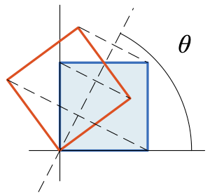 | $\begin{bmatrix} z_1 \\ z_2 \end{bmatrix} = \begin{bmatrix} \cos2\theta&\sin2\theta \\ \sin2\theta&-\cos2\theta \end{bmatrix} \begin{bmatrix} x_1 \\ x_2 \end{bmatrix}$ | $\begin{bmatrix} z_1 & z_2 \end{bmatrix} =  \begin{bmatrix} x_1 & x_2 \end{bmatrix}\begin{bmatrix} \cos2\theta&\sin2\theta \\ \sin2\theta&-\cos2\theta \end{bmatrix}$  $\boldsymbol{Z}_{n \times 2} =\boldsymbol{X}_{n \times 2}\begin{bmatrix} \cos2\theta&\sin2\theta \\ \sin2\theta&-\cos2\theta \end{bmatrix}$ |
| 关于横轴镜像对称                                    | 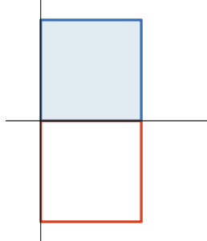 | $\begin{bmatrix} z_1 \\ z_2 \end{bmatrix} = \begin{bmatrix} 1&0 \\ 0&-1 \end{bmatrix} \begin{bmatrix} x_1 \\ x_2 \end{bmatrix}$ | $\begin{bmatrix} z_1 & z_2 \end{bmatrix} = \begin{bmatrix} x_1 & x_2 \end{bmatrix}\begin{bmatrix} 1&0 \\ 0&-1 \end{bmatrix}$  $\boldsymbol{Z}_{n \times 2} =\boldsymbol{X}_{n \times 2}\begin{bmatrix} 1&0 \\ 0&-1 \end{bmatrix}$ |
| 关于纵轴镜像对称                                    | 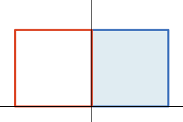 | $\begin{bmatrix} z_1 \\ z_2 \end{bmatrix} = \begin{bmatrix} -1&0 \\ 0&1 \end{bmatrix} \begin{bmatrix} x_1 \\ x_2 \end{bmatrix}$ | $\begin{bmatrix} z_1 & z_2 \end{bmatrix} = \begin{bmatrix} x_1 & x_2 \end{bmatrix}\begin{bmatrix} -1&0 \\ 0&1 \end{bmatrix}$  $\boldsymbol{Z}_{n \times 2} =\boldsymbol{X}_{n \times 2}\begin{bmatrix} -1&0 \\ 0&1 \end{bmatrix}$ |
| 向通过原点、切向量为 $\boldsymbol{\tau}$ 正交投影   | 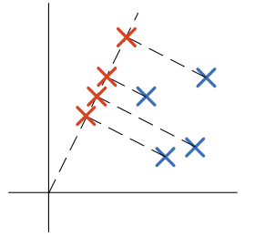 | $\begin{bmatrix} z_1 \\ z_2 \end{bmatrix} = \cfrac{1}{\big\Vert \boldsymbol{\tau} \big\Vert^2} \begin{bmatrix} \tau_1^2 & \tau_1\tau_2 \\ \tau_1\tau_2 & \tau_2^2 \end{bmatrix} \begin{bmatrix} x_1 \\ x_2 \end{bmatrix}$ | $\begin{bmatrix} z_1 & z_2 \end{bmatrix} = \begin{bmatrix} x_1 & x_2 \end{bmatrix}\cfrac{1}{\big\Vert \boldsymbol{\tau} \big\Vert^2} \begin{bmatrix} \tau_1^2 & \tau_1\tau_2 \\ \tau_1\tau_2 & \tau_2^2 \end{bmatrix}$  $\boldsymbol{Z}_{n \times 2} = \boldsymbol{X}_{n \times 2}\cfrac{1}{\big\Vert \boldsymbol{\tau} \big\Vert^2} \begin{bmatrix} \tau_1^2 & \tau_1\tau_2 \\ \tau_1\tau_2 & \tau_2^2 \end{bmatrix}$ |
| 向横轴正交投影                                      | 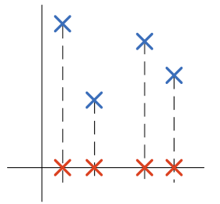 | $\begin{bmatrix} z_1 \\ z_2 \end{bmatrix} = \begin{bmatrix} 1&0 \\ 0&0 \end{bmatrix} \begin{bmatrix} x_1 \\ x_2 \end{bmatrix}$ | $\begin{bmatrix} z_1 & z_2 \end{bmatrix} = \begin{bmatrix} x_1 & x_2 \end{bmatrix}\begin{bmatrix} 1&0 \\ 0&0 \end{bmatrix}$  $\boldsymbol{Z}_{n \times 2} =\boldsymbol{X}_{n \times 2}\begin{bmatrix} 1&0 \\ 0&0 \end{bmatrix}$ |
| 向纵轴正交投影                                      | 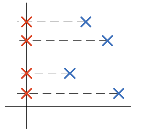 | $\begin{bmatrix} z_1 \\ z_2 \end{bmatrix} = \begin{bmatrix} 0&0 \\ 0&1 \end{bmatrix} \begin{bmatrix} x_1 \\ x_2 \end{bmatrix}$ | $\begin{bmatrix} z_1 & z_2 \end{bmatrix} = \begin{bmatrix} x_1 & x_2 \end{bmatrix}\begin{bmatrix} 0&0 \\ 0&1 \end{bmatrix}$  $\boldsymbol{Z}_{n \times 2} =\boldsymbol{X}_{n \times 2}\begin{bmatrix} 0&0 \\ 0&1 \end{bmatrix}$ |
| 沿水平方向剪切，$\theta$ 为剪切角                   | 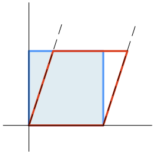 | $\begin{bmatrix} z_1 \\ z_2 \end{bmatrix} = \begin{bmatrix} 1&\cot\theta \\ 0&1 \end{bmatrix} \begin{bmatrix} x_1 \\ x_2 \end{bmatrix}$ | $\begin{bmatrix} z_1 & z_2 \end{bmatrix} = \begin{bmatrix} x_1 & x_2 \end{bmatrix}\begin{bmatrix} 1&0 \\ \cot\theta&1 \end{bmatrix}$  $\boldsymbol{Z}_{n \times 2} =\boldsymbol{X}_{n \times 2}\begin{bmatrix} 1&0 \\ \cot\theta&1 \end{bmatrix}$ |
| 沿竖直方向剪切，$\theta$ 为剪切角                   | 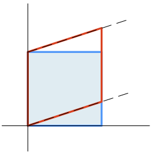 | $\begin{bmatrix} z_1 \\ z_2 \end{bmatrix} = \begin{bmatrix} 1&0 \\ \cot\theta&1 \end{bmatrix} \begin{bmatrix} x_1 \\ x_2 \end{bmatrix}$ | $\begin{bmatrix} z_1 & z_2 \end{bmatrix} = \begin{bmatrix} x_1 & x_2 \end{bmatrix}\begin{bmatrix} 1&\cot\theta \\ 0&1 \end{bmatrix}$  $\boldsymbol{Z}_{n \times 2} =\boldsymbol{X}_{n \times 2}\begin{bmatrix} 1&\cot\theta \\ 0&1 \end{bmatrix}$ |

