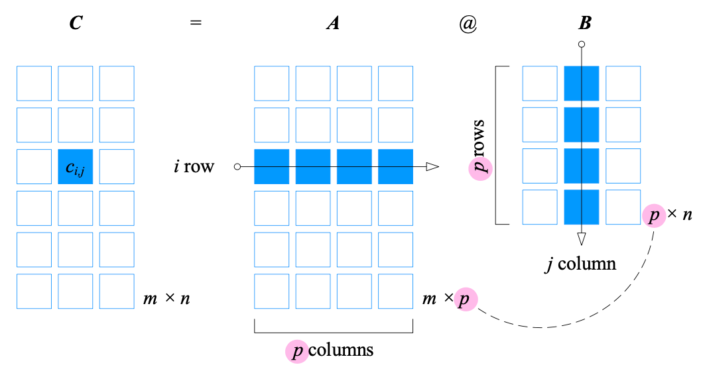

## 矩阵 `matrix`

矩阵使用大写、斜体字母表示：$\boldsymbol{A}$ , $\boldsymbol{B}$​。$n$ 行 $D$ 列的矩阵 $\boldsymbol X$。 

$$
\boldsymbol{X}_{n \times D} = 
\begin{bmatrix}
x_{1,1}&x_{1,2}&\cdots&x_{1,D}\\
x_{2,1}&x_{2,2}&\cdots&x_{2,D}\\
\vdots&\vdots&\ddots&\vdots\\
x_{n,1}&x_{n,2}&\cdots&x_{n,D}
\end{bmatrix}
$$

形状为 $n \times D$ 的矩阵 $\boldsymbol{X}$ 可以看作$D$ 个列向量左右排列或$n$ 个行向量上下叠放。

$$
\begin{alignat}{2}
\boldsymbol{X}_{n \times D} &=
\begin{bmatrix}
\boldsymbol{x}_1&\boldsymbol{x}_2&\cdots&\boldsymbol{x}_i&\cdots&\boldsymbol{x}_D
\end{bmatrix} \\
&=\begin{bmatrix}
\boldsymbol{x}^{(1)}\\
\boldsymbol{x}^{{(2)}}\\
\vdots\\
\boldsymbol{x}^{{(j)}}\\
\vdots\\
\boldsymbol{x}^{{(n)}}
\end{bmatrix}
\end{alignat}
$$

### 矩阵转置 `matrix transpose`

将矩阵的行列互换得到的新矩阵，$n \times D$ 的矩阵转置之后的形状是 $D \times n$。 

$$
\boldsymbol{A}^T = 
\begin{bmatrix}\boldsymbol{a_1}&&\boldsymbol{a_2}&&\cdots&&\boldsymbol{a_D}\end{bmatrix}^T =
\begin{bmatrix}
\boldsymbol{a_1}^T\\
\boldsymbol{a_2}^T\\
\vdots\\
\boldsymbol{a_D}^T\\
\end{bmatrix}
$$

$$
\boldsymbol{A}^T = 
\begin{bmatrix}
\boldsymbol{a}^{(1)}\\
\boldsymbol{a}^{(2)}\\
\vdots\\
\boldsymbol{a}^{(n)}
\end{bmatrix}^T = 
\begin{bmatrix}
\boldsymbol{a}^{(1)T}&&\boldsymbol{a}^{(2)T}&&\cdots&&\boldsymbol{a}^{(n)T}
\end{bmatrix}
$$

### 特殊的矩阵

**行向量是 $1 \times D$ 的矩阵，列向量是 $n \times 1$的矩阵**。

| 特殊矩阵                    | 说明                                                         | 示例                                                |
| --------------------------- | ------------------------------------------------------------ | --------------------------------------------------- |
| 全$1$向量 `all-ones vector` | 列向量的元素都是 $1$，记作 $\boldsymbol{1}$                  | $\begin{bmatrix}1&1&\cdots&1\end{bmatrix}^T$        |
| 零向量 `zero vector`        | 列向量的元素都是 $0$，记作 $\boldsymbol{0}$                  | $\begin{bmatrix}0&0&\cdots&0\end{bmatrix}^T$        |
| 方阵 `square matrix`        | 行和列相同的矩阵，即矩阵形状是 $n \times n$                  | $\begin{bmatrix}1&2\\3&4\end{bmatrix}$              |
| 对角矩阵 `diagonal matrix`  | 除主对角线之外的元素都是 $0$ 的方阵                          | $\begin{bmatrix}1&0&0\\0&4&0\\0&0&9\end{bmatrix}$   |
| 单位矩阵 `identity matrix`  | 主对角线元素为 $1$ 其余元素都是 $0$ 的方阵，记作 $\boldsymbol{I}$ | $\begin{bmatrix}1&0&0\\0&1&0\\0&0&1\end{bmatrix}$   |
| 对称矩阵 `symmetric matrix` | 元素相对于主对角线轴对称的方阵，即$\boldsymbol{A}=\boldsymbol{A}^T$ | $\begin{bmatrix}1&-2&5\\-2&3&8\\5&8&1\end{bmatrix}$ |
| 零矩阵 `null matrix`        | 所有元素都是 $0$ 的方阵                                      | $\begin{bmatrix}0&0&0\\0&0&0\\0&0&0\end{bmatrix}$   |

### 矩阵加减

形状相同的矩阵之间可以进行加减法运算，计算方式是对应位置的元素加减运算。
$$
\boldsymbol{a} + \boldsymbol{b} = \begin{bmatrix}a_1&a_2&\cdots&a_n\end{bmatrix} + \begin{bmatrix}b_1&b_2&\cdots&b_n\end{bmatrix} = \begin{bmatrix}{a_1+b_1}&{a_2+b_2}&\cdots&{a_n+b_n}\end{bmatrix}
$$

$$
\boldsymbol{a} + \boldsymbol{b} = \begin{bmatrix}a_1\\a_2\\\vdots\\a_n\end{bmatrix} + \begin{bmatrix}b_1\\b_2\\\vdots\\b_n\end{bmatrix} = \begin{bmatrix}{a_1+b_1}\\{a_2+b_2}\\\cdots\\{a_n+b_n}\end{bmatrix}
$$

$$
\boldsymbol{A}_{m \times n} + \boldsymbol{B}_{m \times n} = 
\begin{bmatrix}
a_{1,1}&&a_{1,2}&&\cdots&&a_{1,n}\\
a_{2,1}&&a_{2,2}&&\cdots&&a_{2,n}\\
\vdots&&\vdots&&\ddots&&\vdots\\
a_{m,1}&&a_{m,2}&&\cdots&&a_{m,n}
\end{bmatrix} + 
\begin{bmatrix}
b_{1,1}&&b_{1,2}&&\cdots&&b_{1,n}\\
b_{2,1}&&b_{2,2}&&\cdots&&b_{2,n}\\
\vdots&&\vdots&&\ddots&&\vdots\\
b_{m,1}&&b_{m,2}&&\cdots&&b_{m,n}
\end{bmatrix} \\= 
\begin{bmatrix}
{a_{1,1} + b_{1,1}}&&{a_{1,2} + b_{1,2}}&&\cdots&&{a_{1,n} + b_{1,n}}\\
{a_{2,1} + b_{2,1}}&&{a_{2,2} + b_{2,2}}&&\cdots&&{a_{2,n} + b_{2,n}}\\
\vdots&&\vdots&&\ddots&&\vdots\\
{a_{m,1} + b_{m,1}}&&{a_{m,2} + b_{m,2}}&&\cdots&&{a_{m,n} + b_{m,n}}
\end{bmatrix}
$$

### 矩阵乘法

矩阵 $\boldsymbol{A}$ 和 $\boldsymbol{B}$ 相乘的前提是矩阵 $\boldsymbol{A}$ 的列数和矩阵 $\boldsymbol{B}$ 的行数相同，写作 $\boldsymbol{A}\boldsymbol{B}$，`numpy`中矩阵相乘运算符是`@`。
$$
\boldsymbol{C}_{m \times n} = \boldsymbol{A}_{m \times p}\boldsymbol{B}_{p \times n} = \boldsymbol{A}_{m \times p}\text{@}\boldsymbol{B}_{p \times n}
$$
矩阵乘法一般情况下**不满足交换律**。
$$
\boldsymbol{A}_{m \times p}\boldsymbol{B}_{p \times n} \neq \boldsymbol{B}_{p \times n}\boldsymbol{A}_{m \times p}
$$

$$
\boldsymbol{C}=\boldsymbol{A}\boldsymbol{B}=\begin{bmatrix}1&2\\3&4\end{bmatrix}\begin{bmatrix}4&2\\3&1\end{bmatrix}=\begin{bmatrix}1\times4+2\times3&&1\times2+2\times1\\3\times4+4\times3&&3\times2+4\times1\end{bmatrix}=\begin{bmatrix}10&4\\24&10\end{bmatrix}
$$

#### 向量相乘

向量 $\boldsymbol{a}$ 和 $\boldsymbol{b}$ 为等长列向量，$\boldsymbol{a}^T$ 乘 $\boldsymbol{b}$ 为标量，等价于 $\boldsymbol{a}$ 和 $\boldsymbol{b}$ 的标量积，即 $\boldsymbol{a}^T\boldsymbol{b}=\boldsymbol{a} \cdot \boldsymbol{b}$。$\boldsymbol{a}$ 乘 $\boldsymbol{b}^T$ 结果为方阵。
$$
\begin{array}{lcl}
\boldsymbol{a} = \begin{bmatrix}1\\2\\3\end{bmatrix}, \quad 
\boldsymbol{b}=\begin{bmatrix}4\\3\\2\end{bmatrix} \\
\boldsymbol{a}^T\boldsymbol{b} 
= \begin{bmatrix}1&2&3\end{bmatrix}\begin{bmatrix}4\\3\\2\end{bmatrix}
= 1\times4+2\times3+3\times2=16\\
\boldsymbol{a}\boldsymbol{b}^T 
= \begin{bmatrix}1\\2\\3\end{bmatrix}\begin{bmatrix}4&3&2\end{bmatrix}
= \begin{bmatrix}1\times4&1\times3&1\times2\\2\times4&2\times3&2\times2\\3\times4&3\times3&3\times2\end{bmatrix}
= \begin{bmatrix}4&3&2\\8&6&4\\12&9&6\end{bmatrix}
\end{array}
$$

#### 矩阵乘法

矩阵乘积 $\boldsymbol{A}\boldsymbol{B}$ 中，$\boldsymbol{A}$ 的形状是 $m \times p$，可以写成上下叠放的 $m$ 个行向量 $\boldsymbol{a}^{(i)}$，每个 $\boldsymbol{a}^{(i)}$ 有 $p$ 个元素。$\boldsymbol{B}$ 的形状是 $p \times n$，可以写成左右排列的 $n$ 个列向量，每个 $\boldsymbol{b}_j$ 有 $p$​ 个元素。

**A** 中的第 *i* 行向量 **a**(*i*) 乘以 **B** 中第 *j* 列向量 **b***j*，得到标量 **a**(*i*)**b***j*，对应乘积矩 阵 **C** 中第 *i* 行、第 *j* 列元素 *c**i,j*
$$
\boldsymbol{A}_{m \times p} \text{@} \boldsymbol{B}_{p \times n} 
= \begin{bmatrix}\boldsymbol{a}^{(1)}\\\boldsymbol{a}^{(2)}\\\vdots\\\boldsymbol{a}^{(m)}\end{bmatrix}_{m \times 1}\begin{bmatrix}\boldsymbol{b}_{1}&\boldsymbol{b}_{2}&\cdots&\boldsymbol{b}_{n}\end{bmatrix}_{1 \times n}
=\begin{bmatrix}\boldsymbol{a}^{(1)}\cdot\boldsymbol{b}_1&\boldsymbol{a}^{(1)}\cdot\boldsymbol{b}_2&\cdots&\boldsymbol{a}^{(1)}\cdot\boldsymbol{b}_n\\\boldsymbol{a}^{(2)}\cdot\boldsymbol{b}_1&\boldsymbol{a}^{(2)}\cdot\boldsymbol{b}_2&\cdots&\boldsymbol{a}^{(2)}\cdot\boldsymbol{b}_n\\\vdots&\vdots&\ddots&\vdots\\\boldsymbol{a}^{(m)}\cdot\boldsymbol{b}_1&\boldsymbol{a}^{(m)}\cdot\boldsymbol{b}_2&\vdots&\boldsymbol{a}^{(m)}\cdot\boldsymbol{b}_n\end{bmatrix}_{m \times n}
= \boldsymbol{C}_{m \times n}
$$

#### 矩阵除法

