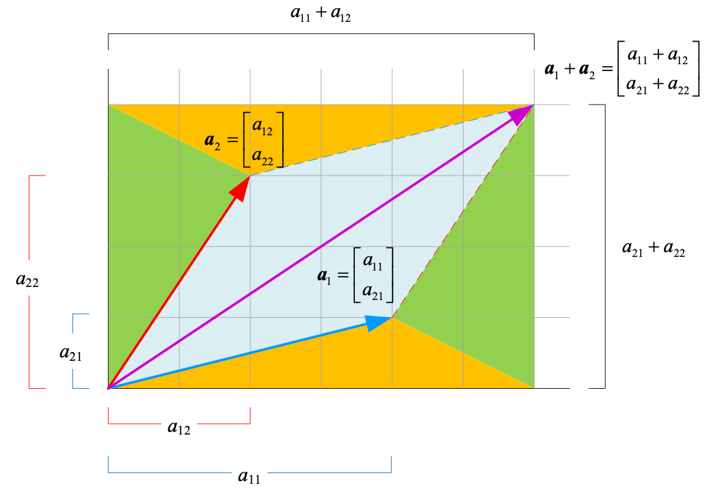
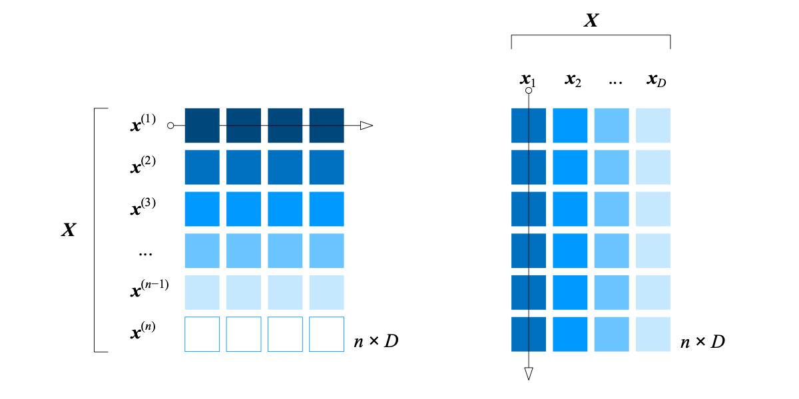
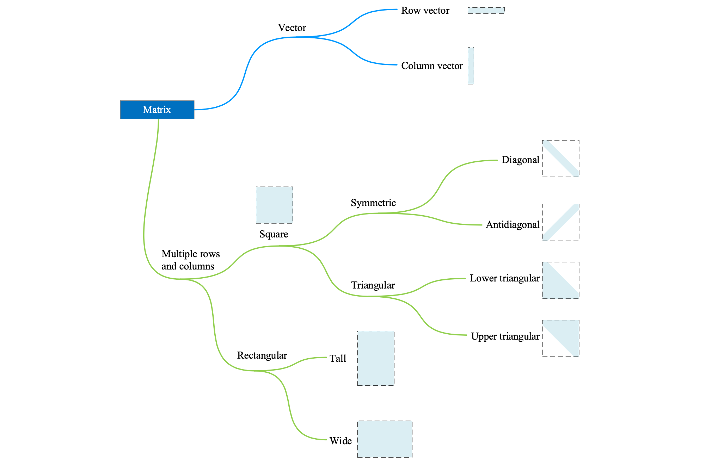

## 矩阵`Matrix`

矩阵是由标量组成的矩形**数组**，矩阵内的元素不局限于标量，也可以是虚数、符号、代数式、偏导等等。通常将更高维度的数组叫做**张量`tensor`**，因此向量和矩阵通常可以看做是一维和二维张量，张量是不同参考系间特定的变换法则。

矩阵两大主要功能：**表格**和**线性映射**。

一个 $n \times D$ 矩阵 $\boldsymbol{X}$ 定义如下：
$$
\boldsymbol{X}_{n \times D} = 
\begin{bmatrix}
x_{1,1}&x_{1,2}&\cdots&x_{1,D}\\
x_{2,1}&x_{2,2}&\cdots&x_{2,D}\\
\vdots&\vdots&\ddots&\vdots\\
x_{n,1}&x_{n,2}&\cdots&x_{n,D}
\end{bmatrix}
$$
其中，$n$ 是**矩阵行数**，$D$ 是**矩阵列数**。从样本数据角度看，$n$ 是样本数，$D$ 是样本数据特征数。

矩阵 $\boldsymbol{X}$ 中**元素 $x_{i,j}$** 被称作 $(i,j)$ 元素，第 $i$ 行、第 $j$ 列元素。

矩阵 $\boldsymbol{X}$ 可以看做是一组上下叠放的行向量或一组左右放置的列向量，用纵线或横线将矩阵划分成**分块矩阵**。
$$
\begin{array}{lcl}
\boldsymbol{X}_{n \times D} =
\begin{bmatrix}
\boldsymbol{x}_1&\boldsymbol{x}_2&\cdots&\boldsymbol{x}_j&\cdots&\boldsymbol{x}_D
\end{bmatrix}, \quad \boldsymbol{x}_j = \begin{bmatrix} x_{1,j}\\x_{2,j}\\\vdots\\x_{n,j} \end{bmatrix} \\

\boldsymbol{X}_{n \times D} = 
\begin{bmatrix}
\boldsymbol{x}^{(1)}\\
\boldsymbol{x}^{{(2)}}\\
\vdots\\
\boldsymbol{x}^{{(i)}}\\
\vdots\\
\boldsymbol{x}^{{(n)}}
\end{bmatrix}, \quad \boldsymbol{x}^{(i)} = \begin{bmatrix} x_{i,1}&x_{i,2}&\cdots&x_{i,D} \end{bmatrix}

\end{array}
$$

### 矩阵形状

#### 方阵

行、列数相等的矩阵称为**方阵**，$n \times n$ 的矩阵称为 **$n$ 阶方阵**，**对称矩阵**的右上方和左下方元素以**主对角线**镜像对称，对称矩阵**转置**结果是矩阵自身。
$$
\boldsymbol{A} = \boldsymbol{A}^T
$$

#### 对角矩阵

**对角矩阵**是除主对角线之外的元素都是 $0$ 的矩阵：
$$
\boldsymbol{\varLambda}_{n \times n} = 
\begin{bmatrix}
\lambda_1&0&\cdots&0 \\
0&\lambda_2&\cdots&0 \\
\vdots&\vdots&\ddots&\vdots \\
0&0&\cdots&\lambda_n
\end{bmatrix}
$$
对角矩阵也可以是长方形矩阵，即**长方形对角矩阵**。

**副对角矩阵**是除副对角线之外的元素都是 $0$ 的矩阵。

#### 单位矩阵

**$n$ 阶单位矩阵**的特点是 $n \times n$ 方阵对角线上的元素为 $1$，其余元素为 $0$，使用 $\boldsymbol{I}$ 表示。
$$
\boldsymbol{I}_{n \times n} = 
\begin{bmatrix}
1&0&\cdots&0 \\
0&1&\cdots&0 \\
\vdots&\vdots&\ddots&\vdots \\
0&0&\cdots&1 
\end{bmatrix}
$$

#### 三角矩阵

方阵对角线以下元素均为 $0$，称为**上三角矩阵**，记作 $\boldsymbol{U}_{n \times n}$；方阵对角线以上元素均为 $0$，称为**下三角矩阵**，记作 $\boldsymbol{L}_{n \times n}$。
$$
\boldsymbol{U}_{n \times n} = 
\begin{bmatrix} 
u_{1,1}&u_{1,2}&\cdots&u_{1,n} \\ 
0&u_{2,2}&\cdots&u_{2,n} \\
\vdots&\vdots&\ddots&\vdots \\
0&0&\cdots&u_{n,n}
\end{bmatrix}, 
\quad
\boldsymbol{L}_{n \times n} = 
\begin{bmatrix} 
l_{1,1}&0&\cdots&0 \\ 
l_{2,1}&l_{2,2}&\cdots&0 \\
\vdots&\vdots&\ddots&\vdots \\
l_{n,1}&l_{n,2}&\cdots&l_{n,n}
\end{bmatrix}
$$
如果矩阵 $\boldsymbol{A}$ 是**可逆矩阵**，则 $\boldsymbol{A}$ 可以通过 $LU$ 分解变成一个下三角矩阵 $\boldsymbol{L}$ 和一个上三角矩阵 $\boldsymbol{U}$ 的乘积。

#### 长方形矩阵

**长方形矩阵**是指行数和列数不相等的矩阵。

### 矩阵加减

两个相同大小的矩阵 $\boldsymbol{A}$ 和 $\boldsymbol{B}$ 相加，是将这两个矩阵对应位置元素相加：
$$
\boldsymbol{A}_{m \times n} + \boldsymbol{B}_{m \times n} = 
\begin{bmatrix}
a_{1,1} + b_{1,1}&a_{1,2} + b_{1,2}&\cdots&a_{1,n} + b_{1,n}\\
a_{2,1} + b_{2,1}&a_{2,2} + b_{2,2}&\cdots&a_{2,n} + b_{2,n}\\
\cdots&\cdots&\ddots&\cdots\\
a_{m,1} + b_{m,1}&a_{m,2} + b_{m,2}&\cdots&a_{m,n} + b_{m,n}
\end{bmatrix}_{m \times n}
$$
矩阵加法满足**交换律**和**结合律**：
$$
\begin{array}{lcl}
\boldsymbol{A} + \boldsymbol{B} = \boldsymbol{B} + \boldsymbol{A} \\
\boldsymbol{A} + \boldsymbol{B} + \boldsymbol{C} = (\boldsymbol{A} + \boldsymbol{B}) + \boldsymbol{C} = \boldsymbol{A} + (\boldsymbol{B} + \boldsymbol{C})
\end{array}
$$
**矩阵减法**的运算规则与加法一致。

元素全为 $0$ 的矩阵，即**零矩阵**，记作 $\boldsymbol{O}$。零矩阵具有如下性质：
$$
\begin{array}{lcl}
\boldsymbol{A} + \boldsymbol{O} = \boldsymbol{O} + \boldsymbol{A} = \boldsymbol{A} \\
\boldsymbol{A} - \boldsymbol{A} = \boldsymbol{O}
\end{array}
$$

### 矩阵标量乘法

矩阵乘以标量时，矩阵的每一个元素都乘以该标量，这种运算叫做**标量乘法**，标量 $k$ 和矩阵 $\boldsymbol{X}$ 的乘积记作 $k\boldsymbol{X}$。
$$
k\boldsymbol{X}_{n \times D} = 
\begin{bmatrix}
k \cdot x_{1,1} & k \cdot x_{1,2} & \cdots & k \cdot x_{1,D} \\
k \cdot x_{2,1} & k \cdot x_{2,2} & \cdots & k \cdot x_{2,D} \\
\vdots & \vdots & \ddots & \vdots \\
k \cdot x_{n,1} & k \cdot x_{n,2} & \cdots & k \cdot x_{n,D} \\
\end{bmatrix}
$$
当 $k = 0$ 时，结果为零矩阵 $\boldsymbol{O}_{n \times D}$。

