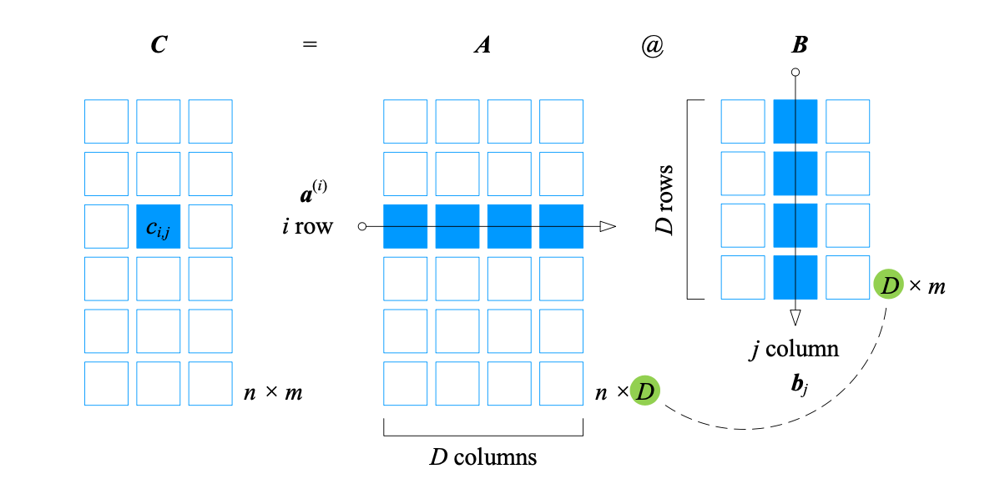

## 矩阵乘法

矩阵的核心功能之一是**线性映射**，线性映射体现在矩阵乘法中，$\boldsymbol{A}\boldsymbol{x}=\boldsymbol{b}$ 完成 $\boldsymbol{x} \rightarrow \boldsymbol{b}$ 的线性映射，如果 $\boldsymbol{A}$ 可逆，$\boldsymbol{A}^{-1}$完成 $\boldsymbol{b} \rightarrow \boldsymbol{x}$ 的线性映射。 

$$
\boldsymbol{x} \xrightleftharpoons[\boldsymbol{x}=\boldsymbol{A}^{-1}\boldsymbol{b}]{\boldsymbol{A}\boldsymbol{x}=\boldsymbol{b}} \boldsymbol{b}
$$

矩阵 $\boldsymbol{A}$ 的列数等于矩阵 $\boldsymbol{B}$ 的行数，$\boldsymbol{A}$ 和 $\boldsymbol{B}$ 两个矩阵可以相乘。
$$
\begin{array}{lcl}
\boldsymbol{A}_{n \times D} = 
\begin{bmatrix}
a_{1,1}&a_{1,2}&\cdots&a_{1,D}\\
a_{2,1}&a_{2,2}&\cdots&a_{2,D}\\
\vdots&\vdots&\ddots&\vdots\\
a_{n,1}&a_{n,2}&\cdots&a_{n,D}
\end{bmatrix}, \quad
\boldsymbol{B}_{D \times m} = 
\begin{bmatrix}
b_{1,1}&b_{1,2}&\cdots&b_{1,m}\\
b_{2,1}&b_{2,2}&\cdots&b_{2,m}\\
\vdots&\vdots&\ddots&\vdots\\
b_{D,1}&b_{D,2}&\cdots&b_{D,m}
\end{bmatrix}
\\
\boldsymbol{C}_{n \times m} = \boldsymbol{A}_{n \times D} \boldsymbol{B}_{D \times m} = \boldsymbol{A}_{n \times D}\text{@}\boldsymbol{B}_{D \times m} = 
\begin{bmatrix}
c_{1,1}&c_{1,2}&\cdots&c_{1,m}\\
c_{2,1}&c_{2,2}&\cdots&c_{2,m}\\
\vdots&\vdots&\ddots&\vdots\\
c_{n,1}&c_{D,2}&\cdots&c_{n,m}
\end{bmatrix}, \quad c_{i,j} = a_{i,1}b_{1,j} + a_{i,2}b_{2,j} + \cdots + a_{i,D}b_{D,j}
\end{array}
$$
$\text{@}$ 是`Numpy`中的矩阵乘法运算符，$\boldsymbol{C}$ 的 $(i,j)$ 元素是 $\boldsymbol{A}$ 第 $i$ 行元素分别和 $\boldsymbol{B}$ 第 $j$ 列元素相乘，再求和。

$\boldsymbol{a}^{(i)}$ 是 $\boldsymbol{A}$ 第 $i$ 行元素构成的行向量，$\boldsymbol{b}_j$ 是 $\boldsymbol{B}$ 的第 $j$ 列元素构成的列向量，$\boldsymbol{a}^{(i)}$ 和 $\boldsymbol{b}_j$ 元素个数都是 $D$，$c_{i,j}$ 可以表示为矩阵乘法或两个列向量的向量内积。
$$
c_{i,j} = \boldsymbol{a}^{(i)}\boldsymbol{b}_j = \boldsymbol{a}^{(i)T} \cdot \boldsymbol{b}_j = \left \langle \boldsymbol{a}^{(i)T}, \boldsymbol{b}_j \right \rangle
$$
矩阵乘法的规则
$$
\begin{align}
\boldsymbol{A}\boldsymbol{O} &= \boldsymbol{O} \\
\boldsymbol{A}\boldsymbol{B}\boldsymbol{C} &= \boldsymbol{A}(\boldsymbol{B}\boldsymbol{C}) = (\boldsymbol{A}\boldsymbol{B})\boldsymbol{C} \\
k(\boldsymbol{A}\boldsymbol{B}) &= (k\boldsymbol{A})\boldsymbol{B} = \boldsymbol{A}(k\boldsymbol{B}) = (\boldsymbol{A}\boldsymbol{B})k \\
\boldsymbol{A}(\boldsymbol{B} + \boldsymbol{C}) &= \boldsymbol{A}\boldsymbol{B} + \boldsymbol{A}\boldsymbol{C} 
\end{align}
$$
矩阵乘法一般情况下不满足交换律
$$
\boldsymbol{A}\boldsymbol{B} \neq \boldsymbol{B}\boldsymbol{A}
$$
矩阵和单位矩阵的乘法
$$
\boldsymbol{A}_{m \times n}\boldsymbol{I}_{n \times n} = \boldsymbol{A}_{m \times n} \\
\boldsymbol{I}_{m \times m}\boldsymbol{A}_{m \times n} = \boldsymbol{A}_{m \times n}
$$
$n$ 阶方阵 $\boldsymbol{A}$ 的**矩阵的幂**
$$
\begin{align}
\boldsymbol{A}^0 &= \boldsymbol{I} \\
\boldsymbol{A}^1 &= \boldsymbol{A} \\
\boldsymbol{A}^2 &= \boldsymbol{A}\boldsymbol{A} \\
\boldsymbol{A}^{n+1} &= \boldsymbol{A}^n\boldsymbol{A}
\end{align}
$$
