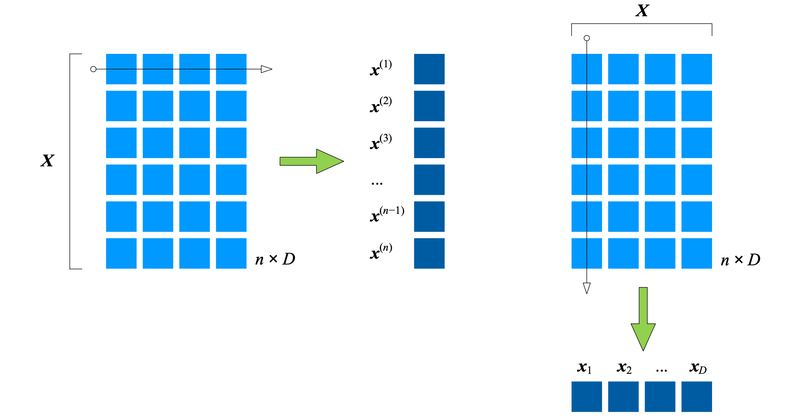
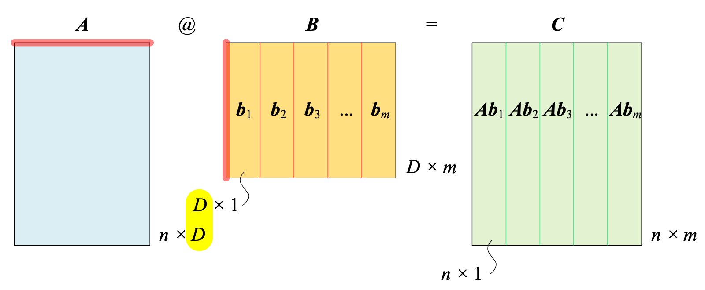
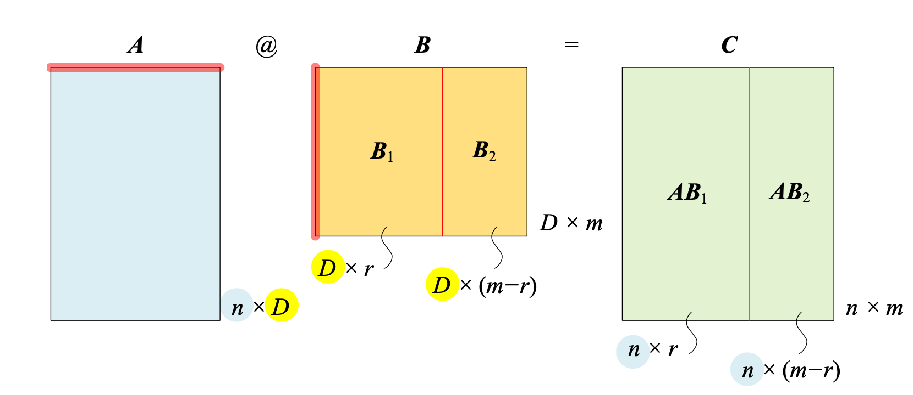

## 分块矩阵 `Block Matrix`

**分块矩阵**将一个矩阵用若干条横线和竖线分割成多个**子块矩阵**。

**切丝、切条**

将矩阵 $\boldsymbol{X}_{n \times D}$ 看做是 $n$ 个行向量或 $D$ 个列向量按照一定规则构造而成。

$$
\boldsymbol{X}_{n \times D} = \begin{bmatrix} \boldsymbol{x}^{(1)} \\ \boldsymbol{x}^{(2)}   \\ \vdots \\ \boldsymbol{x}^{(n)} \end{bmatrix} = \begin{bmatrix} \boldsymbol{x}_1 & \boldsymbol{x}_2 & \cdots & \boldsymbol{x}_D \end{bmatrix} = \begin{bmatrix} x_{1,1}&x_{1,2}&\cdots&x_{1,D} \\ x_{2,1}&x_{2,2}&\cdots&x_{2,D} \\ \vdots&\vdots&\ddots&\vdots \\ x_{n,1}&x_{n,2}&\cdots&x_{n,D} \end{bmatrix}
$$
**切块**
$$
\boldsymbol{X}_{n \times D} = \begin{bmatrix} \boldsymbol{X}_{r \times q} & \boldsymbol{X}_{r \times (D-q)} \\ \boldsymbol{X}_{(n-r) \times q} & \boldsymbol{X}_{(n-r) \times (D-q)}\end{bmatrix}
$$
例如
$$
\boldsymbol{A} = \begin{bmatrix} 1&2&3&0&0\\4&5&6&0&0\\0&0&0&-1&0\\0&0&0&0&1 \end{bmatrix} = \begin{bmatrix} \boldsymbol{A}_{1,1} & \boldsymbol{A}_{1,2} \\ \boldsymbol{A}_{2,1} & \boldsymbol{A}_{2,2} \end{bmatrix} \\\\
\boldsymbol{A}_{1,1} = \begin{bmatrix} 1&2&3\\4&5&6 \end{bmatrix},\quad \boldsymbol{A}_{1,2} = \begin{bmatrix} 0&0 \\ 0&0 \end{bmatrix},\quad \boldsymbol{A}_{2,1} = \begin{bmatrix} 0&0&0 \\ 0&0&0 \end{bmatrix},\quad \boldsymbol{A}_{2,2} = \begin{bmatrix} -1&0 \\ 0&1 \end{bmatrix}
$$

### 分块矩阵运算

#### 转置

**转置运算**由两层构成：第一层将子块当成元素，进行转置；第二层是对子块矩阵转置运算。
$$
\boldsymbol{X}_{n \times D}^T = \begin{bmatrix} \boldsymbol{x}^{(1)T} & \boldsymbol{x}^{(2)T} & \cdots & \boldsymbol{x}^{(n)T} \end{bmatrix} = \begin{bmatrix} \boldsymbol{x}_1^T \\ \boldsymbol{x}_2^T \\ \vdots \\ \boldsymbol{x}_D^T \end{bmatrix} \\\\

\boldsymbol{A}^T = \begin{bmatrix} \boldsymbol{A}_{1,1}^T & \boldsymbol{A}_{2,1}^T \\ \boldsymbol{A}_{1,2}^T & \boldsymbol{A}_{2,2}^T \end{bmatrix} 
$$

#### 标量乘法

$$

$$

#### 加减法

$$

$$

#### 矩阵乘法

上式中分块矩阵的乘法有两层运算。第一层矩阵乘法将子块视作元素来完成矩阵乘法，第二 层是子块矩阵之间矩阵乘法
$$

$$

### 矩阵乘法

#### 矩阵 $\times$ 列向量

$\boldsymbol{A}$ 和 $\boldsymbol{B}$ 相乘时，将 $\boldsymbol{B}$ 分割成列向量：
$$
\boldsymbol{A}\boldsymbol{B} = \boldsymbol{A}\begin{bmatrix} \boldsymbol{b}_1 & \boldsymbol{b}_2 & \cdots & \boldsymbol{b}_m \end{bmatrix} = \begin{bmatrix} \boldsymbol{A}\boldsymbol{b}_1 & \boldsymbol{A}\boldsymbol{b}_2 & \cdots & \boldsymbol{A}\boldsymbol{b}_m \end{bmatrix}
$$

如果存在一组形状相同的矩阵-列向量运算，则可以将运行结果合并：
$$
\begin{array}{lcl}
\boldsymbol{A}\boldsymbol{b}_1 = \boldsymbol{c}_1,\quad \boldsymbol{A}\boldsymbol{b}_2 = \boldsymbol{c}_2,\quad \cdots,\quad \boldsymbol{A}\boldsymbol{b}_m = \boldsymbol{c}_m
\\ \Rightarrow \\
\boldsymbol{A}\underbrace{\begin{bmatrix} \boldsymbol{b}_1 & \boldsymbol{b}_2 & \cdots & \boldsymbol{b}_m \end{bmatrix}}_{\small\boldsymbol{B}} = \underbrace{\begin{bmatrix} \boldsymbol{c}_1 & \boldsymbol{c}_2 & \cdots & \boldsymbol{c}_m \end{bmatrix}}_{\small\boldsymbol{C}}
\end{array}
$$

#### 矩阵 $\times$ 子块矩阵

$$
\boldsymbol{A}\boldsymbol{B} = \boldsymbol{A}\begin{bmatrix} \boldsymbol{B}_1 & \boldsymbol{B}_2 \end{bmatrix} = \begin{bmatrix} \boldsymbol{A}\boldsymbol{B}_1 & \boldsymbol{A}\boldsymbol{B}_2 \end{bmatrix}
$$

