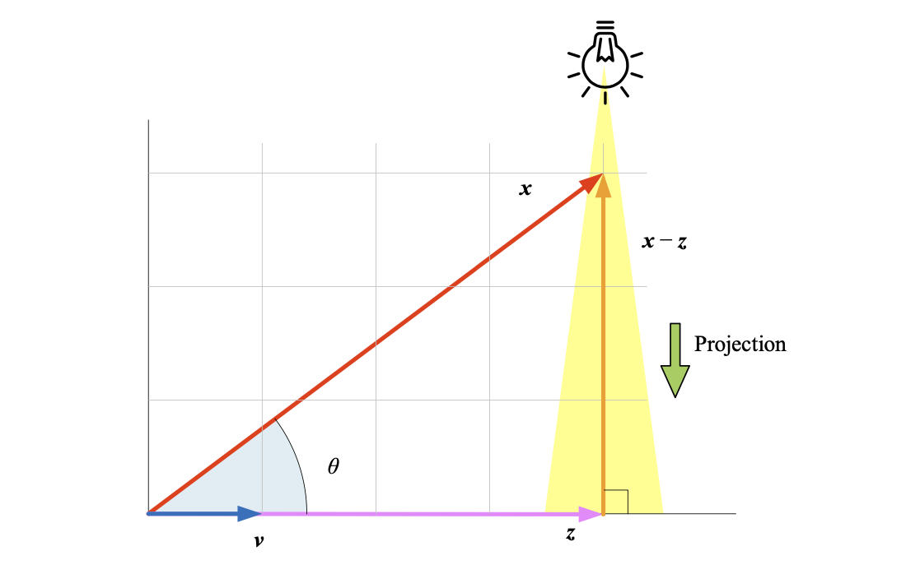
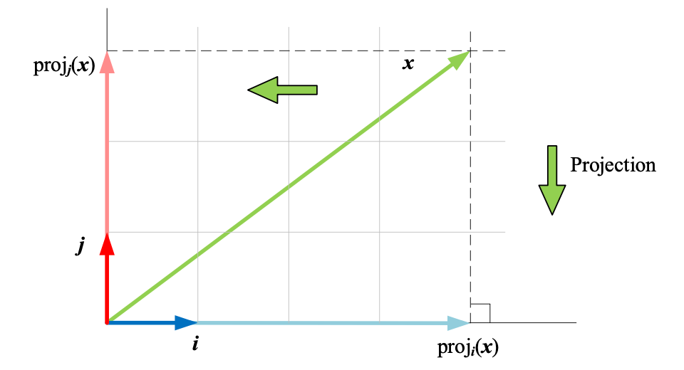

## 正交投影 `Orthogonal Projection`

**正交投影**类似正午头顶阳光将物体投影到地面上，光线之间相互平行且与地面**垂直**。

$\boldsymbol{x}$ 在 $\boldsymbol{v}$ 方向上的投影是向量 $\boldsymbol{z}$，$\boldsymbol{z}$ 的模就是 $\boldsymbol{x}$ 在$\boldsymbol{v}$ 方向上的**标量投影**：
$$
\text{s} = \big\Vert \boldsymbol{z} \big\Vert, \quad \boldsymbol{z} = \text{s}\dfrac{\boldsymbol{v}}{\big\Vert \boldsymbol{v} \big\Vert}
$$
向量 $\boldsymbol{x} - \boldsymbol{z}$ 与 $\boldsymbol{z}$ 正交
$$
(\boldsymbol{x} - \boldsymbol{z}) \perp \boldsymbol{v} \Rightarrow (\boldsymbol{x} - \boldsymbol{z}) \cdot \boldsymbol{v} = (\boldsymbol{x} - \boldsymbol{z})^T \boldsymbol{v} = 0 \\
\left(\boldsymbol{x} - \text{s}\dfrac{\boldsymbol{v}}{\big\Vert \boldsymbol{v} \big\Vert}\right)^T \boldsymbol{v} = 0 \Rightarrow 
\left(\boldsymbol{x}^T - \dfrac{\text{s}}{\big\Vert \boldsymbol{v} \big\Vert}\boldsymbol{v}^T\right)\boldsymbol{v} = 0 \Rightarrow 
\boldsymbol{x}^T\boldsymbol{v} - \text{s}\dfrac{\boldsymbol{v}^T\boldsymbol{v}}{\big\Vert \boldsymbol{v} \big\Vert} \Rightarrow 
\text{s} = \dfrac{\boldsymbol{x}^T\boldsymbol{v}}{\big\Vert \boldsymbol{v} \big\Vert}
$$

向量 $\boldsymbol{x}$ 和 $\boldsymbol{v}$ 的相对夹角是 $\theta$，向量 $\boldsymbol{x}$ 在 $\boldsymbol{v}$ 方向上的**标量投影**：

$$
\text{s} = \big\Vert \boldsymbol{z} \big\Vert = \dfrac{\boldsymbol{x}^T\boldsymbol{v}}{\big\Vert \boldsymbol{v} \big\Vert} = \dfrac{\boldsymbol{v}^T\boldsymbol{x}}{\big\Vert \boldsymbol{v} \big\Vert} = \dfrac{\boldsymbol{x} \cdot \boldsymbol{v}}{\big\Vert \boldsymbol{v} \big\Vert} = \dfrac{\boldsymbol{v} \cdot \boldsymbol{x}}{\big\Vert \boldsymbol{v} \big\Vert} = \dfrac{\langle \boldsymbol{x}, \boldsymbol{v}\rangle}{\big\Vert \boldsymbol{v} \big\Vert} = \big\Vert \boldsymbol{x} \big\Vert \cos\theta
$$
**向量投影**是标量投影结果乘上 $\boldsymbol{v}$ 的方向，即 $\text{s}$ 乘以 $\boldsymbol{v}$ 的单位向量：
$$
\text{proj}_{\boldsymbol{v}}(\boldsymbol{x}) = \text{s}\dfrac{\boldsymbol{v}}{\big\Vert \boldsymbol{v} \big\Vert} = \dfrac{\boldsymbol{x} \cdot \boldsymbol{v}}{{\big\Vert \boldsymbol{v} \big\Vert}^2} \boldsymbol{v}  = \dfrac{\boldsymbol{v} \cdot \boldsymbol{x}}{\boldsymbol{v} \cdot \boldsymbol{v}} \boldsymbol{v} = \dfrac{\boldsymbol{x} \cdot \boldsymbol{v}}{\boldsymbol{v} \cdot \boldsymbol{v}} \boldsymbol{v} = \dfrac{\boldsymbol{x^T} \boldsymbol{v}}{\boldsymbol{v^T} \boldsymbol{v}} \boldsymbol{v} = \dfrac{\boldsymbol{v^T} \boldsymbol{x}}{\boldsymbol{v^T} \boldsymbol{v}} \boldsymbol{v} = \dfrac{\langle \boldsymbol{x}, \boldsymbol{v}\rangle}{\langle \boldsymbol{v}, \boldsymbol{v}\rangle} \boldsymbol{v}
$$
**_Example_** 获取向量在平面直角坐标系上的坐标，即是计算向量分别向单位向量 $\boldsymbol{i} = \begin{bmatrix} 1\\0 \end{bmatrix}$ 和 $\boldsymbol{j} = \begin{bmatrix} 0\\1 \end{bmatrix}$​ 方向上的标量投影。

### 1 投影坐标

点 $(x_1, x_2)$ 在通过原点、切向量 $\boldsymbol{\tau} = \begin{bmatrix} \tau_1 & \tau_2 \end{bmatrix}^T$ 直线方向上正交投影的点的坐标 $(z_1, z_2)$ 为：
$$
\boldsymbol{z} = \dfrac{\boldsymbol{\tau} \cdot \boldsymbol{x}}{\big\Vert \boldsymbol{\tau} \big\Vert^2}\boldsymbol{\tau} = \dfrac{x_1\tau_1 + x_2\tau_2}{\big\Vert \boldsymbol{\tau} \big\Vert^2}\begin{bmatrix} \tau_1 \\ \tau_2 \end{bmatrix} = \dfrac{1}{\big\Vert \boldsymbol{\tau} \big\Vert^2}\begin{bmatrix} x_1\tau_1^2 + x_2\tau_1\tau_2 \\ x_1\tau_1\tau_2 + x_2\tau_2^2 \end{bmatrix} = \dfrac{1}{\big\Vert \boldsymbol{\tau} \big\Vert^2}\begin{bmatrix} \tau_1^2 & \tau_1\tau_2\\\tau_1\tau_2&\tau_2^2  \end{bmatrix}\begin{bmatrix} x_1\\x_2 \end{bmatrix}
$$
设 $\boldsymbol{v}$ 为单位列向量

$$
\text{proj}_{\boldsymbol{v}}(\boldsymbol{x}) = \underset{\small\text{Scaler}}{\left(\boldsymbol{v}^T\boldsymbol{x}\right)}\boldsymbol{v} = \boldsymbol{v}\underset{\small\text{Scaler}}{\left(\boldsymbol{v}^T\boldsymbol{x}\right)} = \boldsymbol{v}\boldsymbol{v}^T\boldsymbol{x} = \left(\boldsymbol{v} \otimes \boldsymbol{v}\right)\boldsymbol{x}
$$

$\boldsymbol{v} \otimes \boldsymbol{v}$​ 为**投影矩阵**，通过向量张量积则**投影坐标**为：
$$
\boldsymbol{z} = \dfrac{1}{\big\Vert \boldsymbol{\tau} \big\Vert^2}(\boldsymbol{\tau} \otimes \boldsymbol{\tau})\boldsymbol{x} = (\dfrac{\boldsymbol{\tau}}{\big\Vert \boldsymbol{\tau} \big\Vert} \otimes \dfrac{\boldsymbol{\tau}}{\big\Vert \boldsymbol{\tau} \big\Vert})\boldsymbol{x} = (\hat{\boldsymbol{\tau}} \otimes \hat{\boldsymbol{\tau}})\boldsymbol{x}
$$

**数据矩阵**

数据矩阵 $\boldsymbol{X}$ 中的样本点的坐标值通常以行向量表示，即 $\boldsymbol{X} = \begin{bmatrix} \boldsymbol{x}^{(1)} & \boldsymbol{x}^{(2)} & \cdots & \boldsymbol{x}^{(n)}\end{bmatrix}^T$，$\boldsymbol{X}$ 向单位向量 $\boldsymbol{v}$ 方向投影得到的标量投影，即 $\boldsymbol{X}$ 在 $\text{span}({\boldsymbol{v}})$ 的坐标：
$$
\boldsymbol{Z} = \boldsymbol{X}\boldsymbol{v}
$$
$\boldsymbol{X}$ 向单位向量 $\boldsymbol{v}$ 方向投影得到的向量投影则为：
$$
\boldsymbol{Z} = (\boldsymbol{X}\boldsymbol{v})\boldsymbol{v}^T = \boldsymbol{X}(\boldsymbol{v} \otimes \boldsymbol{v})
$$

### 2 正交矩阵 `orthogonal matrix`

$n$ 阶方阵 $\boldsymbol{V}$ 满足
$$
\boldsymbol{V}^T\boldsymbol{V} = \boldsymbol{I}
$$
则称 $\boldsymbol{V}$ 为**正交矩阵**，正交矩阵基本性质
$$
\begin{array}{lcl}
\boldsymbol{V}\boldsymbol{V}^T = \boldsymbol{V}^T\boldsymbol{V} = \boldsymbol{I} \\
\boldsymbol{V}^T = \boldsymbol{V}^{-1}
\end{array}
$$

#### 2.1 矩阵乘法第一视角展开

向量内积
$$
\begin{array}{lcl}
\boldsymbol{V}_{n \times n} 
= \begin{bmatrix}
v_{1,1} & v_{1,2} & \cdots & v_{1,n} \\
v_{2,1} & v_{2,2} & \cdots & v_{2,n} \\
\vdots  & \vdots  & \ddots & \vdots  \\
v_{n,1} & v_{n,2} & \cdots & v_{n,n} \\
\end{bmatrix} 
= \begin{bmatrix} \boldsymbol{v}_1 & \boldsymbol{v}_2 & \cdots & \boldsymbol{v}_n \end{bmatrix}
\\
\boldsymbol{V}^T\boldsymbol{V} 
= \begin{bmatrix} {\boldsymbol{v}_1}^T \\ {\boldsymbol{v}_2}^T \\ \vdots \\ {\boldsymbol{v}_n}^T \end{bmatrix} \begin{bmatrix} \boldsymbol{v}_1 & \boldsymbol{v}_2 & \cdots & \boldsymbol{v}_n \end{bmatrix}
= \begin{bmatrix}
{\boldsymbol{v}_1}^T\boldsymbol{v}_1 & {\boldsymbol{v}_1}^T\boldsymbol{v}_2 & \cdots & {\boldsymbol{v}_1}^T\boldsymbol{v}_n \\
{\boldsymbol{v}_2}^T\boldsymbol{v}_1 & {\boldsymbol{v}_2}^T\boldsymbol{v}_2 & \cdots & {\boldsymbol{v}_2}^T\boldsymbol{v}_n \\
\vdots & \vdots & \ddots & \vdots \\
{\boldsymbol{v}_n}^T\boldsymbol{v}_1 & {\boldsymbol{v}_n}^T\boldsymbol{v}_2 & \cdots & {\boldsymbol{v}_n}^T\boldsymbol{v}_n \\
\end{bmatrix}
= \begin{bmatrix} 1&0&\cdots&0\\0&1&\cdots&0\\\vdots & \vdots & \ddots & \vdots\\0&0&\cdots&1\\ \end{bmatrix}
\\\Rightarrow\\
\begin{cases}
{\boldsymbol{v}_j}^T\boldsymbol{v}_j = \boldsymbol{v}_j \cdot \boldsymbol{v}_j = \big\Vert \boldsymbol{v}_j \big\Vert^2 = 1 & j = 1,2,\cdots,n \\
{\boldsymbol{v}_i}^T\boldsymbol{v}_j = 0 & i,j = 1,2,\cdots,n \quad i \neq j
\end{cases}
\end{array}
$$

**列向量 $\boldsymbol{v}_i$ 为单位向量，任意两个列向量两两正交**。

$\{\boldsymbol{v}_1, \boldsymbol{v}_2, \cdots, \boldsymbol{v}_n\}$ 为**规范正交基**，矩阵 $\boldsymbol{V}$ 张起一个 $n$ 维向量空间 $\mathbb{R}^n = \text{span}(\boldsymbol{v}_1, \boldsymbol{v}_2, \cdots, \boldsymbol{v}_n)$，$\begin{bmatrix}\boldsymbol{v}_1, \boldsymbol{v}_2, \cdots, \boldsymbol{v}_n\end{bmatrix}$ 是张起 $\mathbb{R}^n$ 无数规范正交基的一组。

**格拉姆矩阵 `Gram matrix`**

#### 2.2 矩阵乘法第二视角展开

向量张量积
$$
\begin{array}{lcl}
\boldsymbol{V}_{n \times n} = \begin{bmatrix} \boldsymbol{v}_1 & \boldsymbol{v}_2 & \cdots & \boldsymbol{v}_n \end{bmatrix} \\
\boldsymbol{V}\boldsymbol{V}^T = \begin{bmatrix} \boldsymbol{v}_1 & \boldsymbol{v}_2 & \cdots & \boldsymbol{v}_n \end{bmatrix} \begin{bmatrix} \boldsymbol{v}_1^T \\ \boldsymbol{v}_2^T \\ \vdots \\ \boldsymbol{v}_n^T \end{bmatrix} = \boldsymbol{v}_1\boldsymbol{v}_1^T + \boldsymbol{v}_2\boldsymbol{v}_2^T + \cdots + \boldsymbol{v}_n\boldsymbol{v}_n^T = \boldsymbol{I}_{n \times n}
\\\Rightarrow\\
\boldsymbol{V}\boldsymbol{V}^T = \boldsymbol{v}_1 \otimes \boldsymbol{v}_1 + \boldsymbol{v}_2 \otimes \boldsymbol{v}_2 + \cdots + \boldsymbol{v}_n \otimes \boldsymbol{v}_n = \boldsymbol{I}_{n \times n}
\end{array}
$$

**规范正交基对单位矩阵的分解**
$$
\boldsymbol{I}_{n \times n} = \boldsymbol{v}_1 \otimes \boldsymbol{v}_1 + \boldsymbol{v}_2 \otimes \boldsymbol{v}_2 + \cdots + \boldsymbol{v}_n \otimes \boldsymbol{v}_n = \sum_{i=1}^n\boldsymbol{v}_i \otimes \boldsymbol{v}_i
$$
每个 $\boldsymbol{v}_i \otimes \boldsymbol{v}_i$ 都是一个特定方向的**投影矩阵**。

#### 2.3 规范正交基

**_Example_** 如下矩阵 $\boldsymbol{V}$ 和 $\boldsymbol{W}$ 是正交矩阵，$\begin{bmatrix}\boldsymbol{v}_1, \boldsymbol{v}_2\end{bmatrix}$ 和 $\begin{bmatrix}\boldsymbol{w}_1, \boldsymbol{w}_2\end{bmatrix}$ 是规范正交基。
$$
\boldsymbol{V} = \begin{bmatrix}\boldsymbol{v}_1&\boldsymbol{v}_2\end{bmatrix} = \begin{bmatrix}\dfrac{\sqrt{3}}{2}&-\dfrac{1}{2}\\\dfrac{1}{2}&\dfrac{\sqrt{3}}{2}\end{bmatrix}, \quad
\boldsymbol{W} = \begin{bmatrix}\boldsymbol{w}_1&\boldsymbol{w}_2\end{bmatrix} = \begin{bmatrix}\dfrac{\sqrt{2}}{2}&-\dfrac{\sqrt{2}}{2}\\\dfrac{\sqrt{2}}{2}&\dfrac{\sqrt{2}}{2}\end{bmatrix}
$$
**投影坐标**

将列向量 $\boldsymbol{x} = \begin{bmatrix} 4\\3 \end{bmatrix}$ 投影到 $\boldsymbol{V}$ 这个规范正交系中的，投影坐标是
$$
\boldsymbol{V}^T\boldsymbol{x} = \begin{bmatrix}\boldsymbol{v}_1^T \\ \boldsymbol{v}_2^T\end{bmatrix}\boldsymbol{x} = \begin{bmatrix}\boldsymbol{v}_1^T\boldsymbol{x} \\ \boldsymbol{v}_2^T\boldsymbol{x}\end{bmatrix} = \begin{bmatrix}\text{proj}_{\boldsymbol{v}_1}(\boldsymbol{x})\\\text{proj}_{\boldsymbol{v}_2}(\boldsymbol{x})\end{bmatrix} = \begin{bmatrix}\boldsymbol{v}_1&\boldsymbol{v}_2\end{bmatrix} = \begin{bmatrix}\dfrac{\sqrt{3}}{2}&\dfrac{1}{2}\\-\dfrac{1}{2}&\dfrac{\sqrt{3}}{2}\end{bmatrix}\begin{bmatrix} 4\\3 \end{bmatrix} = \begin{bmatrix} 2\sqrt{3}+\dfrac{3}{2}\\-2+\dfrac{3\sqrt{3}}{2} \end{bmatrix}
$$
**向量模不变**

经过正交矩阵线性变换后，向量的 $L^2$ 范数，即向量模不变。
$$
\big\Vert \boldsymbol{V}^T\boldsymbol{x} \big\Vert^2 = \boldsymbol{V}^T\boldsymbol{x}\cdot\boldsymbol{V}^T\boldsymbol{x} = \Big(\boldsymbol{V}^T\boldsymbol{x}\Big)^T\boldsymbol{V}^T\boldsymbol{x} = \boldsymbol{x}^T\boldsymbol{V}\boldsymbol{V}^T\boldsymbol{x} = \boldsymbol{x}^T\boldsymbol{I}\boldsymbol{x} = \boldsymbol{x}^T\boldsymbol{x} = \boldsymbol{x} \cdot \boldsymbol{x} = \big\Vert \boldsymbol{x} \big\Vert^2
$$
**向量夹角不变**

列向量 $\boldsymbol{x}_1$ 和 $\boldsymbol{x}_2$ 经过正交矩阵 $\boldsymbol{V}$ 线性变换后得到 $\boldsymbol{z}_1$ 和 $\boldsymbol{z}_2$，**$\boldsymbol{z}_1$ 和 $\boldsymbol{z}_2$ 的夹角等同于 $\boldsymbol{x}_1$ 和 $\boldsymbol{x}_2$​ 的夹角**。
$$
\begin{align}
\cos(\boldsymbol{z}_1,\boldsymbol{z}_2) 
&=\dfrac{\boldsymbol{z}_1 \cdot \boldsymbol{z}_2}{\big\Vert\boldsymbol{z}_1\big\Vert\big\Vert\boldsymbol{z}_2\big\Vert} 
=\dfrac{\boldsymbol{z}_1 \cdot \boldsymbol{z}_2}{\big\Vert\boldsymbol{x}_1\big\Vert\big\Vert\boldsymbol{x}_2\big\Vert} 
=\dfrac{\boldsymbol{z}_1^T\boldsymbol{z}_2}{\big\Vert\boldsymbol{x}_1\big\Vert\big\Vert\boldsymbol{x}_2\big\Vert} \nonumber\\
&=\dfrac{\big(\boldsymbol{V}^T\boldsymbol{x}_1\big)^T\big(\boldsymbol{V}^T\boldsymbol{x}_2\big)}{\big\Vert\boldsymbol{x}_1\big\Vert\big\Vert\boldsymbol{x}_2\big\Vert} 
=\dfrac{\boldsymbol{x}_1^T\boldsymbol{V}\boldsymbol{V}^T\boldsymbol{x}_2}{\big\Vert\boldsymbol{x}_1\big\Vert\big\Vert\boldsymbol{x}_2\big\Vert} \nonumber\\
&=\dfrac{\boldsymbol{x}_1^T\boldsymbol{x}_2}{\big\Vert\boldsymbol{x}_1\big\Vert\big\Vert\boldsymbol{x}_2\big\Vert}
=\dfrac{\boldsymbol{x}_1\cdot\boldsymbol{x}_2}{\big\Vert\boldsymbol{x}_1\big\Vert\big\Vert\boldsymbol{x}_2\big\Vert}
=\cos(\boldsymbol{x}_1,\boldsymbol{x}_2) 
\end{align}
$$
**行列式值**

正交矩阵的行列式值为 $1$ 或 $-1$
$$
\Big(\det(\boldsymbol{V})\Big)^2 = \det(\boldsymbol{V}^T)\det(\boldsymbol{V}) = \det(\boldsymbol{V}^T\boldsymbol{V}) = \det(\boldsymbol{I}) = 1
$$
### 3 镜像坐标

### 4 格拉姆-施密特正交化

给定非正交 $n$ 个线性不相关的向量 $\begin{bmatrix}\boldsymbol{x}_1, \boldsymbol{x}_2, \ldots, \boldsymbol{x}_n\end{bmatrix}$，通过**格拉姆-施密特正交化**，可以得到 $n$ 个单位正交向量  $\{\boldsymbol{q}_1, \boldsymbol{q}_2, \ldots, \boldsymbol{q}_n\}$，它们可以构造一个规范正交基 $\begin{bmatrix}\boldsymbol{q}_1, \boldsymbol{q}_2, \ldots, \boldsymbol{q}_n\end{bmatrix}$。

