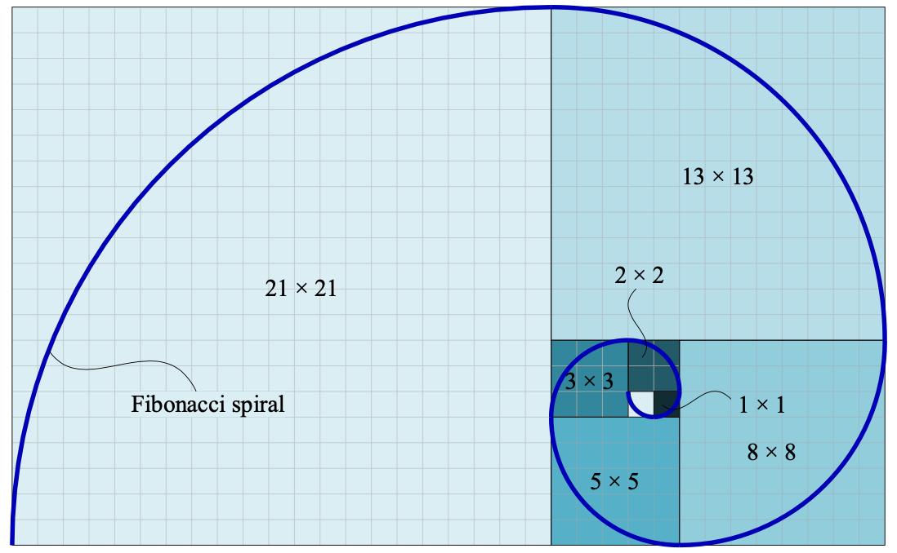
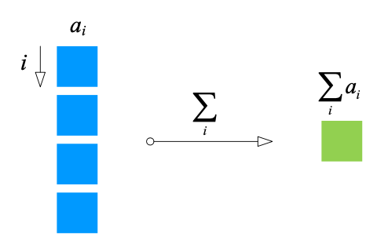
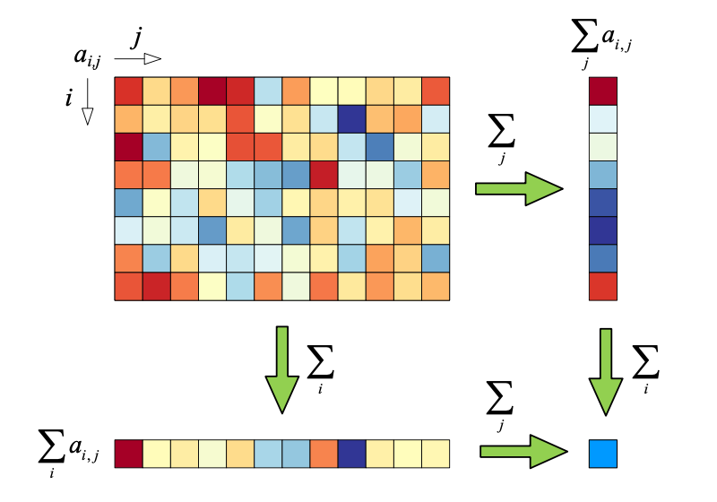
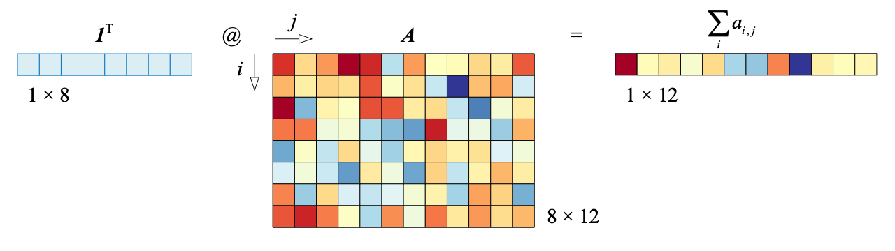
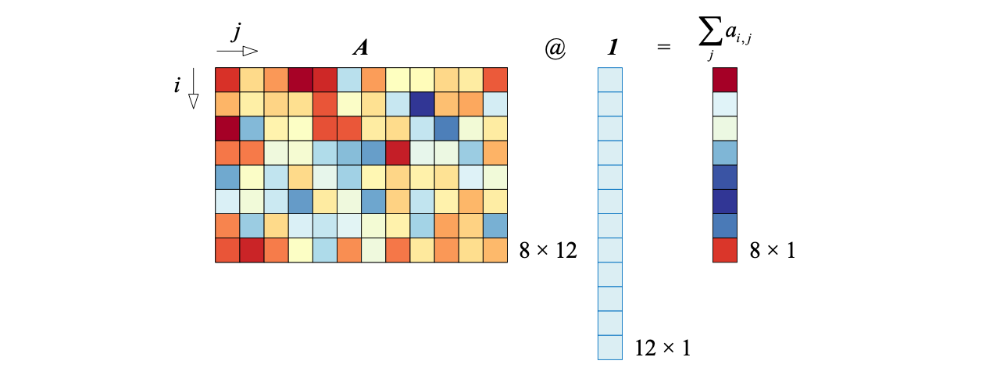
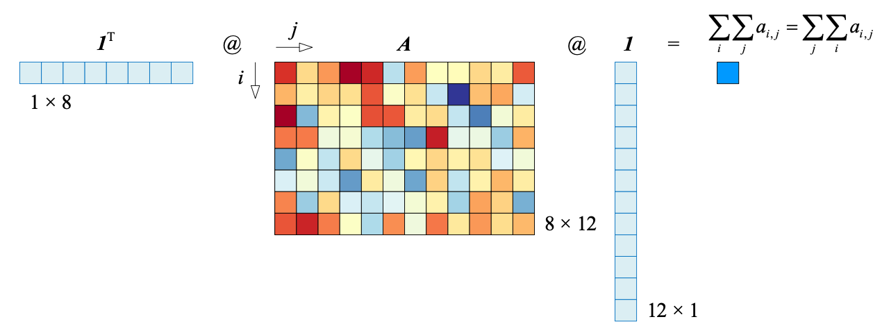
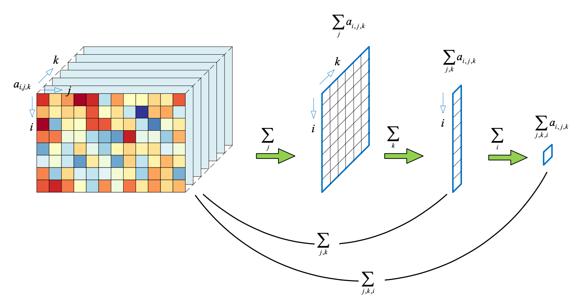

## 数列 `Sequence`

**数列**是按照一定规则排列的一列数。

### 等差数列

等差数列指的是数列中任何**相邻两项的差相等**，相邻两项差值称为**公差**`common difference`。

通项公式 $a_k$：
$$
a_k = a + (k-1) \cdot d
$$
$d$ 为**公差**，$k$ 为**项数**，$a_1$ 是**首项**，$a_1 = a$，前 $k$ 项之和为 $S_k$：
$$
S_k = \sum_{i=1}^{k}a_i = \sum_{i=1}^{k}(a + (i - 1)\cdot d) = \dfrac{(a + (a + (k-1)\cdot d))}{2} \cdot k
$$

### 等比数列

等比数列指的是数列中任何**相邻两项比值相等**，相邻两项比值称为**公比**`common ratio`。

通项公式 $a_k$：
$$
a_k = a \cdot q^{k-1} = \frac{a}{q} \cdot q^k
$$
$q$ 是**公比**，$q \neq 0$，$a_1$ 是首项，$a_1 = a$，前 $k$ 项之和为 $S_k$：
$$
S_k = 
\begin{cases}
\sum_{i=1}^k a_i = \sum_{i=1}^k (a \cdot q^{k-1}) = \dfrac {a \cdot q^k - a}{q - 1}, & q \neq 1 \\
\sum_{i=1}^k a_i = \sum_{i=1}^k a = k \cdot a, & q = 1
\end{cases}
$$

### 斐波那契数列

斐波那契数列可以通过**递归**方法获得
$$
\begin{cases}
F_0 = 0 \\
F_1 = F_2 = 1\\
F_n = F_{n-1} + F_{n-2}, & n > 2
\end{cases}
$$
斐波那契数列从0~10分别是：$0\quad1\quad1\quad2\quad3\quad5\quad8\quad13\quad21\quad34\quad55$。

**黄金分割**

黄金矩形的长宽比例 $\varphi = \dfrac{\sqrt{5} + 1}{2} \approx 1.61803$。 

下图中的螺旋线叫做**斐波那契螺旋线**，它是对**黄金螺旋线**的近似。

### 累加

求和符号 $\Sigma$。
$$
\begin{array}{lcl}
\sum_{i=1}^n a_i = a_1 + a_2 + \cdots + a_{n-1} + a_n \\\\
\sum_{i=m}^n a_i = a_m + a_{m+1} + \cdots + a_{n-1} + a_n \\\\
\sum_{i \in S} a_i
\end{array}
$$
**降维**

对数列 $\{a_i\}, i \in [1, n]$ 求和，相当于在 $i$ 方向上将数组“压扁”，得到一个标量 $\displaystyle \sum_{i=1}^n a_i$ ，$\displaystyle \sum_{i=1}^n a_i$ 除以 $n$ 得到平均数，求和运算的结果是一个标量，**求和运算相当于“降维”**。

数列 $\{a_i\}$ 相当于一个列向量 $\boldsymbol{a}$ 。
$$
\boldsymbol{a} = \begin{bmatrix} a_1\\a_2\\\vdots\\a_n\end{bmatrix}
$$
向量元素求和可以通过**向量内积**或**矩阵运算**得到，$\boldsymbol{1}$ 是全$1$列向量，和 $\boldsymbol{a}$ 等长。
$$
\sum_{i=1}^n a_i 
= \boldsymbol{1} \cdot \boldsymbol{a} 
= \boldsymbol{a} \cdot \boldsymbol{1}
= \begin{bmatrix} a_1\\a_2\\\vdots\\a_n\end{bmatrix} \cdot \begin{bmatrix} 1\\1\\\vdots\\1\end{bmatrix}
= \boldsymbol{a}^T\boldsymbol{1}
= \boldsymbol{1}^T\boldsymbol{a}
= \begin{bmatrix} 1&1&\cdots&1\end{bmatrix} \text{@} \begin{bmatrix} a_1\\a_2\\\vdots\\a_n\end{bmatrix}
$$

**连乘**
$$
\prod_{i=1}^n a_i = a_1 a_2 \cdots a_{n-1} a_n
$$
对数运算
$$
\ln {\left( \prod_{i=1}^n a_i \right)}= \ln{a_1} + \ln{a_2} + \cdots + \ln{a_{n-1}} + \ln{a_n} = \sum_{i=1}^n \ln{a_i}
$$
**乘系数**
$$
\sum_{i=1}^n ca_i = c{\left( \sum_{i=1}^n a_i \right)} = c{\sum_{i=1}^n a_i}
$$
$c \times$ 相当于“缩放”，$\sum$ 相当于“降维”。“缩放->降维”等价于“降维->缩放”。
$$
\sum_{i=1}^n a = na
$$
**分段求和**
$$
\sum_{i=1}^n a_i = (a_1 + a_2 + \cdots + a_k) + (a_{k+1} + a_{k+2} + \cdots + a_n) = \sum_{i=1}^k a_i + \sum_{i=k+1}^n a_i
$$
**两项相加减**
$$
\sum_{i=1}^n (a_i + b_i) = \sum_{i=1}^n a_i + \sum_{i=1}^n b_i \\
\sum_{i=1}^n (a_i - b_i) = \sum_{i=1}^n a_i - \sum_{i=1}^n b_i
$$
**平方**
$$
\sum_{i=1}^n {\left( a_i^2 \right)} = \sum_{i=1}^n a_i^2
$$
等价于列向量 $\boldsymbol{a}$ 的向量内积或矩阵运算
$$
\sum_{i=1}^n a_i^2 = \boldsymbol{a} \cdot \boldsymbol{a} = \boldsymbol{a}^T \boldsymbol{a}
$$

$$
\sum_{i=1}^n (a_i^2) \neq \left( \sum_{i=1}^k a_i \right)^2
$$

**乘法**
$$
\sum_{i=1}^n(a_ib_i) = a_1b_1 + a_2b_2 + \cdots + a_nb_n
$$

$$
\sum_{i=1}^n(a_ib_i) = \boldsymbol{a} \cdot \boldsymbol{b} = \boldsymbol{b} \cdot \boldsymbol{a}
= \boldsymbol{a}^T \boldsymbol{b} = \boldsymbol{b}^T \boldsymbol{a}
$$

$$
\left( \sum_{i=1}^n a_i \right) \left( \sum_{i=1}^n b_i \right) = (a_1+a_2+\cdots+a_n)(b_1+b_2+\cdots+b_n)
$$

$$
\sum_{i=1}^n(a_ib_i) \neq \left( \sum_{i=1}^n a_i \right) \left( \sum_{i=1}^n b_i \right)
$$

**二重求和**
$$
\begin{align}
\sum_{i=1}^3\sum_{j=2}^4 a_ib_j 
&= \sum_{i=1}^3 \left( a_ib_2 + a_ib_3 + a_ib_4 \right)\\
&=(a_1b_2 + a_1b_3 + a_1b_4) + (a_2b_2 + a_2b_3 + a_2b_4) + (a_3b_2 + a_3b_3 + a_3b_4)
\end{align}
$$

#### 两个索引

数列中的项可能有两个或更多索引，例如矩阵 $\boldsymbol{A}_{m \times n}$ 中元素 $a_{ij}$ 指的是第 $i$ 行第 $j$ 列元素。

**偏求和**，即沿着一个索引求和，沿着索引 $i$ 偏求和，得到的是 $m$ 个和，$\displaystyle \sum_{i=1}^n a_{i,j}$ 除以 $n$，得到的就是每一列元素的平均数。同理，沿着索引 $j$ 偏求和，得到的是 $n$ 个和。
$$
\underset{\text{Sum over i}}{\sum_{i=1}^n a_{i,j}} \Rightarrow 
\sum_{i=1}^n a_{i,1},\quad \sum_{i=1}^n a_{i,2},\quad\cdots,\quad\sum_{i=1}^n a_{i,m} \\
\underset{\text{Sum over j}}{\sum_{j=1}^m a_{i,j}} \Rightarrow 
\sum_{j=1}^m a_{1,j},\quad \sum_{j=1}^m a_{2,j},\quad\cdots,\quad\sum_{j=1}^m a_{n,j} \\
$$
$\displaystyle \sum_i a_{i,j}$ 和 $\displaystyle \sum_j a_{i,j}$ 沿着各自剩余的维度再次压扁，得到的就是所有元素 $a_{i,j}$ 的和。
$$
\underset{\text{sum over j}}{\sum_{i=1}^n\sum_{j=1}^m a_{i,j}} = 
\underset{\text{sum over i}}{\sum_{j=1}^m\sum_{i=1}^n a_{i,j}} \\\\
\sum_{j,i} a_{i,j} = \sum_{i,j} a_{i,j}
$$

**矩阵运算**

| 求和运算                              | 矩阵运算                                                     | 图例                                                         |
| ------------------------------------- | ------------------------------------------------------------ | ------------------------------------------------------------ |
| 对索引 $i$ 偏求和                     | $\displaystyle \sum_i a_{i,j} = \boldsymbol{1}^T \boldsymbol{A}$ |  |
| 对索引 $j$ 偏求和                     | $\displaystyle \sum_j a_{i,j} = \boldsymbol{A} \boldsymbol{1}$ |  |
| 对矩阵 $A_{8 \times 12}$ 所有元素求和 | $\displaystyle{\sum_i\sum_j a_{i,j}=\sum_j\sum_i a_{i,j}=\boldsymbol{1}^T\boldsymbol{A}}\boldsymbol{1}$ |  |

#### 两个以上索引

数组 $\{a_{i,j,k}\}$ 有三个维度，下图展示了 $j \rightarrow k \rightarrow i$ 的求和过程。

### 数列极限

$\{a_n\}$ 是数列，如果存在常数 $C$，对于任意给定的正数 $\varepsilon$，无论 $\varepsilon$ 有多小，总存在正整数 $N$，使得 $n>N$ 时，如下不等式均成立。
$$
\left| a_n - C \right| < \varepsilon
$$
则称常数 $C$ 是数列 $\{a_n\}$ 的极限，即**数列 $\{a_n\}$ 收敛于 $C$**。
$$
\lim_{n \to \infty}a_n = C
$$
**收敛数列示例**
$$
\begin{align}
&\lim_{n \to \infty}{\frac{1}{2^n}} = 0 \\
&\lim_{n \to \infty}{\left(1+\frac{1}{n}\right)^n} = e
\end{align}
$$
**数列和的极限**
$$
\begin{align}
&\sum_{k=1}^\infty \dfrac{1}{2^n} = 2 \\
&\sum_{k=1}^\infty \dfrac{1}{n(n+1)} = 1 \\
&\sum_{k=1}^\infty \dfrac{1}{k!} = e - 1 \\
&\sum_{k=1}^\infty \dfrac{(-1)^{n-1}}{n} = \ln{2} \\
&\sum_{k=1}^\infty \dfrac{(-1)^{k+1}}{2k - 1} = \dfrac{\pi}{4}
\end{align}
$$