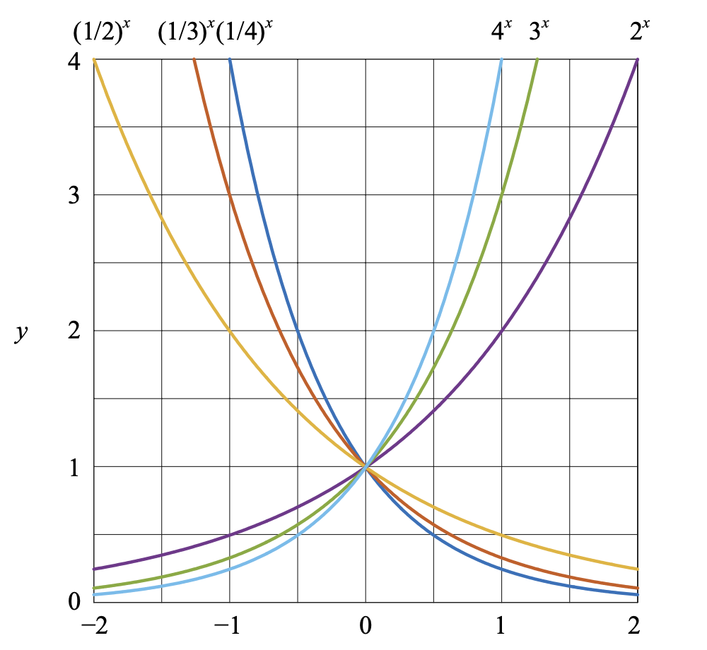
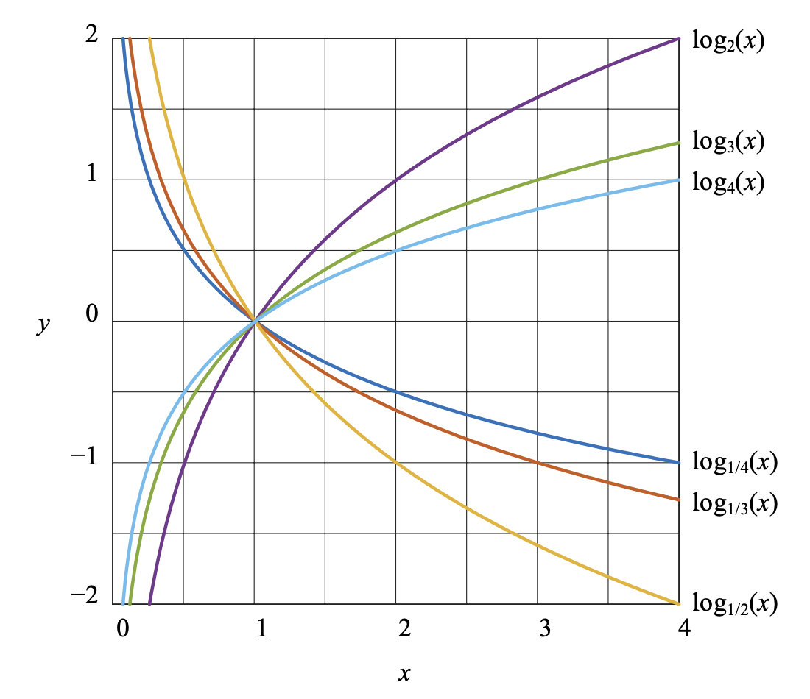
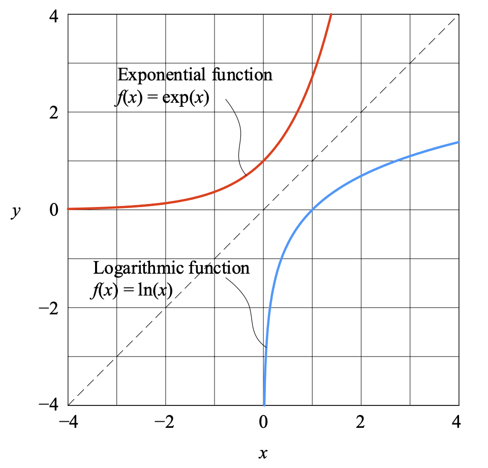

### 指数函数：指数为自变量

$$
y = f(x) = b^x
$$

$b$ 为底数，自变量 $x$ 为指数。

- 指数函数图像都会经过点 $(0, 1)$。
- $b > 1$ 时，$f(x)=b^x$ 单调递增；$0<b<1$ 时，$f(x)=b^x$ 单调递减。

以自然常数 $e$ 为底的指数函数又叫**自然指数函数**，普通指数函数可以转换为以 $e$ 为底的自然指数函数。
$$
\begin{array}{lcl}
f(x) = e^x = \exp (x) \\
f(x) = b^x = e^{(\log_e b) \cdot x} = e^{\ln b \cdot x} = \exp{(\ln b \cdot x)}
\end{array}
$$
**指数增长**模型就是使用如下指数函数表达。
$$
G(t) = (1+r)^t
$$
$r$ 为增长率，$t$ 为年限。

### 对数函数：把连乘变成连加

$$
y = f(x) = \log_b {(x)}
$$

$b$ 为对数底数，$b>0 且 b \neq 1$，对数函数的定义域 $x > 0$。

- 对数函数图像都会经过点 $(1, 0)$。
- $b>1$  时，$f(x)$ 在定义域上单调递增；$0<b<1$ 时，$f(x)$ 在定义域上单调递减。

**自然对数函数**的对数底数是 $e$。
$$
y = f(x) = \log_e(x) = \ln (x)
$$
自然指数函数（$e^x$）和自然对数函数（$\ln x$）**互为反函数**。

#### 对数运算

$$
\begin{array}{lcl}
\log_b x = \dfrac{\log_k x}{\log_k b} \\
\log_b x = \dfrac{\log_{10} x}{\log_{10} b} = \dfrac{\ln x}{\ln b} \\
\log_{b^n} x^m = \dfrac{m}{n} \log_b x \\
x = b^{\log_b (x)} \\
x^{\log_b y} = y^{\log_b x} \\
\log_b{xyz} = \log_b x + \log_b y + \log_b z
\end{array}
$$

#### 对数刻度

