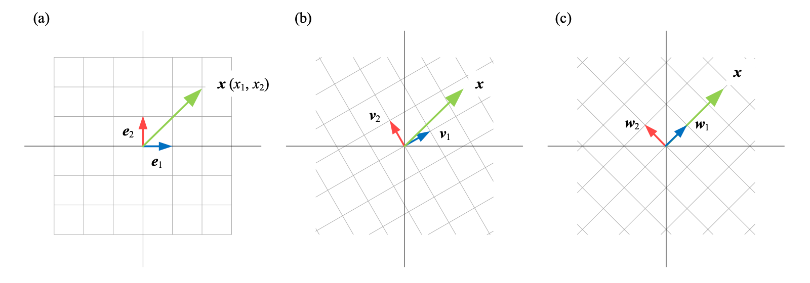

### 向量空间

给定域 $F$，$F$ 上的向量空间 $V$ 是一个集合，$V$ 非空且对加法和标量乘法运算封闭。对于 $V$ 中的元素 $\boldsymbol{u}$ 和 $\boldsymbol{v}$，可以唯一对应 $V$ 中的一个元素 $\boldsymbol{u} + \boldsymbol{v}$；对于 $V$ 中的元素 $\boldsymbol{v}$ 和标量 $k$，可以唯一对应 $V$ 中元素 $k\boldsymbol{v}$。

如果集合 $V$ 连同加法和标量乘法满足如下公理，则称 $V$ 为**向量空间**。$\boldsymbol{u}, \boldsymbol{v}, \boldsymbol{w} \in V$。

- **向量加法交换律**，$\boldsymbol{u} + \boldsymbol{v} = \boldsymbol{v} + \boldsymbol{u}$
- **向量加法结合律**，$(\boldsymbol{u} + \boldsymbol{v}) + \boldsymbol{w} = \boldsymbol{u} + (\boldsymbol{v} + \boldsymbol{w})$
- **向量加法恒等元**，$\boldsymbol{v} + \boldsymbol{0} = \boldsymbol{v}$
- **存在向量加法逆元素**，$\boldsymbol{v} + (-\boldsymbol{v}) = \boldsymbol{0}$
- **标量乘法对向量加法的分配率**，$k(\boldsymbol{u} + \boldsymbol{v}) = k\boldsymbol{u} + k\boldsymbol{v}$
- **标量乘法对域加法的分配率**，$(k+t)\boldsymbol{v} = k\boldsymbol{v} + t\boldsymbol{v}$
- **标量乘法与标量的域乘法相容**，$(kt)\boldsymbol{v} = k(t\boldsymbol{v})$
- **标量乘法的单位元**，$1 \cdot \boldsymbol{v} = \boldsymbol{v}$

#### 线性组合 `linear combination`

$\boldsymbol{v_1}, \boldsymbol{v_2}, \ldots, \boldsymbol{v_n}$ 是向量空间 $V$ 中的向量，下式被称作 $\boldsymbol{v_1}, \boldsymbol{v_2}, \ldots, \boldsymbol{v_n}$ 的**线性组合**：
$$
\alpha_1\boldsymbol{v}_1 + \alpha_2\boldsymbol{v}_2 + \cdots + \alpha_n\boldsymbol{v}_n
$$
其中，$\alpha_1, \alpha_2, \cdots,\alpha_n \in \mathbb{R}$。

#### 张成 `span`

$\boldsymbol{v_1}, \boldsymbol{v_2}, \ldots, \boldsymbol{v_n}$ 所有线性组合的集合称作 $\boldsymbol{v_1}, \boldsymbol{v_2}, \ldots, \boldsymbol{v_n}$ 的**张成**，记作 $\text{span}(\boldsymbol{v_1}, \boldsymbol{v_2}, \ldots, \boldsymbol{v_n})$。

####  线性相关 `linear dependence`，线性无关 `linear independence`

给定向量组 $\boldsymbol{V} = \begin{bmatrix} \boldsymbol{v_1}, \boldsymbol{v_2}, \ldots, \boldsymbol{v_n} \end{bmatrix}$，如果存在**不全为零** $\alpha_1, \alpha_2, \ldots, \alpha_n$ 使得下式成立：
$$
\alpha_1\boldsymbol{v}_1 + \alpha_2\boldsymbol{v}_2 + \cdots + \alpha_n\boldsymbol{v}_n = \boldsymbol{0}
$$
则称向量组 $\boldsymbol{V}$ **线性相关**，否则，$\boldsymbol{V}$​ **线性无关**。即向量组中的某个向量可以表示为其他向量的线性组合即线性相关。

#### 极大无关组，秩 `rank`

矩阵 $\boldsymbol{X}$ 的**列秩**是 $\boldsymbol{X}$ 的线性无关的列向量数量最大值，**行秩**是 $\boldsymbol{X}$ 的线性无关的行向量数量最大值。
$$
\boldsymbol{X}_{m \times n} = \begin{bmatrix} \boldsymbol{x}_1 & \boldsymbol{x}_2 & \cdots & \boldsymbol{x}_n \end{bmatrix}
$$
对于 $V = \{\boldsymbol{x}_1, \boldsymbol{x}_2, \ldots, \boldsymbol{x}_n \}$，如果 $V$ 线性相关，那么总能找出一个向量可以表示为其他向量的线性组合，将它移除。如此往复，直到得到线性无关的向量组 $S = \{\boldsymbol{x}_1, \boldsymbol{x}_2, \ldots, \boldsymbol{x}_r \}$，则称 $S = \{\boldsymbol{x}_1, \boldsymbol{x}_2, \ldots, \boldsymbol{x}_r \}$ 是 $F = \{\boldsymbol{x}_1, \boldsymbol{x}_2, \ldots, \boldsymbol{x}_n \}$ 的**极大线性无关组**，极大线性无关组不唯一。极大线性无关组的元素数量 $r$ 为 $V = \{\boldsymbol{x}_1, \boldsymbol{x}_2, \ldots, \boldsymbol{x}_n \}$ 的**秩**，也称为 $V$ 的维度或维数。

矩阵的列秩和行秩总是相等的，因此也称为矩阵 $\boldsymbol{X}$ 的**秩**，记作 $\text{rank}(\boldsymbol{X})$，$\text{rank}({\boldsymbol{X}}) \leqslant \min(m, n)$。

如果矩阵乘积 $\boldsymbol{A}\boldsymbol{B}$ 存在，则 $\text{rank}(\boldsymbol{A}\boldsymbol{B})$ 满足：
$$
\text{rank}(\boldsymbol{A}\boldsymbol{B}) \leqslant \min(\text{rank}(\boldsymbol{A}), \text{rank}(\boldsymbol{B}))
$$
仅当方阵 $\boldsymbol{A}_{n \times n}$ 满秩，即$\text{rank}(\boldsymbol{A}) = n$，$\boldsymbol{A}$ 可逆。

对于实数矩阵 $\boldsymbol{X}$，以下几个矩阵的秩相等：
$$
\text{rank}(\boldsymbol{X}^T\boldsymbol{X}) = \text{rank}(\boldsymbol{X}\boldsymbol{X}^T) = \text{rank}(\boldsymbol{X}) = \text{rank}(\boldsymbol{X}^T)
$$

#### 基底 `vector basis`，基底向量 `basis vector`

一个向量空间 $V$ 的**基底向量**指 $V$ 中线性无关的 $\boldsymbol{v}_1, \boldsymbol{v}_2, \ldots, \boldsymbol{v}_n$，它们**张成**向量空间 $V$，即$V = \text{span}(\boldsymbol{v}_1, \boldsymbol{v}_2, \ldots, \boldsymbol{v}_n)$。

$\begin{bmatrix} \boldsymbol{v}_1, \boldsymbol{v}_2, \ldots, \boldsymbol{v}_n \end{bmatrix}$ 叫做 $V$ 的**基底**，向量空间 $V$ 中的每一个向量都可以唯一地表示为基底 $\begin{bmatrix} \boldsymbol{v}_1, \boldsymbol{v}_2, \ldots, \boldsymbol{v}_n \end{bmatrix}$​​ 中基底向量的线性组合。

$\begin{bmatrix} \boldsymbol{e}_1, \boldsymbol{e}_2 \end{bmatrix}$ 是平面 $\mathbb{R}^2$ 一组基底，平面 $\mathbb{R}^2$ 上的每一个向量都可以唯一表达成 $x_1\boldsymbol{e}_1 + x_2\boldsymbol{e}_2$，$(x_1, x_2)$ 就是在基底 $\begin{bmatrix} \boldsymbol{e}_1, \boldsymbol{e}_2 \end{bmatrix}$ 下的坐标。

基底选择不唯一，$\begin{bmatrix} \boldsymbol{e}_1, \boldsymbol{e}_2 \end{bmatrix}$、$\begin{bmatrix} \boldsymbol{v}_1, \boldsymbol{v}_2 \end{bmatrix}$、$\begin{bmatrix} \boldsymbol{w}_1, \boldsymbol{w}_2 \end{bmatrix}$ 都是平面 $\mathbb{R}^2$ 基底，即 $\mathbb{R}^2 = \text{span}(\boldsymbol{e}_1, \boldsymbol{e}_2) = \text{span}(\boldsymbol{v}_1, \boldsymbol{v}_2) = \text{span}(\boldsymbol{w}_1, \boldsymbol{w}_2)$。平面 $\mathbb{R}^2$ 上的向量 $\boldsymbol{x}$ 在 $\begin{bmatrix} \boldsymbol{e}_1, \boldsymbol{e}_2 \end{bmatrix}$、$\begin{bmatrix} \boldsymbol{v}_1, \boldsymbol{v}_2 \end{bmatrix}$、$\begin{bmatrix} \boldsymbol{w}_1, \boldsymbol{w}_2 \end{bmatrix}$ 这三组基底上都有各自的唯一坐标。

基底中基底向量如果两两正交，则该基底叫做**正交基**，如果正交基中每个基地向量的模都为$1$，则称该基底为**规范正交基**，$\begin{bmatrix} \boldsymbol{e}_1, \boldsymbol{e}_2 \end{bmatrix}$、$\begin{bmatrix} \boldsymbol{v}_1, \boldsymbol{v}_2 \end{bmatrix}$、$\begin{bmatrix} \boldsymbol{w}_1, \boldsymbol{w}_2 \end{bmatrix}$ 都是规范正交基，张成平面 $\mathbb{R}^2$ 的正交基有无数组，他们之间存在旋转关系。

我们通常将 $\begin{bmatrix} \boldsymbol{e}_1, \boldsymbol{e}_2 \end{bmatrix}$ 叫做平面 $\mathbb{R}^2$ 的**标准正交基**或**标准基**， $\begin{bmatrix} \boldsymbol{e}_1, \boldsymbol{e}_2, \ldots, \boldsymbol{e}_n \end{bmatrix}$ 是 $\mathbb{R}^n$​ 的标准正交基。

平面 $\mathbb{R}^2$ 上，任何两个不平行的非零向量都可以构成平面上的一个基底，如果基底中的基底向量之间两两并非都正交，这样的基底叫做**非正交基**。

#### 维数 `dimension`

向量空间的**维数**是基底中基底向量的个数，记作 $\dim()$。$\dim(\mathbb{R}^2) = 2, \dim(\mathbb{R}^3) = 3$。

