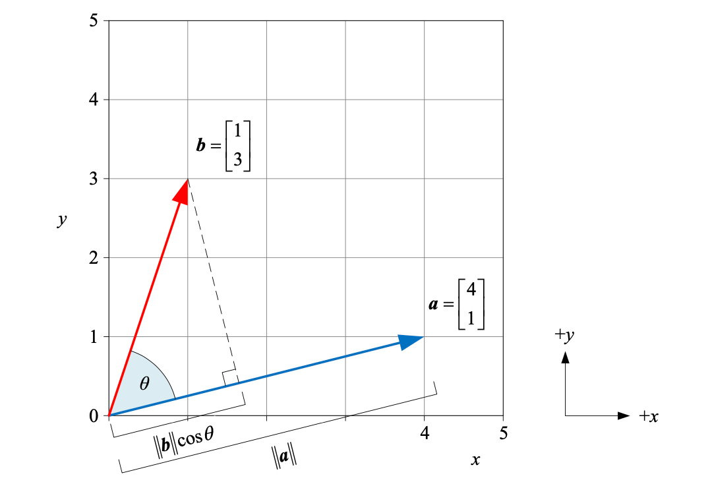
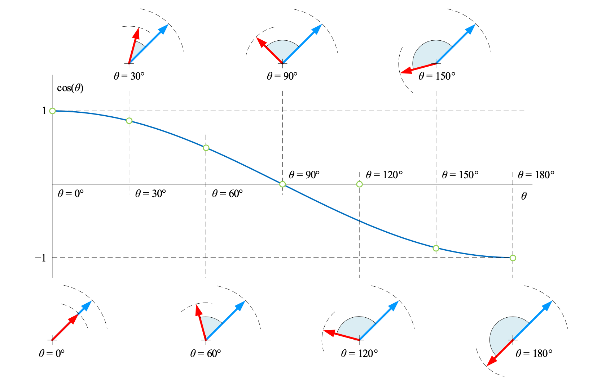
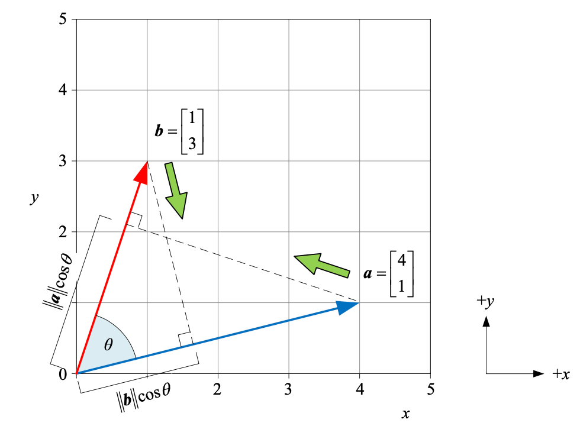
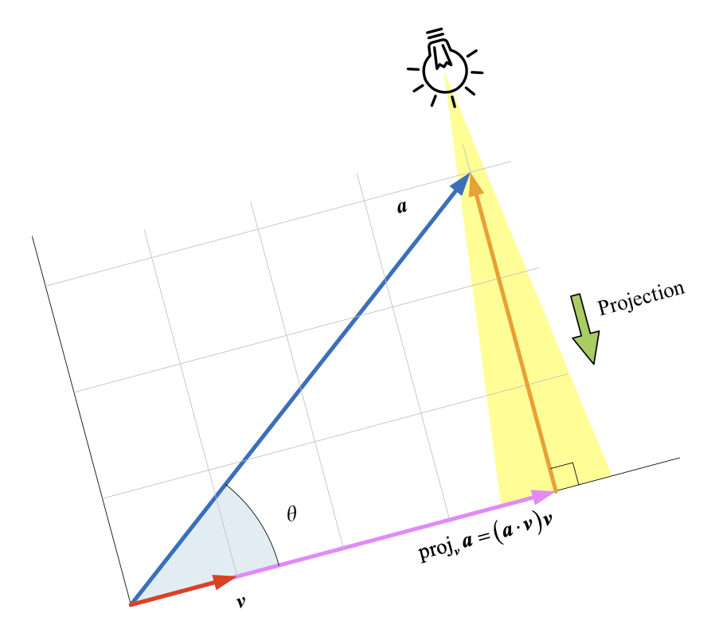

## 向量 `vector`

### 标量乘法

向量的标量乘法就是向量的缩放，即长度缩放，方向不变或反向。

### 转置 `transpose`

行向量转置得到列向量，列向量转置得到行向量。
$$
\begin{bmatrix}
1&2&3
\end{bmatrix}^T = 
\begin{bmatrix}
1\\2\\3
\end{bmatrix}, \quad
\begin{bmatrix}
4\\5\\6
\end{bmatrix}^T = 
\begin{bmatrix}
4&5&6
\end{bmatrix}
$$
向量使用加粗、斜体的小写字母表示：$\boldsymbol{a}$。
$$
\boldsymbol{a} = \begin{bmatrix} a_1&a_2&\cdots&a_n \end{bmatrix}
$$

### 向量乘法

#### 标量乘法 `scalar multiplication`

$$
k \times \boldsymbol{a} = k \times \begin{bmatrix}a_1&a_2&\cdots&a_n\end{bmatrix} = \begin{bmatrix}ka_1&ka_2&\cdots&ka_n\end{bmatrix}
$$

#### 向量内积 `inner product`

向量内积结果是**标量**，又叫**标量积 `scalar product`**或**点积 `dot product`**。
$$
\boldsymbol{a}\cdot\boldsymbol{b} = \begin{bmatrix}a_1&a_2&\cdots&a_n\end{bmatrix}\cdot\begin{bmatrix}b_1&b_2&\cdots&b_n\end{bmatrix}
=a_1 \times b_1 + a_2 \times b_2 + \cdots + a_n \times b_n
$$
向量内积满足**交换律**和**对向量加法满足分配律**，不满足**结合律**。
$$
\boldsymbol{a} \cdot \boldsymbol{b} = \boldsymbol{b} \cdot \boldsymbol{a} \\
\boldsymbol{a} \cdot (\boldsymbol{b} + \boldsymbol{c}) = \boldsymbol{a} \cdot \boldsymbol{b} + \boldsymbol{a} \cdot \boldsymbol{c} \\
(\boldsymbol{a} \cdot \boldsymbol{b}) \cdot \boldsymbol{c} \neq \boldsymbol{a} \cdot (\boldsymbol{b} \cdot \boldsymbol{c})
$$
一些**使用示例**，$\boldsymbol{a} = \begin{bmatrix}1&2&3&4&5\end{bmatrix}^T$

- 元素求和：$\boldsymbol{a} \cdot \boldsymbol{1}=\begin{bmatrix}1&2&3&4&5\end{bmatrix}^T \cdot \begin{bmatrix}1&1&1&1&1\end{bmatrix}^T = 1 \times 1 + 2 \times 1 + 3 \times 1 + 4 \times 1 + 5 \times 1 = 15$
- 元素平均值：$\begin{bmatrix}1&2&3&4&5\end{bmatrix}^T \cdot \begin{bmatrix}1/5&1/5&1/5&1/5&1/5\end{bmatrix}^T = 1 \times 1/5 + 2 \times 1/5 + 3 \times 1/5 + 4 \times 1/5 + 5 \times 1/5 = 3$
- 元素平方和：$\boldsymbol{a} \cdot \boldsymbol{a}=\begin{bmatrix}1&2&3&4&5\end{bmatrix}^T \cdot \begin{bmatrix}1&2&3&4&5\end{bmatrix}^T = 1 \times 1 + 2 \times 2 + 3 \times 3 + 4 \times 4 + 5 \times 5 = 55$

#### 逐项积 `piecewise product`

逐项积也叫**阿达玛乘积 `Hadamard product`**，两个形状相同向量的逐项积为对应位置元素分别相乘，结果为相同形状的向量。
$$
\boldsymbol{a} \odot \boldsymbol{b} 
= \begin{bmatrix}a_1&a_2&\cdots&a_n\end{bmatrix}\odot\begin{bmatrix}b_1&b_2&\cdots&b_n\end{bmatrix}
= \begin{bmatrix}a_1 \times b_1 & a_2 \times b_2 & \cdots & a_n \times b_n\end{bmatrix}
$$

### 向量内积 `inner product`

向量内积又叫**标量积**或**点积**，向量 $\boldsymbol{a}$ 和 $\boldsymbol{b}$ 是两个长度为 $n$ 的列向量，内积：
$$
\boldsymbol{a}\cdot\boldsymbol{b} = \begin{bmatrix}a_1\\a_2\\\vdots\\a_n\end{bmatrix}\cdot\begin{bmatrix}b_1\\b_2\\\vdots\\b_n\end{bmatrix}
=a_1 \times b_1 + a_2 \times b_2 + \cdots + a_n \times b_n = \sum_{i=1}^n{(a_i \times b_i)}
$$
几何视角定义向量内积：
$$
\boldsymbol{a} \cdot \boldsymbol{b} = \big \Vert \boldsymbol{a} \big \Vert \big\Vert \boldsymbol{b} \big\Vert \cos\theta
$$
$\theta$ 是向量 $\boldsymbol{a}$ 和 $\boldsymbol{b}$ 的夹角，$\big\Vert \boldsymbol{b} \big\Vert \cos\theta$ 是向量 $\boldsymbol{b}$ 在 $\boldsymbol{a}$ 方向上的**标量投影**，$\big\Vert \boldsymbol{a} \big\Vert \cos\theta$ 是向量 $\boldsymbol{a}$ 在 $\boldsymbol{b}$ 方向上的**标量投影**。

向量内积为 $0$ 时，$\cos \theta = \dfrac{\boldsymbol{a} \cdot \boldsymbol{b}}{\big\Vert \boldsymbol{a} \big\Vert \big\Vert \boldsymbol{b} \big\Vert} = 0 \Rightarrow \theta = 90 \degree$，两个向量**垂直**。

### 投影 `projection`

投影分为**标量投影**和**向量投影**。

向量的**标量投影**结果为标量。
$$
\begin{array}{lcl}
\big\Vert \boldsymbol{b} \big\Vert \cos \theta = \big\Vert \boldsymbol{b} \big\Vert \dfrac{\boldsymbol{a} \cdot \boldsymbol{b}}{\big\Vert \boldsymbol{a} \big\Vert \big\Vert \boldsymbol{b} \big\Vert} = \dfrac{\boldsymbol{a} \cdot \boldsymbol{b}}{\big\Vert \boldsymbol{a} \big\Vert} \\
\big\Vert \boldsymbol{a} \big\Vert \cos \theta = \big\Vert \boldsymbol{a} \big\Vert \dfrac{\boldsymbol{a} \cdot \boldsymbol{b}}{\big\Vert \boldsymbol{a} \big\Vert \big\Vert \boldsymbol{b} \big\Vert} = \dfrac{\boldsymbol{a} \cdot \boldsymbol{b}}{\big\Vert \boldsymbol{b} \big\Vert}
\end{array}
$$

**向量投影**则是在标量基础上，加上方向，即 $\boldsymbol{b}$ 在 $\boldsymbol{a}$ 方向上的标量投影，再乘以 $\boldsymbol{a}$ 的单位向量。
$$
\text{proj}_a \boldsymbol{b} = \big\Vert \boldsymbol{b} \big\Vert \cos \theta \dfrac{\boldsymbol{a}}{\big\Vert \boldsymbol{a} \big\Vert} = \dfrac{\boldsymbol{a} \cdot \boldsymbol{b}}{\big\Vert \boldsymbol{a} \big\Vert} \dfrac{\boldsymbol{a}}{\big\Vert \boldsymbol{a} \big\Vert}
$$

设 $\boldsymbol{v}$ 为单位向量，$\boldsymbol{a}$ 在 $\boldsymbol{v}$ 方向上的标量投影：
$$
\big\Vert\boldsymbol{a}\big\Vert \cos \theta = \dfrac{\boldsymbol{a} \cdot \boldsymbol{v}}{\big\Vert\boldsymbol{v}\big\Vert} = \boldsymbol{a} \cdot \boldsymbol{v}
$$
$\boldsymbol{a}$ 在 $\boldsymbol{v}$ 方向上的向量投影：
$$
\text{proj}_{\boldsymbol{v}}{\boldsymbol{a}} = (\big\Vert\boldsymbol{a}\big\Vert \cos \theta)\boldsymbol{v} = (\boldsymbol{a} \cdot \boldsymbol{v})\boldsymbol{v} = (\boldsymbol{a}^T\boldsymbol{v})\boldsymbol{v} = (\boldsymbol{v}^T\boldsymbol{a})\boldsymbol{v}
$$

