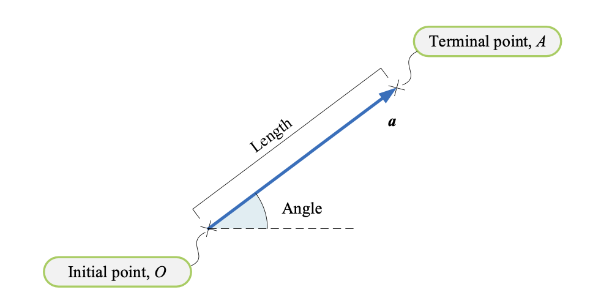
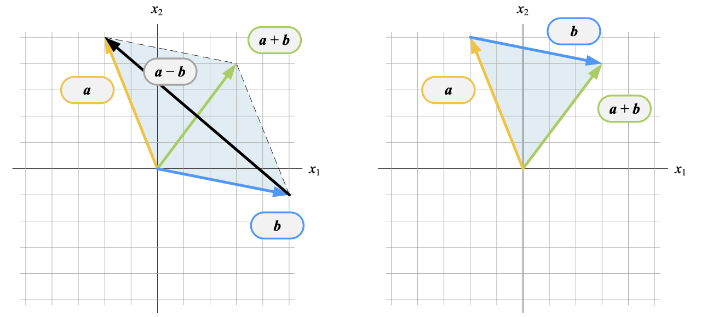

## 向量 `vector`

向量是**有方向的线段**，线段的长度代表**向量的大小**，箭头代表**向量的方向**。

**起点**和**终点**相同的向量称为**零向量**，记作 $\boldsymbol{0}$。

**自由向量**，**固定向量**，**滑动向量**。

一行多列的向量叫做**行向量**，一列多行的向量叫做**列向量**。

**行向量**将 $n$ 个元素排成一行，通常习惯使用行向量表达样本点；**列向量**将 $n$ 个元素排成一列，通常习惯使用列向量表达一个特征样本数据。
$$
\begin{array}
\boldsymbol{a} = \begin{bmatrix} a_1&a_2&\cdots&a_n \end{bmatrix} \\
\boldsymbol{b} = \begin{bmatrix} b_1\\b_2\\\vdots\\b_n \end{bmatrix}
\end{array}
$$
行向量**转置**`transpose`可以得到列向量，反之亦然。$\boldsymbol{a}^T$ 

**全零列向量**和**全1列向量**
$$
\boldsymbol{0} = \begin{bmatrix} 0\\0\\\vdots\\0 \end{bmatrix}, \quad
\boldsymbol{1} = \begin{bmatrix} 1\\1\\\vdots\\1 \end{bmatrix}
$$

### 向量模

向量 $\boldsymbol{a}$ 的**长度**，叫做**向量模**，记作 $\big\Vert \boldsymbol{a} \big\Vert$，也叫**欧几里得距离**、**欧几里得范数**或 **$L^2$ 范数**，$L^2$ 范数是 $L^p$ 范数的一种。
$$
\boldsymbol{a} = \begin{bmatrix} a_1&a_2&\cdots&a_n \end{bmatrix}^T \\
\big\Vert \boldsymbol{a} \big\Vert = \sqrt {a_1^2 + a_2^2 + \cdots + a_n^2} = \left( \sum_{i=1}^n{a_n^2} \right)^{\frac{1}{2}}
$$
向量模等于 $1$ 的向量，叫做**单位向量**，任何**非零向量除以自身的模**，得到**向量方向上的单位向量**。
$$
\hat{\boldsymbol{a}} = \dfrac{\boldsymbol{a}}{\big\Vert a \big\Vert}
$$

$\boldsymbol{e}_1(\boldsymbol{i})$ 和 $\boldsymbol{e}_2(\boldsymbol{j})$ 是两个特殊的单位向量，代表平面直角坐标系中横轴和纵轴的单位向量，$\boldsymbol{e}_1$ 和 $\boldsymbol{e}_2$ 相互垂直。
$$
\boldsymbol{e}_1 = \boldsymbol{i} = \begin{bmatrix} 1\\0 \end{bmatrix}, \quad \boldsymbol{e}_2 = \boldsymbol{j} = \begin{bmatrix} 0\\1 \end{bmatrix}
$$

### 向量加减法

两个向量加减即对应元素相加减，得到元素个数相同的向量。
$$
\boldsymbol{a} \pm \boldsymbol{b} 
= \begin{bmatrix} a_1\\a_2\\\vdots\\a_n \end{bmatrix} \pm \begin{bmatrix} b_1\\b_2\\\vdots\\b_n \end{bmatrix}
= \begin{bmatrix} a_1 \pm b_1\\a_2 \pm b_2\\\vdots\\a_n \pm b_n \end{bmatrix}
$$
**平行四边形法则**和**三角形法则**

两个向量的模和方向均相同，则两个**向量相同**；两个向量的模相同但是方向相反，则两个向量**互为反向量**。两个向量的方向相同或相反，则称**向量平行**。

向量 $\boldsymbol{a}$ 与向量 $\boldsymbol{b}$ 相减可以写成 $\boldsymbol{a}$ 与 $\boldsymbol{b}$ 的反向量相加。
$$
\boldsymbol{a} - \boldsymbol{b} = \boldsymbol{a} + \left(-\boldsymbol{b}\right)
$$
向量加减法性质
$$
\begin{array}{lcl}
\boldsymbol{a} + \boldsymbol{b} = \boldsymbol{b} + \boldsymbol{a} \\
\left(\boldsymbol{a} + \boldsymbol{b}\right) + \boldsymbol{c} = \boldsymbol{a} +  \left(\boldsymbol{b} + \boldsymbol{c}\right) \\
\boldsymbol{a} + \left(-\boldsymbol{a}\right) = \boldsymbol{0}
\end{array}
$$
向量差 $\boldsymbol{a} - \boldsymbol{b}$ 的模（$L^2$ 范数）$\big\Vert \boldsymbol{a} - \boldsymbol{b} \big\Vert$ 就是 $\boldsymbol{a}$ 和 $\boldsymbol{b}$ 两点的欧几里得距离。

### 标量乘法

**向量标量乘法**是标量和向量每个元素分别相乘，结果仍为向量。标量乘法将原向量按标量**比例缩放**，结果中向量的方向为**同向**或**反向**。

向量标量乘法性质
$$
\begin{array}{lcl}
(t+k)\boldsymbol{a} = t\boldsymbol{a} + k\boldsymbol{a} \\
t(\boldsymbol{a} + \boldsymbol{b}) = t\boldsymbol{a} + t\boldsymbol{b} \\
t(k\boldsymbol{a}) = tk\boldsymbol{a} \\
1\boldsymbol{a} = \boldsymbol{a} \\
-1\boldsymbol{a} = -\boldsymbol{a} \\
0\boldsymbol{a} = \boldsymbol{0}
\end{array}
$$

