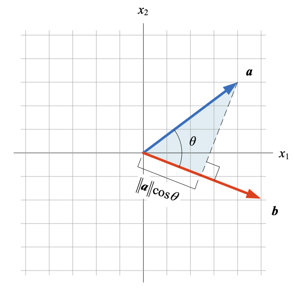
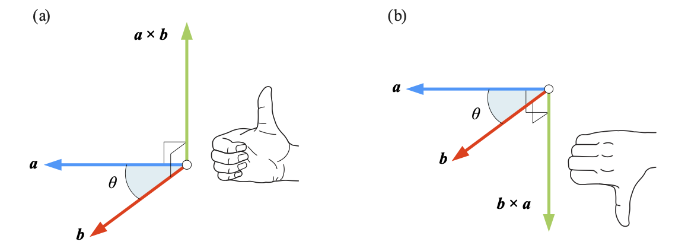
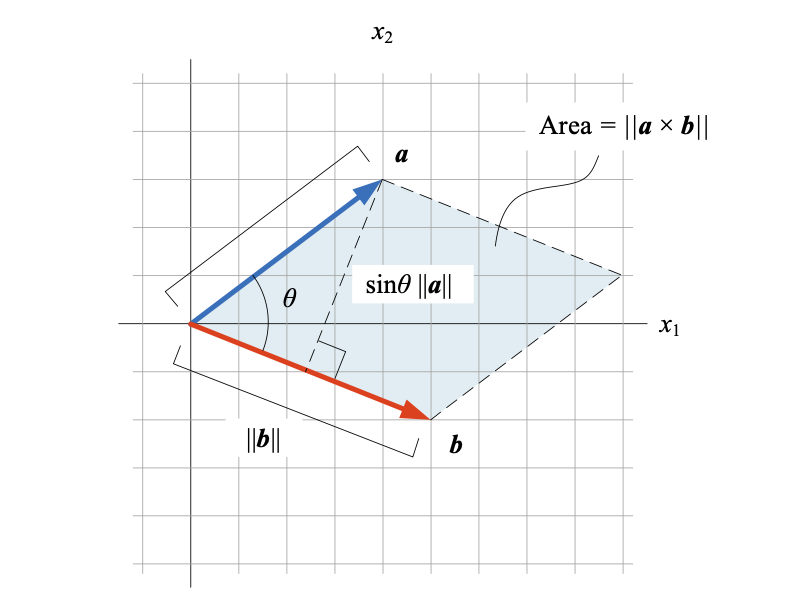
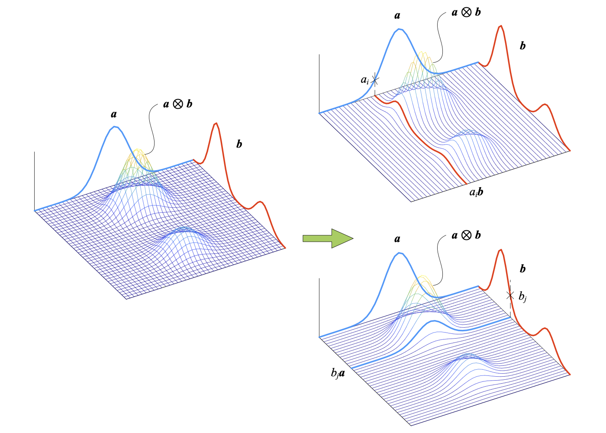

## 向量 `vector`

向量是**有方向的线段**，线段的长度代表**向量的大小**，箭头代表**向量的方向**。**起点**和**终点**相同的向量称为**零向量**，记作 $\boldsymbol{0}$。

**切向量**和**法向量**

**行向量**和**列向量**

向量**转置**：$\boldsymbol{a}^T$

**全零列向量**和**全1列向量**
$$
\boldsymbol{0} = \begin{bmatrix} 0&0&\cdots&0 \end{bmatrix}^T \\
\boldsymbol{1} = \begin{bmatrix} 1&1&\cdots&1 \end{bmatrix}^T
$$

### 1. 向量模

向量 $\boldsymbol{a}$ 的**向量长度**，叫做**向量模**，记作 $\big\Vert \boldsymbol{a} \big\Vert$，也叫**欧几里得距离**、**欧几里得范数**或 **$L^2$ 范数**，$L^2$ 范数是 $L^p$ 范数的一种。
$$
\boldsymbol{a} = \begin{bmatrix} a_1&a_2&\cdots&a_n \end{bmatrix}^T \\\\
\big\Vert \boldsymbol{a} \big\Vert = {\big\Vert \boldsymbol{a} \big\Vert}_2 = \sqrt {a_1^2 + a_2^2 + \cdots + a_n^2} = \left( \sum_{i=1}^n{a_n^2} \right)^{\frac{1}{2}}
$$
向量模等于 $1$ 的向量，叫做**单位向量**，**非 $\boldsymbol{0}$ 向量 $\boldsymbol{a}$ 除以自身的模**，得到 **$\boldsymbol{a}$ 方向上的单位向量**。
$$
\hat{\boldsymbol{a}} = \dfrac{\boldsymbol{a}}{\big\Vert a \big\Vert}
$$

$\boldsymbol{e}_1(\boldsymbol{i})$ 和 $\boldsymbol{e}_2(\boldsymbol{j})$ 
$$
\boldsymbol{e}_1 = \boldsymbol{i} = \begin{bmatrix} 1&0 \end{bmatrix}^T \\
\boldsymbol{e}_2 = \boldsymbol{j} = \begin{bmatrix} 0&1 \end{bmatrix}^T
$$

### 2. 加减法

两个**等行**列向量相加（减），结果为对应位置元素分别相加（减），得到元素个数相同的列向量。
$$
\boldsymbol{a} \pm \boldsymbol{b} 
= \begin{bmatrix} a_1\\a_2\\\vdots\\a_n \end{bmatrix} \pm \begin{bmatrix} b_1\\b_2\\\vdots\\b_n \end{bmatrix}
= \begin{bmatrix} a_1 \pm b_1\\a_2 \pm b_2\\\vdots\\a_n \pm b_n \end{bmatrix}
$$
几何视角：**平行四边形法则**和**三角形法则**。

两个向量的模和方向均相同，则**向量相同**；两个向量的模相同但方向相反，则**互为反向量**。两个向量的方向相同或相反，则**向量平行**。

**加减法性质**
$$
\begin{array}{lcl}
\boldsymbol{a} + \boldsymbol{b} = \boldsymbol{b} + \boldsymbol{a} \\
\left(\boldsymbol{a} + \boldsymbol{b}\right) + \boldsymbol{c} = \boldsymbol{a} +  \left(\boldsymbol{b} + \boldsymbol{c}\right) \\
\boldsymbol{a} + \left(-\boldsymbol{a}\right) = \boldsymbol{0}
\end{array}
$$
### 3. 标量乘法

**向量标量乘法**是标量和向量每个元素分别相乘，结果仍为向量。标量乘法将原向量按标量**比例缩放**，结果中向量的方向为**同向**或**反向**。
$$
k\boldsymbol{a} = k\begin{bmatrix} a_1\\a_2\\\vdots\\a_n \end{bmatrix} = \begin{bmatrix} ka_1\\ka_2\\\vdots\\ka_n \end{bmatrix}
$$
**标量乘法性质**
$$
\begin{array}{lcl}
(t+k)\boldsymbol{a} = t\boldsymbol{a} + k\boldsymbol{a} \\
t(\boldsymbol{a} + \boldsymbol{b}) = t\boldsymbol{a} + t\boldsymbol{b} \\
t(k\boldsymbol{a}) = tk\boldsymbol{a} \\
1\boldsymbol{a} = \boldsymbol{a} \\
-1\boldsymbol{a} = -\boldsymbol{a} \\
0\boldsymbol{a} = \boldsymbol{0}
\end{array}
$$

### 4. 向量内积

**向量内积**又叫**标量积**、**点积**或**点乘**，向量内积结果是一个标量。
$$
\boldsymbol{a} \cdot \boldsymbol{b} 
= \langle \boldsymbol{a}, \boldsymbol{b} \rangle  
= \begin{bmatrix} a_1\\a_2\\\vdots\\a_n \end{bmatrix} \cdot \begin{bmatrix} b_1\\b_2\\\vdots\\b_n \end{bmatrix}
= a_1b_1 + a_2b_2 + \cdots + a_nb_n = \sum_{i=1}^n{a_ib_i}
$$
**向量内积性质**
$$
\begin{array}{lcl}
\boldsymbol{a} \cdot \boldsymbol{b} = \boldsymbol{b} \cdot \boldsymbol{a} \\
\boldsymbol{a} \cdot (\boldsymbol{b} + \boldsymbol{c}) = \boldsymbol{a} \cdot \boldsymbol{b} + \boldsymbol{a} \cdot \boldsymbol{c} \\
(k\boldsymbol{a}) \cdot (t\boldsymbol{b}) = kt(\boldsymbol{a} \cdot \boldsymbol{b}) \\
(\boldsymbol{a} \cdot \boldsymbol{b}) \cdot \boldsymbol{c} \neq \boldsymbol{a} \cdot (\boldsymbol{b} \cdot \boldsymbol{c})
\end{array}
$$

#### 4.1 几何视角

$$
\boldsymbol{a} \cdot \boldsymbol{b} = \big \Vert \boldsymbol{a} \big \Vert \big\Vert \boldsymbol{b} \big\Vert \cos\theta
$$

$\theta$ 是向量 $\boldsymbol{a}$ 和 $\boldsymbol{b}$ 的夹角，$\big\Vert \boldsymbol{b} \big\Vert \cos\theta$ 是向量 $\boldsymbol{b}$ 在 $\boldsymbol{a}$ 方向上的**标量投影**，$\big\Vert \boldsymbol{a} \big\Vert \cos\theta$ 是向量 $\boldsymbol{a}$ 在 $\boldsymbol{b}$ 方向上的**标量投影**。**余弦定理**推导。

#### 4.2 柯西-施瓦茨不等式

$$
-1 \leqslant \cos\theta \leqslant 1 \Rightarrow -\big\Vert \boldsymbol{a} \big\Vert \big\Vert \boldsymbol{b} \big\Vert \leqslant \boldsymbol{a} \cdot \boldsymbol{b} \leqslant \big\Vert \boldsymbol{a} \big\Vert \big\Vert \boldsymbol{b} \big\Vert
$$

如果 $\boldsymbol{a} \cdot \boldsymbol{b} = 0$，则称 $\boldsymbol{a}$ 与 $\boldsymbol{b}$ **正交**。

**柯西-施瓦茨不等式**
$$
(\boldsymbol{a} \cdot \boldsymbol{b})^2 \leqslant \big\Vert \boldsymbol{a} \big\Vert^2\big\Vert \boldsymbol{b} \big\Vert^2 \Rightarrow \big\vert \boldsymbol{a} \cdot \boldsymbol{b} \big\vert \leqslant \big\Vert \boldsymbol{a} \big\Vert \big\Vert \boldsymbol{b} \big\Vert
$$
也可以写作
$$
\big\langle \boldsymbol{a}, \boldsymbol{b} \big\rangle^2 \leqslant \big\langle \boldsymbol{a}, \boldsymbol{a} \big\rangle \big\langle \boldsymbol{b}, \boldsymbol{b} \big\rangle \Rightarrow \big\vert \big\langle \boldsymbol{a}, \boldsymbol{b} \big\rangle \big\vert \leqslant \big\Vert \boldsymbol{a} \big\Vert \big\Vert \boldsymbol{b} \big\Vert
$$
在 $\mathbb{R}^n$ 空间中，上述不等式等价于
$$
\left(\sum_{i=1}^na_ib_i\right)^2 \leqslant \left(\sum_{i=1}^na_i^2\right)\left(\sum_{i=1}^nb_i^2\right)
$$

#### 4.3 余弦相似度

**余弦相似度**用向量夹角的余弦值**度量样本数据的相似性**，使用 $k(\boldsymbol{x}, \boldsymbol{q})$ 来表达 $\boldsymbol{x}$ 和 $\boldsymbol{q}$ 两个列向量的余弦相似度：
$$
k(\boldsymbol{x}, \boldsymbol{q}) = \frac{\boldsymbol{x} \cdot \boldsymbol{q}}{\big\Vert \boldsymbol{x} \big\Vert \big\Vert \boldsymbol{q} \big\Vert} = \frac{\boldsymbol{x}^T \boldsymbol{q}}{\big\Vert \boldsymbol{x} \big\Vert \big\Vert \boldsymbol{q} \big\Vert}
$$
余弦相似度的取值范围是 $[-1, 1]$，如果两个向量方向相同，则余弦相似度为 $1$，如果两个向量完全相反，则余弦相似度为 $-1$。

**余弦距离**定义基于余弦相似度，使用 $d(\boldsymbol{x}, \boldsymbol{q})$ 来表达 $\boldsymbol{x}$ 和 $\boldsymbol{q}$ 两个列向量的余弦距离：
$$
d(\boldsymbol{x}, \boldsymbol{q}) = 1 - k(\boldsymbol{x}, \boldsymbol{q}) = 1 - \frac{\boldsymbol{x} \cdot \boldsymbol{q}}{\big\Vert \boldsymbol{x} \big\Vert \big\Vert \boldsymbol{q} \big\Vert}
$$
余弦距离的取值范围是 $[0, 2]$。

### 5. 向量积

**向量积**也叫**叉积**或**外积**，记作 $\boldsymbol{a} \times \boldsymbol{b}$，向量积的结果为向量。

**方向**

$\boldsymbol{a} \times \boldsymbol{b}$ 方向分别垂直于向量 $\boldsymbol{a}$ 和 $\boldsymbol{b}$，即 $\boldsymbol{a} \times \boldsymbol{b}$ **垂直于向量 $\boldsymbol{a}$ 和 $\boldsymbol{b}$ 构成的平面**。

向量 $\boldsymbol{a}$、$\boldsymbol{b}$、$\boldsymbol{a} \times \boldsymbol{b}$ 和 $\boldsymbol{b} \times \boldsymbol{a}$ 的关系可以使用右手法则判断。

**模（大小）**

$\boldsymbol{a} \times \boldsymbol{b}$ 的模可以通过以下式子获得
$$
\big\Vert \boldsymbol{a} \times \boldsymbol{b} \big\Vert = \big\Vert \boldsymbol{a} \big\Vert \big\Vert \boldsymbol{b} \big\Vert \sin\theta
$$
$\theta$ 为向量 $\boldsymbol{a}$ 和 $\boldsymbol{b}$ 的夹角，从几何视角看，向量积的模 $\big\Vert \boldsymbol{a} \times \boldsymbol{b} \big\Vert$ 相当于平行四边形的面积。

三维直角坐标系中三个正交向量 $\boldsymbol{e}_1(\boldsymbol{i})$、$\boldsymbol{e}_2(\boldsymbol{j})$ 和 $\boldsymbol{e}_3(\boldsymbol{k})$ 向量叉乘存在如下关系
$$
\begin{array} {lcl}
\boldsymbol{i} \times \boldsymbol{j} = \boldsymbol{k},\quad \boldsymbol{j} \times \boldsymbol{k} = \boldsymbol{i},\quad \boldsymbol{k} \times \boldsymbol{i} = \boldsymbol{j} \\
\boldsymbol{j} \times \boldsymbol{i} = -\boldsymbol{k},\quad \boldsymbol{k} \times \boldsymbol{j} = -\boldsymbol{i},\quad \boldsymbol{i} \times \boldsymbol{k} = -\boldsymbol{j} \\
\boldsymbol{i} \times \boldsymbol{i} = \boldsymbol{0},\quad \boldsymbol{j} \times \boldsymbol{j} = \boldsymbol{0},\quad \boldsymbol{k} \times \boldsymbol{k} = \boldsymbol{0}
\end{array}
$$
**叉乘运算常见性质**
$$
\begin{array}{lcl}
\boldsymbol{a} \times \boldsymbol{a} = \boldsymbol{0} \\
\boldsymbol{a} \times (\boldsymbol{b} + \boldsymbol{c}) = \boldsymbol{a} \times \boldsymbol{b} + \boldsymbol{a} \times \boldsymbol{c} \\
(\boldsymbol{a} + \boldsymbol{b}) \times \boldsymbol{c} = \boldsymbol{a} \times \boldsymbol{c} + \boldsymbol{b} \times \boldsymbol{c} \\
\boldsymbol{a} \times (\boldsymbol{b} \times \boldsymbol{c}) \neq (\boldsymbol{a} \times \boldsymbol{b}) \times \boldsymbol{c} \\
k(\boldsymbol{a} \times \boldsymbol{b}) = k(\boldsymbol{a}) \times \boldsymbol{b} = \boldsymbol{a} \times (k\boldsymbol{b}) \\
\boldsymbol{a} \cdot (\boldsymbol{b} \times \boldsymbol{c}) = (\boldsymbol{a} \times \boldsymbol{b}) \cdot \boldsymbol{c}
\end{array}
$$
### 6. 逐项积

**元素乘积**也叫**阿达玛乘积 `Hadamard product`**或**逐项积**。
$$
\boldsymbol{a} \odot \boldsymbol{b} 
= \begin{bmatrix}a_1&a_2&\cdots&a_n\end{bmatrix}^T \odot \begin{bmatrix}b_1&b_2&\cdots&b_n\end{bmatrix}^T
= \begin{bmatrix}a_1b_1 & a_2b_2 & \cdots & a_nb_n\end{bmatrix}^T
$$

### 7. 张量积

**张量积**又叫**克罗内克积`Kronecker product`**，两个列向量 $\boldsymbol{a}$ 和 $\boldsymbol{b}$ 的张量积 $\boldsymbol{a} \otimes \boldsymbol{b}$ 定义为
$$
\boldsymbol{a} \otimes \boldsymbol{b} = \begin{bmatrix} a_1\\a_2\\ \vdots \\a_n \end{bmatrix}_{n \times 1} \otimes \begin{bmatrix} b_1\\b_2\\ \vdots \\b_m \end{bmatrix}_{m \times 1} = \boldsymbol{a}\boldsymbol{b}^T = \begin{bmatrix} a_1\\a_2\\ \vdots \\a_n \end{bmatrix} \begin{bmatrix} b_1\\b_2\\ \vdots \\b_m \end{bmatrix}^T = \begin{bmatrix} a_1b_1&a_1b_2&\cdots&a_1b_m \\ a_2b_1&a_2b_2&\cdots&a_2b_m \\ \vdots&\vdots&\ddots&\vdots \\ a_nb_1&a_nb_2&\cdots&a_nb_m \end{bmatrix}
$$
向量 $\boldsymbol{a}$ 与自身的张量积 $\boldsymbol{a} \otimes \boldsymbol{a}$ 的结果是**对称方阵**。
$$
\boldsymbol{a} \otimes \boldsymbol{a} = \begin{bmatrix} a_1\\a_2\\ \vdots \\a_n \end{bmatrix}_{n \times 1} \otimes \begin{bmatrix} a_1\\a_2\\ \vdots \\a_n \end{bmatrix}_{n \times 1} = \boldsymbol{a}\boldsymbol{a}^T = \begin{bmatrix} a_1\\a_2\\ \vdots \\a_n \end{bmatrix} \begin{bmatrix} a_1\\a_2\\ \vdots \\a_n \end{bmatrix}^T = \begin{bmatrix} a_1a_1&a_1a_2&\cdots&a_1a_n \\ a_2a_1&a_2a_2&\cdots&a_2a_n \\ \vdots&\vdots&\ddots&\vdots \\ a_na_1&a_na_2&\cdots&a_na_n \end{bmatrix}
$$
**张量积常见性质**
$$
\begin{array}{lcl}
(\boldsymbol{a} \otimes \boldsymbol{a})^T = \boldsymbol{a} \otimes \boldsymbol{a} \\
(\boldsymbol{a} \otimes \boldsymbol{b})^T = \boldsymbol{b} \otimes \boldsymbol{a} \\
(\boldsymbol{a} + \boldsymbol{b}) \otimes \boldsymbol{v} = \boldsymbol{a} \otimes \boldsymbol{v} + \boldsymbol{b} \otimes \boldsymbol{v} \\
\boldsymbol{v} \otimes (\boldsymbol{a} + \boldsymbol{b}) = \boldsymbol{v} \otimes \boldsymbol{a} + \boldsymbol{v} \otimes \boldsymbol{b} \\
t(\boldsymbol{a} \otimes \boldsymbol{b}) = (t\boldsymbol{a}) \otimes \boldsymbol{b} = \boldsymbol{a} \otimes (t\boldsymbol{b}) \\
(\boldsymbol{a} \otimes \boldsymbol{b}) \otimes \boldsymbol{v} = \boldsymbol{a} \otimes (\boldsymbol{b} \otimes \boldsymbol{v})
\end{array}
$$
**几何视角**

向量 $\boldsymbol{a}$ 和 $\boldsymbol{b}$ 相当于两个维度上的支撑框架，两者的张量积“张起”一个网格面 $\boldsymbol{a} \otimes \boldsymbol{b}$。关注 $\boldsymbol{b}$ 方向时，网格面沿同一方向的每一条曲线都类似于 $\boldsymbol{b}$，只是高度上存在一定的缩放，这个缩放比例就是 $a_i$，$a_i$ 是向量 $\boldsymbol{a}$ 中的第 $i$ 个元素。观察 $\boldsymbol{a}$ 方向的网格面，缩放的比例是向量 $\boldsymbol{b}$ 中的某个元素。

