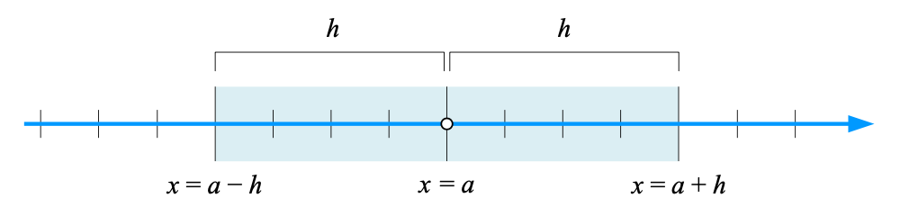
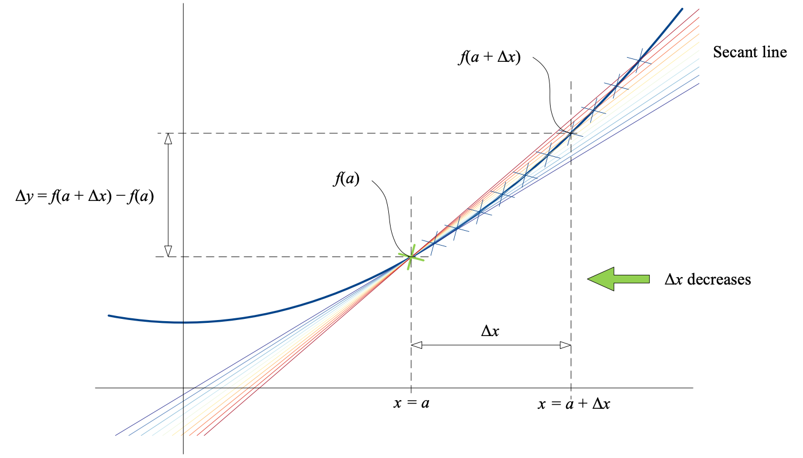

### 函数极限

设函数 $f(x)$ 在点 $a$ 的某一个**去心邻域**内有定义，如果存在常数 $C$，对于任意给定正数 $\varepsilon$，不管它多小，总存在正数 $\delta$，使得 $x$ 满足如下不等式时
$$
0 < |x - a| < \delta
$$
对应函数值 $f(x)$ 都满足
$$
|f(x) - C| < \varepsilon
$$
常数 $C$ 就是函数 $f(x)$ 当 $x \to a$ 时的**极限**，记作：
$$
\lim_{x \to a}f(x) = C
$$

#### 邻域

**邻域**是一个特殊的开区间，点 $a$ 的 $h(h > 0)$ 邻域满足 $a - h < x < a + h$。

$a$ 为邻域的中心，$h$ 为邻域的半径，**去心领域**指的是在 $a$ 的邻域中去掉 $a$ 的集合。

#### 右极限、左极限

当 $0 \lt x - a \lt \delta$ 时，$x$ 从右侧趋于 $a$，记作 $x \to a^+$，此时常数 $C$ 叫做函数 $f(x)$ 的右极限
$$
\lim_{x \to a^+}f(x) = C
$$
当 $\delta \lt x - a \lt 0$ 时，$x$ 从左侧趋于 $a$，记作 $x \to a^-$，此时常数 $C$ 叫做函数 $f(x)$ 的左极限
$$
\lim_{x \to a^-}f(x) = C
$$
**当 $x \to a$ 时函数 $f(x)$ 极限存在的充分必要条件是，左右极限存在且相等。**

### 导数

**导数**描述函数在某一点的变化率，从几何视角看，导数可以视为函数曲线**切线的斜率**。

对于函数 $f(x)$ 自变量 $x$ 在 $a$ 点处一个微小增加 $\Delta x$，会导致函数值增量 $\Delta y = f(a + \Delta x) - f(a)$，当 $\Delta x \to 0$ 时，函数值增量 $\Delta y$ 和自变量增加 $\Delta x$ 比值的极限存在，则称 $y = f(x)$ 在 $a$ 处可导，极限值即函数 $f(x)$ 在 $a$ 处的一阶导数值：
$$
f^\prime(a) = f^\prime(x)\big\vert_{x=a} = \dfrac{\mathrm{d}f(x)}{\mathrm{d}x}\big\vert_{x=a} = \lim_{\Delta x \to 0}\dfrac{f(a + \Delta x) - f(a)}{\Delta x}
$$
从几何视角看，随着 $\Delta x$ 不断减小，割线不断接近切线。

如果函数 $f(x)$ 在 $x=a$ 可导，则函数在该点连续；但是反过来不成立。

一阶导数的一阶导数叫做该函数的二阶导数记作：$f^{\prime\prime}$

对于一元函数 $f(x)$，驻点是函数一阶导数为 $0$ 的点，驻点可能是一元函数的极小值、极大值或鞍点。

#### 导数计算法则

和、差、积、商、链式法则

#### 常见函数导数

