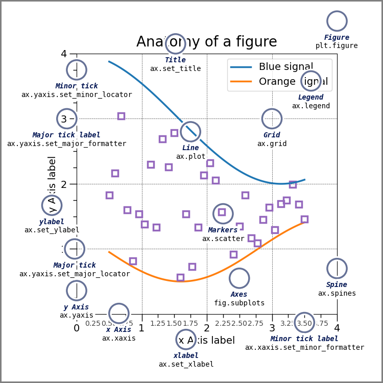

## 可视之美

- **[`Matplotlib`](https://matplotlib.org/)**
- **[`Seaborn`](https://seaborn.pydata.org/)**
- **[`Plotly`](https://plotly.com/graphing-libraries/)**

### 一幅图的基本构成



| 构成部分             | 说明                                                         |
| -------------------- | ------------------------------------------------------------ |
| **`图形对象figure`** | 整个绘图区域的边界框，可以包含一个或多个子图                 |
| **`子图对象axes`**   | 实际绘图区域，包含若干坐标轴、绘制的图像和文本标签等         |
| **`坐标轴axis`**     | 显示子图数据范围并提供刻度标记和标签的对象                   |
| **`图脊spine`**      | 连接坐标轴和图像区域的线条，通常包括上下左右四条             |
| **`标题title`**      | 概述图像主题和内容的文本标签，通常位于图像的中心位置或上方   |
| **`刻度tick`**       | 刻度标记，表示坐标轴上的数据值                               |
| **`标签label`**      | 用于描述坐标轴或图像的文本标签                               |
| **`图例legend`**     | 表示不同数据系列的图例，通常用于区分不同数据系列或数据类型   |
| **`艺术家artist`**   | 所有绘图元素都被视为艺术家对象，包括图像区域、子图区域、坐标轴、刻度、标签、图例等等 |

### `Matplotlib`

```python
import matplotlib.pyplot as plt

# 创建画布`figure`, 设置`width`=10 inches, `height`=5 inches
fig = plt.figure(figsize=(10, 5))
# 创建一组绘图区域[[`axes_0_0`, `axes_0_1`, `axes_0_2`], [`axes_1_0`, `axes_1_1`, `axes_1_2`]]
axes = fig.subplots(2, 3)
# 为第一行的第二个绘图`axes`添加标题"test"
axes[0][1].set_title("test")

plt.show()
```

```python
import matplotlib.pyplot as plt

# 创建画布`figure`, 画布的形状`width`=10 inches, `height`=5 inches
# 在画布上创建2行3列，共6个绘图区域
fig, axes = plt.subplots(2, 3, figsize=(10, 5))
# 为第一行的第二个绘图`axes`添加标题"test"
axes[0][1].set_title("test")

plt.show()
```

在绘制图表之前，需要先创建画布（`figure`），然后在画布上划分绘图区域（`axes`），在绘图区域绘制图表。

| 函数                   | 说明                                                         |
| ---------------------- | ------------------------------------------------------------ |
| `plt.figure()`         | 创建或激活一个`figure`对象，可以设置画布的尺寸`figsize`      |
| `Figure.subplots()`    | 向画布中添加一组绘图区域（`axes`）                           |
| `Figure.add_subplot()` | 添加一个绘图区域到画布中，这个绘图区域是一组绘图区域的一部分 |
| `plt.subplot()`        | 添加一个绘图区域到当前激活的画布（`figure`）或恢复当前画布的一个绘图区域 |
| `plt.subplots()`       | 创建一个画布（`figure`）和一组绘图区域                       |


### `Plotly`


